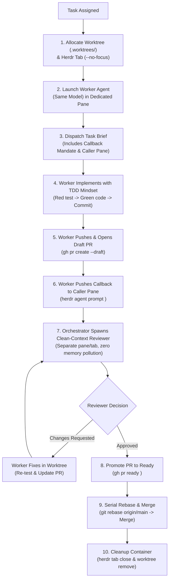
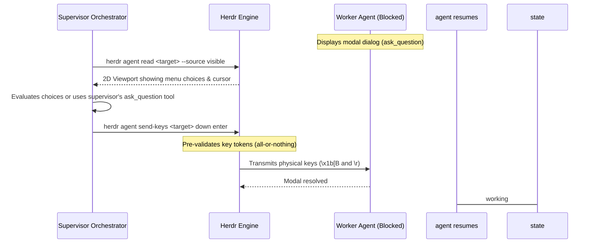

# Herdr

Herdr is an external multiplexer and supervisor control plane for interactive AI coding agents (Claude Code, OpenAI Codex CLI, Google Antigravity CLI, Gemini, Cursor, and Pi). It decouples topology (`workspace` → `tab` → `pane`), OS processes (`pty`), and cognitive agents (`agent`), enabling a single model to orchestrate multiple subagents concurrently without trapping them in headless subshells or blinding human supervisors.

## 0. Fundamental Axioms & Mental Model

1. **Treat the Interactive PTY as a First-Class Sandbox**: Never run agents with headless `-p` or `--print` flags. Interactive agents require their live TUI for multi-turn conversational repair, tool approvals, and thought visibility. Herdr multiplexes the real interactive PTY.
2. **The 3-Axis Decoupling**:
   - **Worker State (PTY/Screen)**: `idle`, `working`, `blocked`, `done`, `unknown`.
   - **Observer State (Host Wait Handle)**: `none`, `waiting`, `settled`, `timed_out`.
   - **Delivery State (Engineering/Git)**: `implementation` → `draft_pr` → `clean_review` → `ready_for_review` → `merged`.
   - *An observer timeout is not a worker failure; an idle worker is not a completed mission. Settlement only grants permission to inspect.*
3. **Law of Swarms**: Code synthesis is embarrassingly parallel ($O(1)$ scaling), but software integration is strictly serial ($O(N^2)$ interaction space). Run writers in parallel isolated checkouts; review and merge PRs serially into a moving verified baseline.
4. **Single-Model Fleet Discipline**: The orchestrator and all spawned workers/reviewers execute on the **exact same model** to maintain uniform capability tiers, prompt-contract compliance, and zero-loss semantic alignment.

---

## 1. Enter, Route & Discover Coordinates

Use this skill when explicitly asked to control or orchestrate with Herdr. Before issuing any command, verify execution inside a Herdr-managed pane:

```bash
test "${HERDR_ENV:-}" = 1
```

If this check fails, explain that Herdr control commands must run inside a Herdr-managed pane. **Never run bare `herdr` for discovery**: it launches or attaches the interactive TUI. Use `herdr --help`, `herdr <group>`, and `herdr status --json`.

### Discover Caller Coordinates
Every orchestrating agent must discover its own coordinates immediately upon entry. These identifiers anchor all downstream callback loops:

```bash
CALLER_PANE_ID="${HERDR_PANE_ID:-$(herdr pane current --json | jq -r .result.pane_id)}"
CALLER_TAB_ID="${HERDR_TAB_ID:-}"
CALLER_WS_ID="${HERDR_WORKSPACE_ID:-}"
```

---

## 2. The Core Breakthrough: Bidirectional Push Notification

### Why Pure Pull / Polling Fails Across Agent Runtimes
Traditional orchestration relies on the supervisor repeatedly pulling or waiting on workers (`herdr agent wait`). In multi-agent environments, this breaks down across different agent runtimes:
- **Claude Code**: Supports background commands and streaming monitors that can stream stdout deltas back as new messages.
- **Codex / Antigravity / Gemini / Cursor**: Operate on discrete tool-call turns. A synchronous wait freezes the tool turn; if the turn ends or yields without an active wait, background workers finish unnoticed, resulting in permanently stalled workflows.

### The Push Callback Mandate
**Never dispatch a task without providing your caller coordinates and an explicit callback contract.** 
When an agent finishes (or becomes blocked by a material decision), it must **push a notification back into the caller's terminal pane**:

```
+-----------------------------------------------------------------------------------+
| BIDIRECTIONAL PUSH-CALLBACK ARCHITECTURE                                          |
+-----------------------------------------------------------------------------------+
| 1. Orchestrator captures: CALLER_PANE_ID="$HERDR_PANE_ID"                         |
| 2. Orchestrator dispatches worker with mandatory Callback Mandate                 |
| 3. Worker completes work, writes .agent-runs/<task>/report.md                     |
| 4. Worker pushes callback to Orchestrator pane:                                   |
|    herdr agent prompt "$CALLER_PANE_ID" \                                         |
|      "I'm the herdr agent in pane $WORKER_PANE (tab $WORKER_TAB).                 |
|       I've finished my work on $BRANCH / PR #$PR_NUM. Summary: $SUMMARY.          |
|       Read my full output: herdr agent read $WORKER_PANE --source ... --lines 100"|
| 5. Worker emits desktop toast: herdr notification show "Task Finished"            |
+-----------------------------------------------------------------------------------+
```

#### Why This Guarantees Universal Continuity:
- If the orchestrator is in an active `agent wait`, the wait unblocks as soon as the worker's status transitions to `done` or `idle`.
- If the orchestrator yielded context or concluded its tool turn, **`herdr agent prompt <CALLER_PANE_ID>` injects text and Enter directly into the orchestrator's PTY**, immediately waking the orchestrator with a fresh user-turn prompt!
- When introducing itself, the worker identifies its origin pane, branch, PR number, and exact read command, ensuring zero ambiguity.

---

## 3. End-to-End Delivery Flow: Worktree → Draft PR → Clean Review → Merge

Follow this standardized lifecycle for every delegated task:



### Step 1: Physical Worktree & Tab Allocation
Never allow parallel agents to share a working directory. Concurrent builds clobber `.git/index.lock` and overwrite untracked files.

```bash
TASK_NAME="feature-auth"
WORKTREE_PATH=".worktrees/$TASK_NAME"
BRANCH_NAME="feature/$TASK_NAME"

# 1. Create Git worktree from verified baseline
git worktree add -b "$BRANCH_NAME" "$WORKTREE_PATH" origin/main

# 2. Open worktree as a dedicated tab in Herdr without stealing user focus
herdr tab create --workspace "$CALLER_WS_ID" \
  --cwd "$PWD/$WORKTREE_PATH" \
  --label "$TASK_NAME" \
  --no-focus
# Save returned .result.tab.tab_id and .result.root_pane.pane_id
```

### Step 2: Launch Worker on the Same Model
Start the agent in the new pane sitting at an interactive prompt:

```bash
# Start agent (using the current model and runtime kind)
herdr agent start "worker-$TASK_NAME" \
  --kind codex \
  --pane "$WORKER_PANE_ID" \
  -- --model "$CURRENT_MODEL"
```

### Step 3: Dispatch Brief with the Callback Mandate
Submit the task prompt using bracketed paste (`agent prompt`). Always append the Callback Mandate:

```bash
cat <<EOF > /tmp/brief-$TASK_NAME.txt
# Mission: Implement $TASK_NAME
Context: ...
Acceptance Criteria: ...
Check Command: npm test / cargo test

## MANDATORY COMPLETION PROTOCOL
Caller Coordinates:
- CALLER_PANE_ID="$CALLER_PANE_ID"
- CALLER_TAB_ID="$CALLER_TAB_ID"
- WORKER_PANE_ID="$WORKER_PANE_ID"

When all tests pass:
1. Commit your changes with a conventional commit message.
2. Push your branch: git push origin "$BRANCH_NAME"
3. Open a Draft Pull Request:
   gh pr create --draft --title "feat: $TASK_NAME" --body "\$(cat .agent-runs/report.md)"
4. Save your summary to .agent-runs/report.md
5. NOTIFY THE CALLER AGENT IMMEDIATELY:
   herdr agent prompt "$CALLER_PANE_ID" "I'm the herdr agent in pane $WORKER_PANE_ID (tab $WORKER_TAB_ID). I've finished my work on $BRANCH_NAME. PR: #\$(gh pr view --json number -q .number) (Draft). Tests are passing. You can read my full report with: herdr agent read $WORKER_PANE_ID --source recent-unwrapped --lines 100"
6. Emit completion toast:
   herdr notification show "Finished: $TASK_NAME" --body "Draft PR opened by worker in pane $WORKER_PANE_ID" --sound done
EOF

herdr agent prompt "$WORKER_PANE_ID" "$(cat /tmp/brief-$TASK_NAME.txt)"
```

### Step 4: Runtime-Specific Wait & Watchdog
- **Claude Code**: Monitor the background pane using streaming or subshell monitoring.
- **Antigravity / Codex / Gemini / Cursor**:
  - Run bounded wait:
    ```bash
    herdr agent wait "$WORKER_PANE_ID" --until idle --until done --timeout 60000
    ```
  - If yielding tool turns, set an asynchronous watchdog timer (e.g. `schedule` tool for 5 minutes) and conclude the turn. When the worker fires `herdr agent prompt <CALLER_PANE_ID>`, the incoming prompt reactivates the supervisor session automatically.

### Step 5: Clean-Context PR Review
**Never review code in the implementer agent's session.** Implementer agents suffer from cognitive inertia, context window bloat, and confirmation bias. Always review in a clean context:

1. Spawn a dedicated reviewer agent in a split pane or fresh tab:
   ```bash
   herdr pane split --pane "$CALLER_PANE_ID" --direction right --no-focus
   REVIEWER_PANE_ID="<returned-pane-id>"
   herdr agent start "reviewer-$PR_NUMBER" --kind codex --pane "$REVIEWER_PANE_ID" -- --model "$CURRENT_MODEL"
   ```
2. Dispatch the Review Brief passing *only* the PR diff and criteria:
   ```bash
   cat <<EOF > /tmp/review-brief-$PR_NUMBER.txt
   # Mission: Review Pull Request #$PR_NUMBER
   Examine diff: gh pr diff $PR_NUMBER
   Verify against specification and coding standards.
   Leave review: gh pr review $PR_NUMBER --comment / --request-changes / --approve -b "..."
   
   Callback:
   herdr agent prompt "$CALLER_PANE_ID" "I'm the reviewer agent in pane $REVIEWER_PANE_ID. Review for PR #$PR_NUMBER completed: [APPROVED / CHANGES_REQUESTED]. Summary: ..."
   EOF
   herdr agent prompt "$REVIEWER_PANE_ID" "$(cat /tmp/review-brief-$PR_NUMBER.txt)"
   ```

### Step 6: Promoting to Ready & Serial Merge
1. If the reviewer requested changes, forward the specific feedback to the worker pane in its worktree. The worker fixes, verifies, pushes updates, and prompts the caller.
2. Once the reviewer approves, promote the PR from Draft to Ready:
   ```bash
   gh pr ready "$PR_NUMBER"
   ```
3. **Serial Integration & Merge Conflict Protocol**:
   Before merging, ensure the branch is rebased cleanly onto current `origin/main`:
   ```bash
   git -C "$WORKTREE_PATH" fetch origin main
   git -C "$WORKTREE_PATH" rebase origin/main
   # If conflicts occur:
   # 1. Inspect conflict markers; preserve existing main features while integrating branch logic.
   # 2. git -C "$WORKTREE_PATH" add <resolved-files>
   # 3. git -C "$WORKTREE_PATH" rebase --continue
   # 4. Verify test suite passes (green).
   # 5. Push with lease: git -C "$WORKTREE_PATH" push --force-with-lease
   ```
4. Merge the PR serially:
   ```bash
   gh pr merge "$PR_NUMBER" --squash --delete-branch
   ```

### Step 7: Finished Terminal Cleanup
Follow the mandatory lifecycle sequence:
**WAIT/NOTIFY → READ → verify handback → merge PR → close pane/tab → remove worktree.**

```bash
# Close worker tab
herdr tab close "$WORKER_TAB_ID"

# Remove physical worktree checkout
git worktree remove "$WORKTREE_PATH" --force
```

Verify the tab/pane IDs are gone. Never close the caller's orchestration tab or primary workspace.

---

## 4. The Interactive Modal Bridge (`send-keys` vs. `prompt`)

### The `agent_blocked` Safety Barrier
When an agent pauses for user confirmation (`[y/N]`, bash tool permission) or an interactive questionnaire (`ask_question`: `↑/↓ Navigate · enter Select · esc Skip`), Herdr’s screen heuristic matches a `Blocked` rule (priority 300–1100).
- **Herdr actively rejects `herdr agent prompt` with `agent_blocked` before writing a single byte.**
- **Why?** Sending prose into an ncurses/ratatui arrow menu causes unbound key absorption, drops characters, or triggers `Esc` cancellation when bracketed paste escapes arrive.

### The Surgical Keystroke Bridge
When an agent is `blocked`, resolve it mechanically using `herdr agent send-keys`:



```bash
# 1. Read visible modal snapshot
herdr agent read "$WORKER_PANE_ID" --source visible --lines 20

# 2. Send pre-validated keystrokes to select and confirm
herdr agent send-keys "$WORKER_PANE_ID" down enter
```

`send-keys` validates every key token (`up`, `down`, `enter`, `esc`, `ctrl+c`, `tab`) before transmission. If any token is invalid, **zero bytes** reach the terminal.

---

## 5. Terminal Screen Inspection: The 4 Read Sources & Alt-Screen Physics

Standard terminal scrapers fail because full-screen TUIs (Claude Code, Vim, Ink) run on the **Alternate Screen Buffer** (`\x1b[?1049h`), where off-screen rows are discarded from memory. 

Herdr provides 4 specialized read sources:

| Source | Scope & Boundary | Primary Architectural Role |
|---|---|---|
| **`visible`** | 2D rendered viewport grid | **Modals & Spinners**: Inspect active questionnaires, confirmation dialogs, or live thinking status. |
| **`recent`** | Viewport + host scrollback | **Columnar Data**: Preserves terminal column line breaks for ASCII diagrams and fixed-width tables. |
| **`recent-unwrapped`** | Viewport + scrollback with soft wraps merged | **LLM Code, Tables & JSON**: Normalizes terminal wrapping into continuous logical lines. **Mandatory default for reading transcripts.** |
| **`detection`** | Pinned bottom screen rows | **State Introspection**: Raw plain text evaluated by TOML regex rules. |

### The Filesystem Fallback Invariant
If increasing `--lines` on a settled agent in `recent-unwrapped` does not reveal the full deliverable, the agent is on the Alternate Screen. **Never guess truncated output**: instruct the agent to write its deliverable to `.agent-runs/<task>/report.md` on disk, and read the file directly.

---

## 6. Complete Verified CLI Command Matrix

| Command Group | Command & Exact Syntax | Modifies PTY? | Primary Rationale |
|---|---|---|---|
| **Status** | `herdr status --json` | No | Introspect server/client version and protocol health. |
| **Workspace** | `herdr workspace list` | No | List project workspaces and repo root anchors. |
| | `herdr workspace get <WS_ID>` | No | Inspect detailed workspace state and linked worktree metadata. |
| | `herdr workspace close <WS_ID> [--group]` | Yes | Close workspace container (use `--group` if child worktrees exist). |
| **Worktree** | `herdr worktree list [--cwd <PATH>]` | No | List Git worktrees across repositories. |
| | `herdr worktree create [--cwd <PATH>] --branch <NAME> --path <PATH> --no-focus` | Yes (pty) | Create Git worktree and mount as Herdr workspace. |
| | `herdr worktree remove --workspace <ID> [--force]` | Yes | Remove physical worktree directory and close workspace. |
| **Tab** | `herdr tab create --workspace <WS> --cwd <PATH> --label <TEXT> --no-focus` | Yes (pty) | Encapsulate independent task branch without stealing focus. |
| | `herdr tab get <TAB_ID>` | No | Query tab state and aggregate agent status. |
| | `herdr tab close <TAB_ID>` | Yes | Terminate all child panes and free tab layout upon completion. |
| **Pane** | `herdr pane split --pane <PANE_ID> --direction <right\|down> --cwd <PATH> --no-focus` | Yes (pty) | Create sibling terminal split based on caller geometry. |
| | `herdr pane get <PANE_ID>` | No | Inspect pane process, dimensions, and scroll state. |
| | `herdr pane run <PANE_ID> <CMD>...` | Yes | Run raw non-agent shell commands (`cargo test`, `git status`). |
| | `herdr pane close <PANE_ID>` | Yes | Close finished individual pane. |
| **Agent** | `herdr agent start <NAME> --kind <KIND> --pane <PANE_ID> -- <ARGS...>` | Yes | Launch AI CLI in shell pane sitting at prompt. |
| | `herdr agent get <TARGET>` | No | Inspect cognitive agent session ID, status, and title. |
| | `herdr agent prompt <TARGET> <TEXT>` | Yes (paste) | Deliver prompt atomically via bracketed paste with 300ms Enter delay. |
| | `herdr agent send-keys <TARGET> <KEY>...` | Yes (keys) | The modal bridge: navigate menus and answer confirmation prompts. |
| | `herdr agent wait <TARGET> --until idle --until done --timeout <MS>` | No | Event-driven kernel wait on Herdr state mutation bus. |
| | `herdr agent read <TARGET> --source recent-unwrapped --lines <N>` | No | Read uncorrupted, unwrapped terminal output. |
| | `herdr agent explain <TARGET> --json` | No | Disclose regex manifest rules and evidence governing agent state. |
| **Notification**| `herdr notification show <TITLE> --body <TEXT> --sound done` | No | Non-blocking desktop/TUI toast alert across connected clients. |


---

## 7. Recovery & Signal Handling

| Signal / Symptom | Diagnosis | Immediate Required Action |
|---|---|---|
| `error.code: agent_blocked` | Target is pausing on an interactive question or modal. | `herdr agent read <target> --source visible` $\to$ resolve via `herdr agent send-keys <target> down enter`. |
| `error.code: agent_prompt_stalled` | Agent did not transition to `working`/`blocked` within 5,000ms. | Inspect pane. If model is running slow extended thinking, wait for settlement; do not inject duplicate prompts. |
| `error.code: timeout` | `agent wait` reached deadline before reaching target status. | READ current pane output (`visible` and `recent-unwrapped`). Check if agent is still actively working or compiling. Renew wait if progressing. |
| `error.code: workspace_group_close_required` | Attempted `workspace close` on a repository with child worktrees. | Close child worktrees first or append `--group` only if authorized to destroy all worktree sessions. |
| Agent frozen on tool call | Agent CLI crashed or hung on zombie process. | Send `ctrl+c` via `herdr agent send-keys <target> ctrl+c`. READ visible pane to confirm return to prompt. |
| Merge conflict during rebase | `origin/main` advanced with competing changes. | Run `git rebase origin/main`, resolve conflict markers, run test suite, and push `--force-with-lease`. |

---

## 8. Summary Checklist Before Claiming Done

- [ ] Every worker operated in its own isolated Git worktree checkout.
- [ ] Implementer opened a **Draft PR** and pushed a callback to `$CALLER_PANE_ID`.
- [ ] A fresh Reviewer agent in a **clean context** audited the PR diff (`gh pr diff`).
- [ ] PR was promoted from draft to ready (`gh pr ready`), rebased serially on `origin/main`, and merged.
- [ ] Finished tabs, panes, and worktrees were cleanly closed and removed under the cleanup lifecycle.

---

## 9. References & Deep Dive Guides

| Topic | Reference |
|---|---|
| Deep socket RPC event loops, state machines, and fallback recovery | `references/event-monitoring.md` |
| Concrete copy-paste mission brief templates for workers and reviewers | `references/mission-briefs.md` |
| Parallel agent capacity, resource thresholds, and pane topologies | `references/parallel-capacity.md` |
| Runbook for diagnosing and unblocking stalled, modal-blocked, or stopped agents | `references/stopped-agent-recovery.md` |

