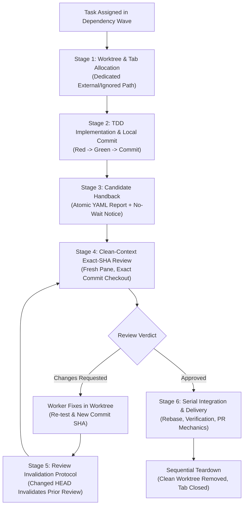

# Parallel Capacity, Clean Review & Serial Delivery

Read this reference when managing concurrent agent lanes, allocating worktree capacity, scheduling clean-context technical reviews, and executing serial integration.

---

## 1. Fundamental Swarm Axioms & Role Architecture

### 1.1 The Law of Swarms
> **Code synthesis is embarrassingly parallel ($O(1)$ scaling), but software integration is strictly serial ($O(N^2)$ interaction space).**

- **Parallelize Synthesis**: Multiple agents write tests, documentation, and feature code concurrently in isolated Git worktrees without interference.
- **Serialize Integration**: Merging multiple branches cannot be done concurrently without risking semantic collision, compile race conditions, or broken invariants. Changes must be audited independently and merged serially into a moving, verified baseline.

### 1.2 Role-First Architecture & Runtime Decoupling
Herdr operates on a decoupled multi-agent topology where **runtime is distinct from role**:
- **Codex CTO**: Owns strategic direction, high-level scope, architectural decisions, and candidate gate approvals.
- **Codex Engineering Manager (EM)**: Owns daily orchestration, dependency waves, task graph dispatch, capacity monitoring, report intake, and checkpointing.
- **AGY Implementers**: Focused synthesis and unit testing in isolated checkouts.
- **Fresh AGY Reviewers**: Independent technical audits of exact candidate SHAs in clean context windows.
- **AGY Integration Executor**: Repository preparation, worktree provisioning, serial rebase, packaging validation, PR mechanics, and clean teardown.
- **AGY Recovery Executor**: Diagnostic inspection and state reconciliation for stalled agents.

> [!IMPORTANT]
> **No Autonomous Management Bootstrapping**: Workers and reviewers execute bounded tasks under explicit briefs. A worker must never bootstrap a nested management hierarchy or inherit CTO duties.

### 1.3 Leadership Topology & Live Coordinate Discovery
Mission leadership operates under a unified two-pane topology:
- **ONE Leadership Tab, Exactly TWO Panes**:
  - **CTO (LEFT)**: Strategy, architectural constraints, and candidate gate approvals.
  - **Engineering Manager (RIGHT)**: Task graph dispatch, worker oversight, report intake, capacity tracking.
- **Cold Bootstrap Sequence**:
  - The CTO initializes the leadership tab.
  - The CTO provisions the EM pane via a native right split:
    ```bash
    herdr pane split --pane "$CTO_PANE_ID" --direction right
    ```
  - **Verification Invariant**: Verify that both leadership panes share the exact same `tab_id` and maintain the expected layout (CTO left, EM right).
- **Worker & Reviewer Isolation**:
  - In contrast to the co-located leadership tab, implementers, fresh technical reviewers, and executors **never share panes or tabs**. Each task runs in its own dedicated tab with its own isolated Git worktree.
- **Verified Live Discovery vs. Stale Startup Env**:
  - When panes are relocated or migrated (e.g. CTO moving the EM pane to the leadership tab while preserving identity), shell environment variables set at startup (`HERDR_TAB_ID`, `HERDR_PANE_ID`) become stale.
  - Roles, registration briefs, and handback reports must query runtime introspection (`herdr pane current --json`) for verified live `pane_id`, `tab_id`, `terminal_id`, and `session_id`, rather than trusting stale startup environment variables.

---

## 2. Dynamic Capacity Budget & Resource Thresholds

### 2.1 Initial 2-Worker Calibration & Dynamic Refill
When launching a multi-agent wave where host resources, token limits, or PTY stability are uncalibrated:
1. **Initial Calibration Wave**: Begin by dispatching **2 concurrent workers** to observe CPU, memory, and PTY response.
2. **Dynamic Capacity Refill**: As soon as an active worker completes its assignment, publishes its handback report, and settles, immediately unblock and dispatch ready disjoint downstream lanes.
3. **No Unconditional 2-Worker Cap**: The 2-worker limit is strictly a calibration starting point, never a permanent ceiling. Expand concurrency dynamically to match available host resources and token capacity.

### 2.2 Resource Invariants

| Resource | Limits & Invariants | Operational Rule |
|---|---|---|
| **Worktrees** | Dedicated 1:1 mapping: each concurrent task gets its own checkout under `.worktrees/<task>` or a task-owned external root. | **Never share working checkouts.** Concurrent builds clobber `.git/index.lock` and untracked files. |
| **Runtimes & Models** | Heterogeneous runtime capability: orchestrator and workers execute on model tiers suited to their role (e.g., Codex `gpt-6-astra` for EM; AGY `gemini-3.8-flash-high` for executors). | Runtime is not role. Pin model choices per mission; do not force artificial single-model fleet constraints. |
| **Compiler / Test Leases** | Heavy native compilers (`cargo`, `xcodebuild`, comprehensive test runners) saturate CPU and memory, triggering system lockups or OOM aborts. | **Enforce Build Leases**: Serialize heavy compilation passes and full test suites while parallelizing text/code drafting and static checks. |
| **Reviewers** | Reviewers run in fresh, clean context panes. | Read-only checkouts at exact candidate commit SHAs; zero file mutations. |

### 2.3 Quota, Rate-Limit & Resource Exhaustion (The pF Precedent)
When an executing agent encounters visible upstream API quota exhaustion, token depletion, or 429 rate-limit errors in its terminal/PTY output (as observed in the historical `pF` worker exhaustion case):
- **Distinct from Dead Worker or Successful Idle**: A visible quota exhaustion or rate-limit error is neither a hung/dead worker nor a normal completion. It represents an external platform capacity boundary while the agent remains blocked.
- **Preserve Artifacts & Stop Blind Retries**: Stop execution immediately. Do **not** blind-retry with the same exhausted model tier and do **not** restart the session blindly, which burns remaining quota or loops on rate limits. All worktree changes, partial outputs, and published reports must be preserved intact.
- **Authorized Replacement Sequence**:
  1. **Ownership & Effect Reconciliation**: Verify and reconcile owned processes, background commands, and worktree git status before taking action.
  2. **Actual Model Verification**: Discover and verify that an authorized native alternative model tier (e.g., stepping up from `gemini-3.8-flash-high` to `gemini-3.1-pro-high`) is genuinely functional and available via native CLI/TUI tools before provisioning.
  3. **Explicit Native Registration**: Launch the replacement worker in a fresh native session, verify live coordinates (`pane_id`, `tab_id`, `terminal_id`, `session_id`, `actual_model`) via `herdr pane current --json`, and register explicitly with the Engineering Manager.
  4. **Manager-Owned Attempt Increment**: Only the Engineering Manager assigns the new attempt (e.g., attempt 2). Workers never increment their own attempt counters. Historical attempt records and prior reports from the exhausted session remain preserved in the run root.
- **Strict Escalation Boundary**:
  - If no authorized replacement model or capacity exists within the approved mission parameters, escalate immediately to the Engineering Manager and CTO.
  - **Prohibitions**: Never attempt ad-hoc billing or credential changes, never alter global host configurations or runtime settings, and never introduce external retry frameworks, wrappers, or unapproved dependencies.

---

## 3. Dependency Waves & Parallel Dispatch

### 3.1 Task Graph Decomposition
Decompose complex missions into a directed acyclic graph (DAG) based on two criteria:
1. **Independent Verifiable Outcomes**: Each lane produces a self-contained, testable deliverable.
2. **Disjoint Writable Surfaces**: No two concurrent lanes may own or write to the same files.

### 3.2 Dispatching Disjoint Lanes in Parallel
All ready tasks whose dependencies are satisfied must be dispatched in the same wave. For example, once the canonical contract is verified, independent reference writers and native scenario authors run concurrently in separate worktrees.

### 3.3 Continuous Review While Writing Continues
When a worker finishes and publishes its handback report, immediately spawn a fresh reviewer in a dedicated pane to audit the candidate. **Never pause remaining writers to wait for a review.** Drafting and technical review proceed in parallel.

---

## 4. The 6-Stage Delivery Lifecycle

Every feature lane progresses through this standardized lifecycle:



### Stage 1: Dedicated Worktree Allocation
Allocate an isolated Git worktree and open a Herdr tab without stealing user focus:
```bash
git worktree add -b "lane/<task-name>" "<worktree-path>" origin/main
herdr tab create --workspace "$CALLER_WS_ID" --cwd "$PWD/<worktree-path>" --label "<task-name>" --no-focus
```

### Stage 2: TDD Implementation & Local Commit
The implementer executes focused test-driven development:
1. Write a failing test demonstrating the required behavior (Red).
2. Implement minimal production code to pass the test (Green).
3. Commit changes locally to the feature branch with a conventional commit message:
   ```bash
   git add <owned-files>
   git commit -m "feat(<scope>): <description>"
   ```
*(Note: In unified multi-lane missions, lane writers commit locally without opening individual PRs. The integration executor combines commits into the single delivery candidate).*

### Stage 3: Candidate Handback
The implementer publishes an immutable YAML report to `<RUN_ROOT>/<TASK_ID>-a<ATTEMPT>-handback.yaml` outside the worktree following the canonical atomic publication pipeline defined in [report-contract.md](report-contract.md), and notifies the manager via `herdr agent prompt` **without `--wait`**.

### Stage 4: Clean-Context Exact-SHA Review
**Never review code in the implementer's active pane.** Implementer panes carry conversational drift and confirmation bias.
1. Spawn a fresh reviewer agent in a separate pane or tab:
   ```bash
   herdr pane split --pane "$CALLER_PANE_ID" --direction right --no-focus
   herdr agent start "reviewer-<task>" --kind agy --pane "$REVIEWER_PANE_ID" -- --model "$REVIEWER_MODEL"
   ```
2. Reviewer checks out the candidate at its exact commit SHA:
   ```bash
   git checkout "$CANDIDATE_HEAD_SHA"
   ```
3. Reviewer inspects specification conformance, code standards, and the exact diff (`git diff $BASE_SHA...$CANDIDATE_HEAD_SHA`), and executes test suites directly, recording true observed exits.

### Stage 5: Review Invalidation Protocol
> [!WARNING]
> **Load-Bearing Invariant: Changed HEAD Invalidates Prior Review**
> Technical review binds strictly to an exact commit SHA. Any subsequent commit, rebase, or fix pushes the branch HEAD to a new SHA ($SHA_2 \neq SHA_1$). When branch HEAD advances, any prior approval is automatically **stale and invalidated**. The new SHA must undergo fresh technical verification before integration.

### Stage 6: Serial Integration & Delivery
Integration proceeds serially under the direction of the AGY Integration Executor, parameterized by the brief's assigned delivery authority (`DELIVERY_AUTHORITY`):

#### Mode A: Unmerged Draft PR Delivery (`DELIVERY_AUTHORITY="unmerged_pr"`)
When a mission's authorized scope explicitly concludes at an unmerged candidate PR (e.g., bootstrapping waves, review milestones):
1. Combine verified lane commits onto the candidate branch.
2. Run repository generators (`python3 scripts/gen-marketplace.py`), validation scripts (`python3 scripts/validate-skills.py`), and `git diff --check`.
3. Push candidate branch: `git push origin <candidate-branch>`.
4. Open single integrated draft PR:
   ```bash
   gh pr create --draft --title "<Title>" --body "<Body>"
   ```
5. Hand back unmerged PR to CTO/EM. **Do not push directly to main or merge.**

#### Mode B: Authorized Merge Delivery (`DELIVERY_AUTHORITY="authorized_merge"`)
When the mission authorizes autonomous completion into `main`:
1. Rebase candidate cleanly onto latest `origin/main`.
2. Run verification test suites on the rebased tree.
3. Push with lease: `git push --force-with-lease`.
4. Promote PR to ready (`gh pr ready <PR_NUM>`) and squash merge (`gh pr merge <PR_NUM> --squash --delete-branch`), respecting branch protections and same-account approval limits.

---

## 5. Merge Conflict Ownership & Serial Rebase

When multiple lanes integrate, downstream branches may encounter merge conflicts against the advancing `main`. Treat conflict resolution as standard engineering execution, not an escalation barrier:

1. **Detect Conflict Early**:
   `gh pr view <PR_NUM> --json mergeable` or attempt `git rebase origin/main`.
2. **Rebase in the Isolated Worktree**:
   ```bash
   git -C <worktree-path> fetch origin main
   git -C <worktree-path> rebase origin/main
   ```
3. **Resolve Conflict Markers with Integrity**:
   - Inspect conflicting files via `git status`.
   - Preserve both upstream fixes and branch feature logic. Never blindly accept "ours" or "theirs".
   - Stage resolved files: `git add <resolved-file>`.
   - Continue rebase: `git rebase --continue`.
4. **Re-Verify with Tests**:
   Never assume conflict resolution succeeded simply because Git markers cleared. Re-run complete test suites:
   ```bash
   npm test / cargo test / python3 scripts/validate-skills.py
   ```
5. **Force-Push with Lease**:
   ```bash
   git -C <worktree-path> push --force-with-lease
   ```

---

## 6. Safe Sequential Teardown & Evidence Preservation

Follow the mandatory lifecycle sequence:
**WAIT/NOTIFY $\longrightarrow$ READ $\longrightarrow$ verify handback $\longrightarrow$ integrate/PR $\longrightarrow$ close tab/pane $\longrightarrow$ remove worktree.**

### 6.1 Clean Worktree Verification
Before removing any worktree, verify that the working tree is completely clean:
```bash
git -C "<worktree-path>" status --porcelain
```
If untracked or uncommitted files exist, investigate and archive before proceeding.

### 6.2 Protection Against Blind Force Deletion
> [!CAUTION]
> **No Default Force Cleanup**: Never execute `git worktree remove --force` on a dirty worktree or unverified directory. Force-deleting checkouts risks nonrecoverable data loss. Close containers only after all changes are committed and verified.

```bash
# 1. Close Herdr tab
herdr tab close "$WORKER_TAB_ID"

# 2. Remove clean worktree
git worktree remove "<worktree-path>"
```

### 6.3 Host Evidence Invariant
All immutable YAML reports, execution transcripts, and validation logs must reside in `report_root` on the host filesystem (outside disposable worktrees). Removing ephemeral worktrees leaves durable mission evidence intact.
