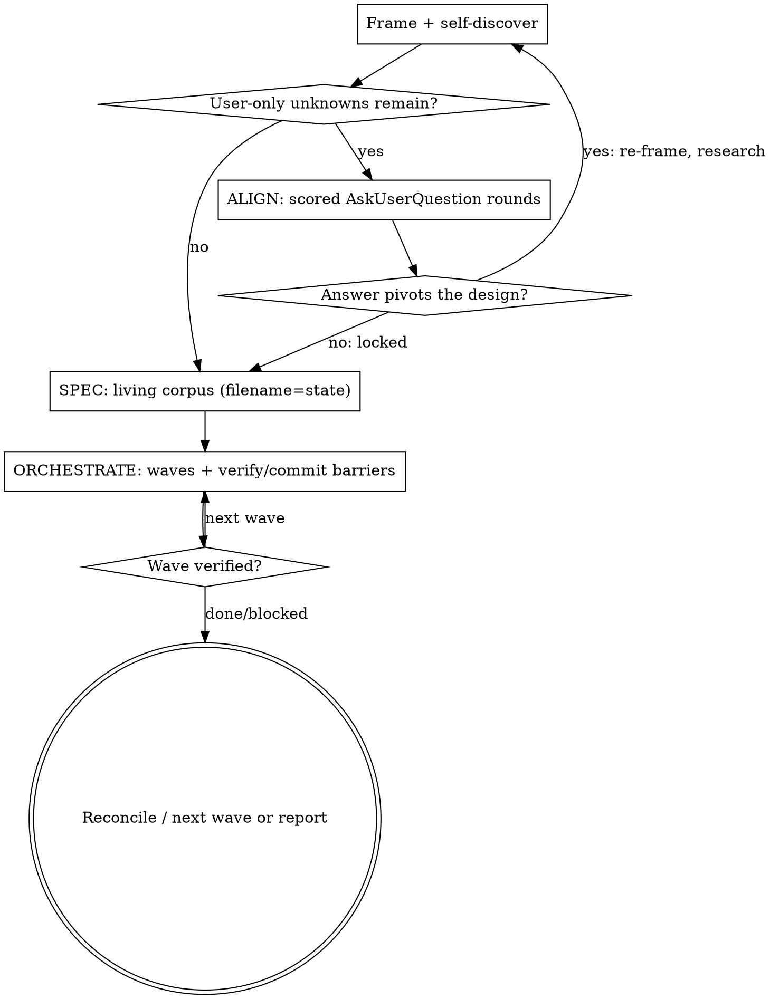

# Run Aligned Delivery

Drive a large, ambiguous initiative the way a great architect runs a project:
**front-load every decision that is genuinely the human's to make** (so execution
can be autonomous), **turn the answers into a living spec corpus**, then
**orchestrate parallel agents in disciplined waves**. The signature is
collaboration, not interrogation — you surface the real forks, scored and with
their catch, the human chooses, then you build hard.

One skill, three phases. Run them in order; loop back when an answer changes the picture.

## When to use / not use

**Use** when the work is big AND at least one of: ambiguous (many valid
interpretations), high-stakes (modernization, rewrite, migration, data/auth), or
multi-component (spans subsystems). Examples: "modernize this stack", "rewrite X
in Y", "port this service", "migrate N call sites", "build this platform from
scratch", "this gnarly bug spans three services".

**Do NOT use** for small, clear, single-file or single-function work — just
implement it, or have one short design conversation first. If you can name the
destination and the diff in one sentence, you do not need this skill. For chasing
a single reproducible runtime bug, use a dedicated debugging methodology, not this.

## Core principle

> **The brief is the lever.** Time spent surfacing the right forks — and scoring
> the options so the human chooses well — buys autonomous, high-quality execution
> later. Cheap-to-check unknowns you resolve yourself; user-only unknowns you ask, well.

## The loop

---

## Phase 0 — Frame and self-discover (before asking anything)

You do not get to ask the human a question you could have answered yourself.

1. **State your framing + assumptions out loud**, and invite correction: "Here's
   how I read this; here's what I'm assuming — correct me or I proceed." Surfacing
   a wrong assumption now is cheaper than building on it.
2. **Scan for contradictions first.** Mutually exclusive goals ("offline-first" +
   "always-current"), unacknowledged trade-offs ("simple" + "handles every edge
   case"). Reconcile these *before* any detailed question — disambiguating the
   wrong foundation is wasted effort.
3. **Do the homework an agent can do:** read the code, run searches/researchers,
   map the subsystems. If a question is answerable from the repo, the docs, or a
   quick research pass, answer it — don't spend a question on it.
4. **Decompose if it's really several initiatives.** If the ask is N independent
   subsystems, say so and sequence them; this skill drives one coherent initiative
   at a time.

What's left — the genuine **user-only unknowns** (a preference, a risk tolerance, a
credential/constraint, an irreversible or outward-facing call) — is what Phase 1 asks.

## Phase 1 — ALIGN: scored, multi-round questioning (the heart)

Use your environment's structured multi-choice question tool (e.g. `AskUserQuestion`)
to surface the real forks. This is NOT one polite clarifying question; it is
**repeated batches of carefully designed, scored, categorized questions** that
converge the design.

The full method (scoring rubric, recommendation-first, the "what's the catch",
categorization, batching, adaptation) is in
[`references/question-design.md`](references/question-design.md) — read it before
your first round. The essentials:

- **Recommendation first, scored options.** Each option carries a `/100` score and a
  one-line trade-off; lead with the recommended option marked "(Recommended)". The
  human should choose in seconds and see why.
- **Name the catch.** Every option states its downside/risk, not just its upside.
  The score is honest, not a sales pitch.
- **Categorize** the decision space (runtime, data, security, deploy, testing,
  sequencing, …) so the human sees the shape — up to ~20 categories for a big
  initiative.
- **Batch** within the tool's per-card limits (`AskUserQuestion`: up to 4
  questions/card, up to 4 options each — surface the top-scored options; "Other"
  covers the rest). Group a card by theme.
- **Adaptation budget: up to ~10 rounds** (ceiling, not a target — many initiatives
  need fewer). Treat 10 as the default adaptation budget: re-plan the remaining
  questions after each batch based on the answers.
- **Adaptive re-planning is mandatory.** When an answer changes the architecture (a
  pivot), loop back to Phase 0 — re-frame, research the new constraint, re-score the
  *downstream* questions before continuing. A locked early answer can invalidate a
  later question; don't ask it stale.
- **Ask only user-only unknowns.** If you can decide it from evidence or a sensible
  default, decide it, state it, and move on (note auto-decided low-stakes items
  rather than spending a card on them).

**Gate:** the decisions are locked — every load-bearing fork has an answer. Do not
start the spec corpus or write code before this gate. Carry the answers verbatim
into Phase 2.

## Phase 2 — SPEC: a living corpus where the filename is the state

Convert the locked decisions into a navigable spec corpus that another agent (or a
future you) can execute with zero prior context — and that doubles as the project's
to-do board.

**Filename-prefix-as-state** (the distinctive convention — lighter than
status-fields-in-content; scannable with `ls`; transitioned with `git mv`):

| Prefix | Meaning |
|---|---|
| `00_`, `01_`, … | Stable spine: the decision log, architecture, data model, contracts. Not state-tracked. |
| `TODO_` | Specced, not started. |
| `WIP_` | In progress. |
| `DONE_` | Implemented **and** verified. |
| `BLOCKED_` | Needs an operator resource or an unresolved decision (say why at the top). |

Build, at minimum:
- **`00_DECISIONS_LOCKED.md`** — every Phase-1 answer, grouped by category, each
  with the chosen option + why. This is the contract the orchestration obeys.
- A short **architecture / data-model / interface-contract spine** (the
  cross-cutting shapes every later agent must honor).
- **One spec per unit of work** (per component / per provider / per migration site),
  each: pointing at the **source-of-truth code as ground truth** (the existing or
  legacy implementation to reproduce — link exact paths), restating the applicable
  locked decisions, listing the contract + edge cases + a porting/build checklist.

Rules: keep each spec a *living to-do* (rename the prefix as state changes);
reference, don't duplicate; persistent files are your working memory and survive
context compaction (re-read them after a compaction). Don't pad to a file count — a
navigable corpus, not dozens of thin files.

**Gate:** the corpus is sufficient for a zero-context agent and every spec links
real ground-truth. Confirm sufficiency before orchestrating.

## Phase 3 — ORCHESTRATE: dependency-ordered waves with verify-and-commit barriers

Drive execution with parallel subagents — deterministically if your environment has
a workflow primitive (e.g. the `Workflow` tool; otherwise parallel subagent/Task
dispatch). Treat the spec corpus as the source of truth and yourself as the
conductor who never writes the code.

Hard-won discipline (this is where naive parallelism fails):

- **Waves, not a free-for-all.** Each wave contains only **file-disjoint, genuinely
  independent** units. Put a **barrier** between waves where the next depends on the
  prior. Order waves by dependency (foundation → shared utils → leaf units → integration).
- **Cap concurrency to respect rate limits.** Keep each parallel wave at or under the
  agreed concurrency (e.g. ≤5); sequence the rest. Queue accordingly.
- **Pin the model** for every agent when the human asks for a specific tier.
- **Verify-and-commit at each barrier, with a single agent, alone.** A lone verifier
  runs the gate (typecheck + tests), fixes drift, and commits the wave — so no two
  agents ever race the git index or the lockfile. Build agents do NOT commit and do
  NOT run installs concurrently; one scaffold/verify agent owns installs and commits.
- **Mission-grade prompts.** Each subagent starts at zero context: give it role,
  dense context, the exact spec file as its blueprint, hard constraints, a
  binary/specific/verifiable definition-of-done, evidence-based verification, a
  failure protocol, and a handback format. Set ceilings (upper bounds with a release
  valve), never floors. Define the destination; leave the path open.
- **Reconcile after every wave** — agents make systematic errors. Read the handback,
  re-run the full gate yourself, spot-check; a subagent's "done" is a claim, not
  verification.
- **Flag what you cannot verify.** If a step needs an operator resource (a live
  credential, a proxy, production access), reach the highest rung you can
  (static/unit/integration) and hand off the genuinely-unverifiable slice with the
  exact command to run.

As units land verified, `git mv` their specs `WIP_`/`TODO_` → `DONE_`. The corpus
stays the live board.

---

## Decision rules

- If you can answer a question from the code, docs, or a quick research pass,
  **decide it** — don't spend a question card. Ask only user-only unknowns.
- If two stated goals contradict, **resolve the contradiction before** any technical question.
- If an answer pivots the architecture, **stop and re-frame + re-research** before
  continuing the question rounds — don't ask downstream questions against a stale design.
- If a wave's units share files or state, they are **not** the same wave — serialize
  or re-cut the boundaries.
- If you cannot make a verification claim with fresh evidence, **don't make it** —
  say which rung you reached.
- If the initiative is actually several initiatives, **decompose and sequence**; run
  this loop on one at a time.
- Prefer the smallest corpus and the fewest agents that do the job. Reject machinery
  that doesn't improve the outcome.

## What to show the user (output contract)

1. Your framing + assumptions + any contradictions found (Phase 0).
2. The scored question rounds (Phase 1) — recommendation-first, options scored with their catch.
3. A short summary of locked decisions, then the spec corpus location + the filename-state convention (Phase 2).
4. The wave plan (what runs in parallel, concurrency cap, barriers) before launching, then per-wave verified results (Phase 3).
5. Honest status: what's verified, what's `BLOCKED_`/operator-gated, what's next.

## Guardrails

- Do not write code, scaffold, or dispatch build agents before the Phase-1 decisions
  are locked and (for non-trivial work) a spec exists.
- Do not ask the human a question you could answer yourself; do not present an option
  without its score and its catch.
- Do not let a parallel wave exceed the agreed concurrency, share files across agents,
  or let build agents commit concurrently.
- Do not claim a wave is done without re-running the gate yourself.
- Do not pad the spec corpus with thin files or invent a deadline/timeline the work didn't specify.

## Reference routing

| File | Read when |
|---|---|
| [`references/question-design.md`](references/question-design.md) | Designing the Phase-1 question rounds — the scoring rubric, recommendation-first/catch format, categorization, batching within tool limits, the ~10-round adaptation budget, and when to ask vs decide. |
