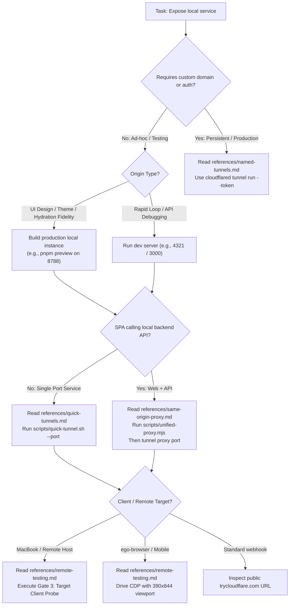

# Cloudflare Tunnel

Expose local development ports, containers, and multi-service architectures to the public internet securely using Cloudflare Tunnel without opening firewall ports.

## Purpose & Mental Model

AI agents often develop applications inside isolated environments (Docker containers, cloud VMs, WSL) that cannot be directly reached by external services, physical mobile devices, or remote browser controllers like `ego-browser`.

Cloudflare Tunnel establishes an outbound encrypted connection (QUIC or HTTP/2) from your local environment to Cloudflare's global edge network:

1. **Quick Tunnels (`trycloudflare.com`):** Zero-configuration, ephemeral public HTTPS URLs. No Cloudflare account or DNS required. Best for ad-hoc agent testing, webhooks, and remote browser validation.
2. **Named Tunnels (Production):** Persistent, authenticated tunnels tied to custom domains and Cloudflare Zero Trust.
3. **Same-Origin Unified Proxy Pattern:** When testing Single Page Applications (React, Expo Web, Vite) that consume local APIs (Supabase, Express, FastAPI), running a lightweight unified reverse proxy on one port eliminates browser **Mixed Content** (`https` -> `http`) and CORS blocks.

### The Mandatory 3-Gate Verification Rule

Never report a tunnel URL to a user or open a browser on a remote machine until all 3 gates pass:

```
┌────────────────────────────────────────────────────────────────────────┐
│ Gate 1: Local Origin Health                                            │
│ curl -s -f http://127.0.0.1:<PORT>/<path>  ──> Must return HTTP 200    │
└───────────────────────────────────┬────────────────────────────────────┘
                                    ▼
┌────────────────────────────────────────────────────────────────────────┐
│ Gate 2: Global DNS Publication                                         │
│ dig @1.1.1.1 +short <subdomain>            ──> Must return Edge IPs    │
└───────────────────────────────────┬────────────────────────────────────┘
                                    ▼
┌────────────────────────────────────────────────────────────────────────┐
│ Gate 3: Target Client Reachability (Zero False Positives)              │
│ ssh <client> "curl -s -o /dev/null -w '%{http_code}' <URL>"  ──> 200 OK│
└────────────────────────────────────────────────────────────────────────┘
```

---

## Decision Tree



---

## Minimal Reading Sets

Load only the reference files required for your specific path:

| Scenario | Read First | Supporting |
|---|---|---|
| **Quick ad-hoc tunnel for single port** | `references/quick-tunnels.md` | `references/daemon-lifecycle.md` |
| **Frontend SPA + Backend API (Expo, React, Supabase)** | `references/same-origin-proxy.md` | `references/quick-tunnels.md` |
| **Remote browser testing (MacBook `open`, ego-browser, mobile)** | `references/remote-testing.md` | `references/daemon-lifecycle.md` |
| **Production named tunnel with custom domain & DNS** | `references/named-tunnels.md` | `references/ingress-rules.md` |
| **Tunnel fails, 502, NXDOMAIN lock, or UDP blocked** | `references/troubleshooting.md` | `references/networking-protocols.md` |

---

## Quick Starts

### 1. Expose a Single Local Port with Process Group Isolation
Using the bundled automated script:

```bash
# Starts tunnel detached with setsid, extracts URL, verifies DNS
bash scripts/quick-tunnel.sh --port 8080 --out /tmp/tunnel-url.txt
```

Or via raw CLI with agent-safe process isolation:
```bash
# 1. Clean previous state
rm -rf /tmp/cloudflared-8080.log /tmp/cloudflared-8080.pid ~/.cloudflared/

# 2. Launch detached daemon (never dies on subshell/tool exit)
setsid nohup cloudflared tunnel \
  --url http://127.0.0.1:8080 \
  --logfile /tmp/cloudflared-8080.log \
  --pidfile /tmp/cloudflared-8080.pid \
  --no-autoupdate \
  --protocol quic </dev/null >/dev/null 2>&1 &

# 3. Extract URL
sleep 3
TUNNEL_URL=$(grep -o 'https://[-a-z0-9.]*trycloudflare.com' /tmp/cloudflared-8080.log | tail -n 1)
```

---

### 2. The 2-Step DNS Handshake (Preventing 5-Min NXDOMAIN Locks)

When a new `*.trycloudflare.com` subdomain is assigned, public authoritative edge DNS requires 1–3s to propagate. Quering client/local DNS (e.g. Tailscale MagicDNS `100.100.100.100`) prematurely causes an immediate **300-second NXDOMAIN negative-cache lock**.

```bash
HOST_ONLY=$(echo "$TUNNEL_URL" | sed -E 's#^https?://##')

# Step A: Wait for global authoritative DNS (1.1.1.1 & 8.8.8.8)
for i in {1..15}; do
  IP1=$(dig @1.1.1.1 +short "$HOST_ONLY" 2>/dev/null | tail -n 1)
  IP2=$(dig @8.8.8.8 +short "$HOST_ONLY" 2>/dev/null | tail -n 1)
  if [[ -n "$IP1" && -n "$IP2" ]]; then break; fi
  sleep 1
done

# Step B: Flush client DNS cache before first query
ssh macbook "dscacheutil -flushcache 2>/dev/null || true"

# Step C: Verify directly from client machine (Target Perspective Gate)
ssh macbook "curl -s -o /dev/null -w '%{http_code}' -m 5 '$TUNNEL_URL'" # Must return 200
```

---

### 3. Full-Stack Web + API (Unified Same-Origin Proxy)
Solves the browser **Mixed Content** block where an HTTPS tunnel cannot talk to `http://127.0.0.1:<api-port>`:

```bash
# 1. Start unified proxy on port 8099
node scripts/unified-proxy.mjs \
  --port 8099 \
  --static /tmp/web-dist \
  --api-port 55721 \
  --api-prefixes /api/,/auth/,/rest/,/functions/ &

# 2. Expose the unified proxy with isolated daemon
bash scripts/quick-tunnel.sh --port 8099 --out /tmp/public-app.txt
```

---

## Key Patterns

### Pattern A: Process-Isolated Daemon Spawning (`setsid`)
Always decouple the tunnel daemon from the tool invocation process group:
```bash
setsid nohup cloudflared tunnel --url "http://127.0.0.1:${PORT}" --logfile "$LOGFILE" </dev/null >/dev/null 2>&1 &
```

### Pattern B: Forcing HTTP/2 Fallback
If corporate firewalls or cloud security groups block UDP port 7844 (QUIC):
```bash
cloudflared tunnel --protocol http2 --url http://127.0.0.1:8080
```

### Pattern C: Clean Teardown & Session Reset
Never leave orphaned tunnel processes or stale token caches:
```bash
pkill -f "cloudflared tunnel" || true
rm -rf /tmp/cloudflared* ~/.cloudflared/
```

---

## Common Pitfalls

| Pitfall | Impact | Fix |
|---|---|---|
| **Launching background job without `setsid`** | Tunnel dies as soon as agent tool / subshell finishes. | Use `setsid nohup ... </dev/null >/dev/null 2>&1 &`. See `references/daemon-lifecycle.md`. |
| **Probing tunnel from origin container only** | False-positive 200 OK while remote user gets connection failure or DNS error. | Mandate **Target Client Perspective Probe** (`ssh <client> curl == 200`). See `references/remote-testing.md`. |
| **Early DNS query before edge propagation** | MagicDNS / router caches NXDOMAIN for 300s, locking user out for 5 minutes. | Wait for `1.1.1.1` & `8.8.8.8` `NOERROR` first, then flush client DNS. See `references/quick-tunnels.md`. |
| **Tunneling only frontend SPA port** | Browser blocks API calls as **Mixed Content** or `ERR_CONNECTION_REFUSED`. | Use `references/same-origin-proxy.md` and `scripts/unified-proxy.mjs`. |
| **Missing `--no-autoupdate`** | `cloudflared` hangs or restarts during agent tool execution. | Always include `--no-autoupdate` on startup. |
| **Tunneling raw dev server for UI review** | Flaky Vite reloads, missing static theme scripts, or uncompiled headers. | Build local instance and tunnel `pnpm preview` (`wrangler dev`). |

---

## Reference Routing Table

Every topic has an exhaustive reference document. Read the relevant file when performing detailed work:

| Reference File | Read When |
|---|---|
| [`references/quick-tunnels.md`](references/quick-tunnels.md) | Setting up ephemeral development tunnels on `trycloudflare.com`, DNS propagation timings, and CLI flags. |
| [`references/named-tunnels.md`](references/named-tunnels.md) | Setting up persistent production tunnels with Cloudflare Zero Trust, tokens, custom domains, and systemd services. |
| [`references/ingress-rules.md`](references/ingress-rules.md) | Writing `config.yml` ingress rules, path-based routing, `originRequest` timeouts, TLS verification, and validation commands. |
| [`references/same-origin-proxy.md`](references/same-origin-proxy.md) | Resolving Mixed Content and CORS errors when exposing full-stack SPA + API architectures (React, Expo Web, Supabase). |
| [`references/remote-testing.md`](references/remote-testing.md) | Driving `ego-browser`, target client verification gates (`ssh macbook "open"`), and external webhook testing. |
| [`references/networking-protocols.md`](references/networking-protocols.md) | Resolving QUIC/UDP packet loss, configuring HTTP/2 fallback (`--protocol http2`), and adjusting firewall egress rules. |
| [`references/daemon-lifecycle.md`](references/daemon-lifecycle.md) | Managing background `cloudflared` daemons (`setsid`), PID tracking, metrics endpoints, and deterministic teardown. |
| [`references/troubleshooting.md`](references/troubleshooting.md) | Diagnosing `502 Bad Gateway`, `1033 Argo Tunnel error`, 5-min NXDOMAIN locks, and false-positive probe failures. |

---

## Verification & Orphan Check

Validate that the skill follows the `build-skill` specification:

```bash
cd /root/dev/skills-by-yigitkonur/skills/use-cloudflare-tunnel && for f in $(find references -name '*.md' -type f); do grep -q "$(basename $f)" SKILL.md || echo "ORPHAN: $f"; done
```
Must return 0 orphans.
