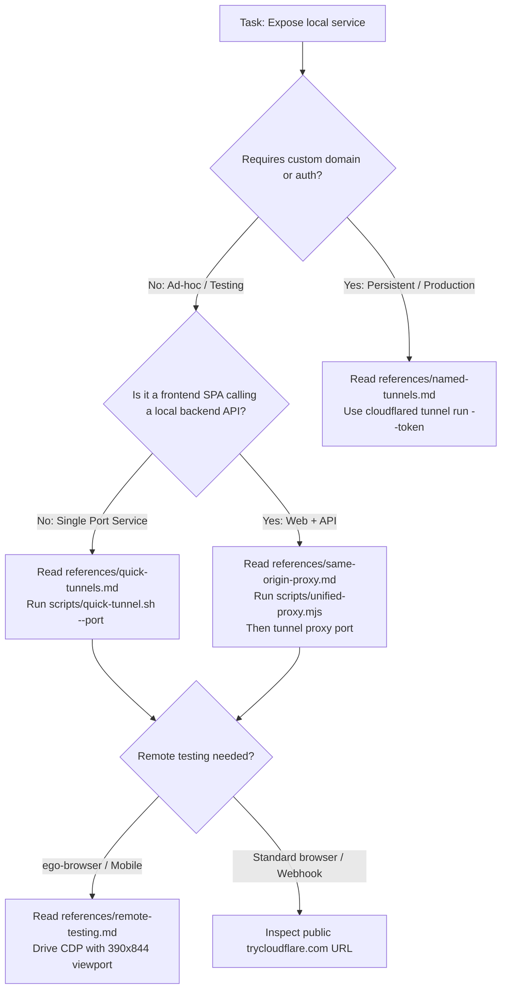

# Cloudflare Tunnel

Expose local development ports, containers, and multi-service architectures to the public internet securely using Cloudflare Tunnel without opening firewall ports.

## Purpose & Mental Model

AI agents often develop applications inside isolated environments (Docker containers, cloud VMs, WSL) that cannot be directly reached by external services, physical mobile devices, or remote browser controllers like `ego-browser`.

Cloudflare Tunnel establishes an outbound encrypted connection (QUIC or HTTP/2) from your local environment to Cloudflare's global edge network:

1. **Quick Tunnels (`trycloudflare.com`):** Zero-configuration, ephemeral public HTTPS URLs. No Cloudflare account or DNS required. Best for ad-hoc agent testing, webhooks, and remote browser validation.
2. **Named Tunnels (Production):** Persistent, authenticated tunnels tied to custom domains and Cloudflare Zero Trust.
3. **Same-Origin Unified Proxy Pattern:** When testing Single Page Applications (React, Expo Web, Vite) that consume local APIs (Supabase, Express, FastAPI), running a lightweight unified reverse proxy on one port eliminates browser **Mixed Content** (`https` -> `http`) and CORS blocks.

---

## Decision Tree



---

## Minimal Reading Sets

Load only the reference files required for your specific path:

| Scenario | Read First | Supporting |
|---|---|---|
| **Quick ad-hoc tunnel for single port** | `references/quick-tunnels.md` | `references/daemon-lifecycle.md` |
| **Frontend SPA + Backend API (Expo, React, Supabase)** | `references/same-origin-proxy.md` | `references/quick-tunnels.md` |
| **Remote browser testing (ego-browser) & mobile viewports** | `references/remote-testing.md` | `references/same-origin-proxy.md` |
| **Production named tunnel with custom domain & DNS** | `references/named-tunnels.md` | `references/ingress-rules.md` |
| **Tunnel fails to connect, 502 Bad Gateway, or UDP blocked** | `references/troubleshooting.md` | `references/networking-protocols.md` |

---

## Quick Starts

### 1. Expose a Single Local Port in One Command
Using the bundled automated script:

```bash
# Starts tunnel in background, extracts URL, verifies connectivity
bash scripts/quick-tunnel.sh --port 8080 --out /tmp/tunnel-url.txt
```

Or via raw CLI:
```bash
cloudflared tunnel --url http://127.0.0.1:8080 --logfile /tmp/cf-8080.log --no-autoupdate &
sleep 4
grep -o 'https://[-a-z0-9.]*trycloudflare.com' /tmp/cf-8080.log | tail -n 1
```

---

### 2. Full-Stack Web + API (Unified Same-Origin Proxy)
Solves the browser **Mixed Content** block where an HTTPS tunnel cannot talk to `http://127.0.0.1:<api-port>`:

```bash
# 1. Start unified proxy on port 8099
node scripts/unified-proxy.mjs \
  --port 8099 \
  --static /tmp/web-dist \
  --api-port 55721 \
  --api-prefixes /api/,/auth/,/rest/,/functions/ &

# 2. Expose the unified proxy
bash scripts/quick-tunnel.sh --port 8099 --out /tmp/public-app.txt
```

---

### 3. Remote Verification with ego-browser (iPhone Dimensions)
Connect a remote Chromium browser running on the host OS to the containerized tunnel:

```javascript
ego-browser nodejs <<'SCRIPT'
const task = await useOrCreateTaskSpace('tunnel-verification');

// Set iPhone mobile viewport (390 x 844)
await cdp('Emulation.setDeviceMetricsOverride', {
  width: 390,
  height: 844,
  deviceScaleFactor: 3,
  mobile: true
});

await openOrReuseTab('https://your-subdomain.trycloudflare.com', { wait: true, timeout: 20 });
await wait(3);

cliLog('Page Text: ' + await snapshotText());

// Keep session open for user inspection
await completeTaskSpace(task.id, { keep: true });
SCRIPT
```

---

## Key Patterns

### Pattern A: Regex URL Extraction
Always parse the assigned subdomain deterministically from the logfile:
```bash
TUNNEL_URL=$(grep -o 'https://[-a-z0-9.]*trycloudflare.com' /tmp/cloudflared.log | head -n 1)
```

### Pattern B: Forcing HTTP/2 Fallback
If corporate firewalls or cloud security groups block UDP port 7844 (QUIC):
```bash
cloudflared tunnel --protocol http2 --url http://127.0.0.1:8080
```

### Pattern C: Clean Teardown
Never leave orphaned tunnel processes:
```bash
bash scripts/tunnel-ctl.sh kill all
```

---

## Common Pitfalls

| Pitfall | Impact | Fix |
|---|---|---|
| **Tunneling only frontend SPA port** | Browser blocks API calls as **Mixed Content** or `ERR_CONNECTION_REFUSED`. | Use `references/same-origin-proxy.md` and `scripts/unified-proxy.mjs`. |
| **Missing `--no-autoupdate`** | `cloudflared` hangs or restarts during agent tool execution. | Always include `--no-autoupdate` on startup. |
| **Port binding to external IP only** | `cloudflared` fails with `502 Bad Gateway` connecting to origin. | Bind local service to `127.0.0.1` or `0.0.0.0`. |
| **Assuming quick tunnel URLs are persistent** | Hardcoded URLs break when daemon restarts. | Re-extract URL from log or switch to `references/named-tunnels.md`. |
| **Orphaned daemons holding ports** | New tunnel runs fail or output old URLs. | Run `bash scripts/tunnel-ctl.sh kill all` before fresh runs. |

---

## Reference Routing Table

Every topic has an exhaustive reference document. Read the relevant file when performing detailed work:

| Reference File | Read When |
|---|---|
| [`references/quick-tunnels.md`](references/quick-tunnels.md) | Setting up ephemeral development tunnels on `trycloudflare.com`, configuring CLI flags, and parsing assigned URLs. |
| [`references/named-tunnels.md`](references/named-tunnels.md) | Setting up persistent production tunnels with Cloudflare Zero Trust, tokens, custom domains, and systemd services. |
| [`references/ingress-rules.md`](references/ingress-rules.md) | Writing `config.yml` ingress rules, path-based routing, `originRequest` timeouts, TLS verification, and validation commands. |
| [`references/same-origin-proxy.md`](references/same-origin-proxy.md) | Resolving Mixed Content and CORS errors when exposing full-stack SPA + API architectures (React, Expo Web, Supabase). |
| [`references/remote-testing.md`](references/remote-testing.md) | Driving `ego-browser`, configuring CDP iPhone viewports, exfiltrating screenshots, and testing external webhooks (Stripe/GitHub). |
| [`references/networking-protocols.md`](references/networking-protocols.md) | Resolving QUIC/UDP packet loss, configuring HTTP/2 fallback (`--protocol http2`), and adjusting firewall egress rules. |
| [`references/daemon-lifecycle.md`](references/daemon-lifecycle.md) | Managing background `cloudflared` processes in agent workflows, metrics endpoints (`/ready`, `/metrics`), and graceful teardown. |
| [`references/troubleshooting.md`](references/troubleshooting.md) | Diagnosing `502 Bad Gateway`, `1033 Argo Tunnel error`, loopback connection refused, and cleaning up zombie processes. |

---

## Verification & Orphan Check

Validate that the skill follows the `build-skill` specification:

```bash
cd /root/.agents/skills/use-cloudflare-tunnel && for f in $(find references -name '*.md' -type f); do grep -q "$(basename $f)" SKILL.md || echo "ORPHAN: $f"; done
```
Must return 0 orphans.
