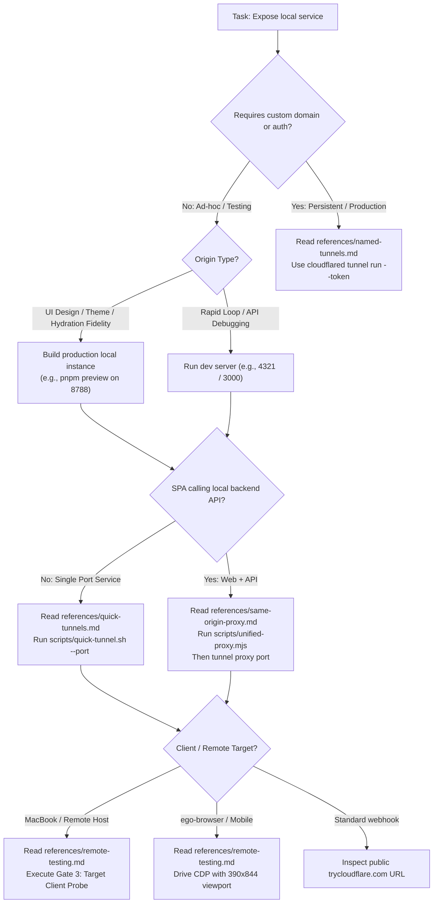

# Cloudflare Tunnel

Expose local development ports, containers, and multi-service architectures to the public internet securely using Cloudflare Tunnel without opening firewall ports.

## Purpose & Mental Model

AI agents often develop applications inside isolated environments (Docker containers, cloud VMs, WSL, local dev servers) that cannot be directly reached by external services, physical mobile devices, or remote browser controllers like `ego-browser`.

Cloudflare Tunnel establishes an outbound encrypted connection (QUIC or HTTP/2 over port 7844) from your local environment to Cloudflare's global edge network:

1. **Quick Tunnels ([`try.cloudflare.com`](https://try.cloudflare.com/)):** Zero-configuration, ephemeral public HTTPS URLs. No Cloudflare account, API tokens, or DNS required. Features native agent support via `--output json`. Best for ad-hoc agent testing, webhooks, and remote browser validation.
   * **Agent Trade-offs:** Zero secret leakage risk and instant one-command setup, but subdomains rotate on restart (`*.trycloudflare.com`) and lack Cloudflare Access Zero Trust policies.
2. **Named Tunnels (Production):** Persistent, authenticated tunnels tied to custom domains and Cloudflare Zero Trust Access policies.
3. **Same-Origin Unified Proxy Pattern:** When testing Single Page Applications (React, Expo Web, Vite) that consume local APIs (Supabase, Express, FastAPI), running a lightweight unified reverse proxy on one port eliminates browser **Mixed Content** (`https` -> `http`) and CORS blocks.

### The Mandatory 3-Gate Verification Rule

Never report a tunnel URL to a user or open a browser on a remote machine until all 3 gates pass:

```
┌────────────────────────────────────────────────────────────────────────┐
│ Gate 1: Local Origin Health                                            │
│ curl -s -f http://127.0.0.1:<PORT>/<path>  ──> Must return HTTP 200    │
└───────────────────────────────────┬────────────────────────────────────┘
                                    ▼
┌────────────────────────────────────────────────────────────────────────┐
│ Gate 2: Global DNS Publication (60s SOA Negative Cache Window)         │
│ dig @1.1.1.1 +short <subdomain>            ──> Must return Edge IPs    │
└───────────────────────────────────┬────────────────────────────────────┘
                                    ▼
┌────────────────────────────────────────────────────────────────────────┐
│ Gate 3: Target Client Reachability (Zero False Positives)              │
│ ssh <client> "curl -s -o /dev/null -w '%{http_code}' <URL>"  ──> 200 OK│
└────────────────────────────────────────────────────────────────────────┘
```

---

## Decision Tree


```mermaid
flowchart TD
    Start["Task: Expose local service"] --> NeedAuth{"Requires custom domain or auth?"}
    
    NeedAuth -->|No: Ad-hoc / Testing| TargetOrigin{"Origin Type?"}
    NeedAuth -->|Yes: Persistent / Production| NamedTunnel["Read references/named-tunnels.md
Use cloudflared tunnel run --token"]
    
    TargetOrigin -->|UI Design / Theme / Hydration Fidelity| BuiltInstance["Build production local instance
(e.g., pnpm preview on 8788)"]
    TargetOrigin -->|Rapid Loop / API Debugging| DevInstance["Run dev server (e.g., 4321 / 3000)"]

    BuiltInstance --> IsFullStack{"SPA calling local backend API?"}
    DevInstance --> IsFullStack

    IsFullStack -->|Yes: Web + API| Unified["Read references/same-origin-proxy.md
Run scripts/unified-proxy.mjs
Then tunnel proxy port"]
    IsFullStack -->|No: Single Port Service| QuickTunnel["Read references/quick-tunnels.md
Run scripts/quick-tunnel.sh --port <P>"]

    QuickTunnel --> VerifyTarget{"Client / Remote Target?"}
    Unified --> VerifyTarget
    
    VerifyTarget -->|MacBook / Remote Host| TargetProbe["Read references/remote-testing.md
Execute Gate 3: Target Client Probe"]
    VerifyTarget -->|ego-browser / Mobile| Remote["Read references/remote-testing.md
Drive CDP with 390x844 viewport"]
    VerifyTarget -->|Standard webhook| Done["Inspect public trycloudflare.com URL"]
```

---

## Minimal Reading Sets

Load only the reference files required for your specific path:

| Scenario | Read First | Supporting |
|---|---|---|
| **Quick ad-hoc tunnel for single port** | `references/quick-tunnels.md` | `references/daemon-lifecycle.md` |
| **Frontend SPA + Backend API (Expo, React, Supabase)** | `references/same-origin-proxy.md` | `references/quick-tunnels.md` |
| **Remote browser testing (MacBook `open`, ego-browser, mobile)** | `references/remote-testing.md` | `references/daemon-lifecycle.md` |
| **Production named tunnel with custom domain & DNS** | `references/named-tunnels.md` | `references/ingress-rules.md` |
| **Tunnel fails, 502, NXDOMAIN lock, or UDP blocked** | `references/troubleshooting.md` | `references/networking-protocols.md` |

---

## Quick Starts

### 1. Expose a Single Local Port with Process Group Isolation
Using the bundled automated script:

```bash
# Starts tunnel detached, extracts URL, verifies DNS (auto-handles macOS/Linux)
bash scripts/quick-tunnel.sh --port 8080 --out /tmp/tunnel-url.txt
```

Or via raw CLI with agent-safe process isolation and native `--output json`:
```bash
# 1. Clean previous state (DO NOT delete ~/.cloudflared which stores production certs!)
rm -f /tmp/cloudflared-8080.log /tmp/cloudflared-8080.pid

# 2. Launch detached daemon (auto-fallback across Linux setsid / macOS nohup)
CF_ARGS=(tunnel --url "http://127.0.0.1:8080" --protocol auto --logfile /tmp/cloudflared-8080.log --pidfile /tmp/cloudflared-8080.pid --no-autoupdate --output json)
if command -v setsid &>/dev/null; then
  setsid nohup cloudflared "${CF_ARGS[@]}" </dev/null >/dev/null 2>&1 &
else
  nohup cloudflared "${CF_ARGS[@]}" </dev/null >/dev/null 2>&1 &
fi

# 3. Extract URL (or parse json events)
sleep 3
TUNNEL_URL=$(grep -o 'https://[-a-z0-9.]*trycloudflare.com' /tmp/cloudflared-8080.log | tail -n 1)
```

---

### 2. The 2-Step DNS Handshake (Preventing 60-Second Negative-Cache Delays)

When a new `*.trycloudflare.com` subdomain is assigned, public authoritative edge DNS requires 1–3s to propagate. Querying client/local DNS (e.g. Tailscale MagicDNS `100.100.100.100`) prematurely causes an immediate **60-second RFC 2308 negative-cache lock** (Cloudflare SOA minimum TTL).

```bash
HOST_ONLY=$(echo "$TUNNEL_URL" | sed -E 's#^https?://##')

# Step A: Wait for global authoritative DNS (1.1.1.1 & 8.8.8.8)
for i in {1..15}; do
  IP1=$(dig @1.1.1.1 +short "$HOST_ONLY" 2>/dev/null | tail -n 1)
  IP2=$(dig @8.8.8.8 +short "$HOST_ONLY" 2>/dev/null | tail -n 1)
  if [[ -n "$IP1" && -n "$IP2" ]]; then break; fi
  sleep 1
done

# Step B: Flush client DNS cache before first query
if command -v dscacheutil &>/dev/null; then
  dscacheutil -flushcache 2>/dev/null || true
fi

# Step C: Verify directly from target client machine (Target Perspective Gate)
# e.g., ssh <client> "curl -s -L -o /dev/null -w '%{http_code}' -m 5 '$TUNNEL_URL'" # Returns 200 or 3xx redirect
```

---

### 3. Full-Stack Web + API (Unified Same-Origin Proxy)
Solves the browser **Mixed Content** block where an HTTPS tunnel cannot talk to `http://127.0.0.1:<api-port>`:

```bash
# 1. Start unified proxy on port 8099
node scripts/unified-proxy.mjs \
  --port 8099 \
  --static /tmp/web-dist \
  --api-port 55721 \
  --api-prefixes /api/,/auth/,/rest/,/functions/ &

# 2. Expose the unified proxy with isolated daemon
bash scripts/quick-tunnel.sh --port 8099 --out /tmp/public-app.txt
```

---

## Key Patterns

### Pattern A: Cross-Platform Process-Isolated Daemon Spawning
Decouple the tunnel daemon from the tool invocation process group:
```bash
CF_ARGS=(tunnel --url "http://127.0.0.1:${PORT}" --protocol auto --logfile "$LOGFILE" --output json)
if command -v setsid &>/dev/null; then
  setsid nohup cloudflared "${CF_ARGS[@]}" </dev/null >/dev/null 2>&1 &
else
  nohup cloudflared "${CF_ARGS[@]}" </dev/null >/dev/null 2>&1 &
fi
```

### Pattern B: Protocol Negotiation (`auto` vs `http2`)
While Named Tunnels default to `auto`, ad-hoc quick tunnels (`cloudflared tunnel --url ...`) internally default to `quic` unless `--protocol auto` is explicitly supplied. Always pass `--protocol auto` so `cloudflared` automatically falls back to HTTP/2 over TCP port 7844 if UDP is blocked by firewalls:
```bash
# Recommended: Auto-negotiate QUIC with HTTP/2 fallback
cloudflared tunnel --protocol auto --url http://127.0.0.1:8080

# Or force pure HTTP/2 if UDP 7844 is strictly prohibited:
cloudflared tunnel --protocol http2 --url http://127.0.0.1:8080
```

### Pattern C: Clean Teardown (Preserving Named Tunnels)
Never delete `~/.cloudflared/` during quick tunnel cleanup! That directory stores production named tunnel credentials. Clean only process instances and temporary logs:
```bash
pkill -f "cloudflared tunnel" || true
rm -f /tmp/cloudflared*
```

---

## Common Pitfalls

| Pitfall | Impact | Fix |
|---|---|---|
| **Wiping `~/.cloudflared/`** | Destroys permanent named tunnel `cert.pem` and `<UUID>.json` keys! | Quick tunnels do NOT use `~/.cloudflared/`. Delete only `/tmp/cloudflared-*`. |
| **Assuming HTTP/2 runs on port 443** | Firewall still blocks tunnel even with `--protocol http2`. | Open outbound destination **port 7844 TCP & UDP** (tunnel data plane). Port 443 is control plane only. |
| **Hardcoding `setsid` on macOS** | Silent failure when `setsid` is absent, causing 20s script timeouts. | Use `if command -v setsid; then setsid ...; else nohup ...; fi`. |
| **Hardcoding glob `path: /v2/*` in ingress** | Fails to match subpaths because `path` is evaluated as Go regex. | Use Go regex `path: /v2/.*` or `path: ^/v2/`. |
| **Probing tunnel from origin container only** | False-positive 200 OK while remote user gets connection failure or DNS error. | Mandate **Target Client Perspective Probe** (`curl == 200` from client network stack). |
| **Early DNS query before edge propagation** | Client resolver caches negative answer for 60s SOA TTL. | Wait for `1.1.1.1` & `8.8.8.8` `NOERROR` first, then flush client DNS. |
| **Tunneling only frontend SPA port** | Browser blocks API calls as **Mixed Content** or `ERR_CONNECTION_REFUSED`. | Use `references/same-origin-proxy.md` and `scripts/unified-proxy.mjs`. |
| **Missing `--no-autoupdate`** | `cloudflared` hangs or restarts during agent tool execution. | Always include `--no-autoupdate` on startup. |

---

## Reference Routing Table

Every topic has an exhaustive reference document. Read the relevant file when performing detailed work:

| Reference File | Read When |
|---|---|
| [`references/quick-tunnels.md`](references/quick-tunnels.md) | Setting up ephemeral development tunnels on `trycloudflare.com`, `--output json` agent mode, DNS propagation timings, and CLI flags. |
| [`references/named-tunnels.md`](references/named-tunnels.md) | Setting up persistent production tunnels with Cloudflare Zero Trust, tokens, custom domains, and systemd services. |
| [`references/ingress-rules.md`](references/ingress-rules.md) | Writing `config.yml` ingress rules, Go regex path routing, `originRequest` timeouts, TLS verification, and validation commands. |
| [`references/same-origin-proxy.md`](references/same-origin-proxy.md) | Resolving Mixed Content and CORS errors when exposing full-stack SPA + API architectures (React, Expo Web, Supabase). |
| [`references/remote-testing.md`](references/remote-testing.md) | Driving `ego-browser`, target client verification gates, and external webhook testing. |
| [`references/networking-protocols.md`](references/networking-protocols.md) | Understanding QUIC/HTTP/2 over port 7844, Post-Quantum hybrid key exchange, and running `cloudflared tunnel diag`. |
| [`references/daemon-lifecycle.md`](references/daemon-lifecycle.md) | Managing background `cloudflared` daemons cross-platform, PID tracking, metrics endpoints, and safe teardown. |
| [`references/troubleshooting.md`](references/troubleshooting.md) | Diagnosing `502 Bad Gateway`, `1033 Argo Tunnel error`, 60s SOA negative cache locks, and false-positive probe failures. |

---

## Verification & Orphan Check

Validate that the skill follows the specification:

```bash
for f in $(find references -name '*.md' -type f); do grep -q "$(basename "$f")" SKILL.md || echo "ORPHAN: $f"; done
```
Must return 0 orphans.
