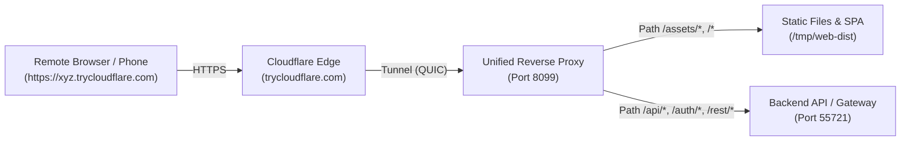

# The Same-Origin Unified Proxy Pattern for SPAs & APIs

When exposing full-stack applications (Frontend Single Page Application + Backend API) through Cloudflare Tunnel, naive single-port forwarding almost always breaks. This reference explains why and provides the standard solution.

---

## 1. The Mixed-Content Trap (Why Naive Tunneling Fails)

Suppose your development environment runs:
* **Frontend Web App (Expo Web / React / Vite):** on `http://127.0.0.1:8099`
* **Backend API / Supabase / Express / FastAPI:** on `http://127.0.0.1:55721`

If you tunnel only the frontend:
```bash
cloudflared tunnel --url http://127.0.0.1:8099
# Gives: https://my-app.trycloudflare.com
```

When a user or remote browser opens `https://my-app.trycloudflare.com`:
1. The browser successfully downloads `index.html` and the compiled JavaScript bundle.
2. The JavaScript code executes inside the remote user's browser.
3. The JavaScript tries to call its configured backend API:
   ```javascript
   fetch("http://127.0.0.1:55721/api/v1/data")
   ```
4. **FATAL ERROR:**
   * **Failure 1 (Mixed Content Block):** Modern browsers block active network requests from an HTTPS origin (`https://my-app.trycloudflare.com`) to an unencrypted HTTP endpoint (`http://...`).
   * **Failure 2 (Target Isolation):** The remote browser resolves `127.0.0.1` on *its own* device (the host laptop or phone), not inside the container where your backend actually lives. The request fails with `ERR_CONNECTION_REFUSED`.

---

## 2. The Solution: Unified Same-Origin Proxy

Instead of tunneling the frontend or backend directly, place a lightweight reverse proxy in front of both. Then tunnel **only the proxy port**.



### Key Advantages:
1. **Zero Mixed-Content Warnings:** Everything is accessed through the same HTTPS origin (`https://xyz.trycloudflare.com`).
2. **Zero CORS Issues:** API requests and web pages share the exact same scheme, host, and port.
3. **Single Tunnel Lifecycle:** Only one `cloudflared` process to launch, monitor, and tear down.

---

## 3. Dynamic Bundle Origin Patching

In compiled frontend bundles (e.g., built by Expo Web, Vite, or Webpack), environment variables like `API_BASE_URL` or `EXPO_PUBLIC_SUPABASE_URL` are often hardcoded to `http://127.0.0.1:55721` during build time.

To make the bundle work both locally and over any tunnel URL without rebuilding:

### In Source Code:
```typescript
const apiBaseUrl = typeof window !== 'undefined' && window.location.origin
  ? window.location.origin
  : process.env.EXPO_PUBLIC_API_URL || 'http://127.0.0.1:55721';
```

### Or Post-Build Automated Patch (via Node script):
If the bundle was already compiled with a hardcoded URL:
```javascript
import fs from 'node:fs';
const bundlePath = '/path/to/dist/_expo/static/js/web/bundle.js';
let code = fs.readFileSync(bundlePath, 'utf8');

// Replace hardcoded localhost API target with dynamic browser origin
code = code.replace(
  '"http://127.0.0.1:55721"',
  '(typeof window!=="undefined"&&window.location.origin?window.location.origin:"http://127.0.0.1:55721")'
);

fs.writeFileSync(bundlePath, code, 'utf8');
```

---

## 4. Running the Unified Proxy Script

Use the bundled `scripts/unified-proxy.mjs` script:

```bash
# Start unified proxy
node scripts/unified-proxy.mjs \
  --port 8099 \
  --static /path/to/web/dist \
  --api-port 55721 \
  --api-prefixes /api/,/auth/,/rest/,/functions/ &

# Expose via quick tunnel
cloudflared tunnel --url http://127.0.0.1:8099 --logfile /tmp/cf.log &
```

---

## 5. Alternative Implementations

### Caddyfile (Zero SSL locally, auto reverse proxy)
```caddy
:8099 {
    handle /api/* {
        reverse_proxy 127.0.0.1:55721
    }
    handle {
        root * /path/to/dist
        file_server
        try_files {path} /index.html
    }
}
```

### Nginx Configuration
```nginx
server {
    listen 8099;
    
    location /api/ {
        proxy_pass http://127.0.0.1:55721;
        proxy_set_header Host $host;
        proxy_set_header X-Forwarded-For $remote_addr;
    }

    location / {
        root /path/to/dist;
        index index.html;
        try_files $uri $uri/ /index.html;
    }
}
```
