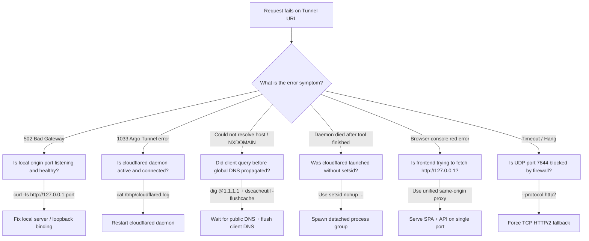

# Troubleshooting & Diagnostic Matrix

Exhaustive diagnostic procedures for resolving Cloudflare Tunnel failures, origin connectivity issues, DNS negative cache locks, and browser security blocks.

---

## 1. Quick Diagnostic Decision Tree



---

## 2. Diagnostic Matrix

| Error Symptom | Root Cause | Solution |
|---|---|---|
| **`Could not resolve host / NXDOMAIN on target machine`** | Target machine (or MagicDNS `100.100.100.100`) queried the new subdomain 1s before global DNS publication, caching `NXDOMAIN` for 300s. | 1. Verify `1.1.1.1` has record: `dig @1.1.1.1 +short <HOST>`.<br>2. Flush client DNS: `ssh macbook "dscacheutil -flushcache"`.<br>3. If stuck, kill daemon, wipe `~/.cloudflared`, and request a fresh subdomain. |
| **`Tunnel daemon dies when agent finishes tool`** | Process was spawned in tool subshell without process group isolation (`setsid`). Subshell exit sent `SIGHUP`/`SIGTERM`. | Spawn using `setsid nohup cloudflared tunnel ... </dev/null >/dev/null 2>&1 &`. |
| **`Agent reports 200 OK, but user cannot open page`** | False-positive probe: Agent tested from origin container loopback (or with `--resolve`), ignoring client-side network stack. | Mandate **Target Client Perspective Probe**: `ssh <target> "curl -s -o /dev/null -w '%{http_code}' <URL>"` must return 200. |
| **`502 Bad Gateway`** | `cloudflared` is connected to edge, but cannot reach the local port specified in `--url`. | 1. Check local server: `curl -Is http://127.0.0.1:<PORT>`<br>2. Ensure server binds to `127.0.0.1` or `0.0.0.0` (not external IP).<br>3. Check if local server crashed. |
| **`1033 Argo Tunnel error`** | Cloudflare edge has no active connection for the tunnel UUID or subdomain. | 1. The `cloudflared` process was stopped or killed.<br>2. Check `pgrep -a -f cloudflared` to ensure daemon is alive.<br>3. Check log for `Initiating graceful shutdown`. |
| **`Blocked: mixed-content`** | The web page was loaded over `https://...trycloudflare.com`, but client JS calls `http://127.0.0.1:<API>`. | **Apply Same-Origin Proxy:** Run `scripts/unified-proxy.mjs` to serve both web build and API under the single HTTPS tunnel origin. |
| **`ERR_CONNECTION_REFUSED`** | Remote browser evaluated `fetch('http://127.0.0.1:port')` on *its own* machine. | Remote devices cannot reach the container's localhost. Route API requests through the tunnel or unified proxy. |
| **`QUIC connection failed`** | UDP port 7844 is blocked by intermediate router, cloud security group, or ISP. | Pass `--protocol http2` to fall back to standard TCP port 443. |
| **`CORS error / No 'Access-Control-Allow-Origin'`** | Origin server rejected cross-origin preflight `OPTIONS` request. | Ensure backend API or reverse proxy returns `Access-Control-Allow-Origin: *` and handles `OPTIONS` with status 204. |

---

## 3. Systematic Diagnostic Commands

Run this sequence to diagnose any failing tunnel:

```bash
# Step 1: Check if local service is responding locally
curl -Is http://127.0.0.1:8099 || echo "FAIL: Local origin is not listening on 8099!"

# Step 2: Check if cloudflared daemon is alive
pgrep -a -f "cloudflared tunnel" || echo "FAIL: cloudflared daemon is NOT running!"

# Step 3: Check global DNS publication on 1.1.1.1
dig @1.1.1.1 +short <subdomain>.trycloudflare.com || echo "FAIL: Not published on 1.1.1.1 yet!"

# Step 4: Probe directly from target client machine
ssh macbook "curl -s -o /dev/null -w '%{http_code}' https://<subdomain>.trycloudflare.com" || echo "FAIL: Client cannot reach tunnel!"
```
