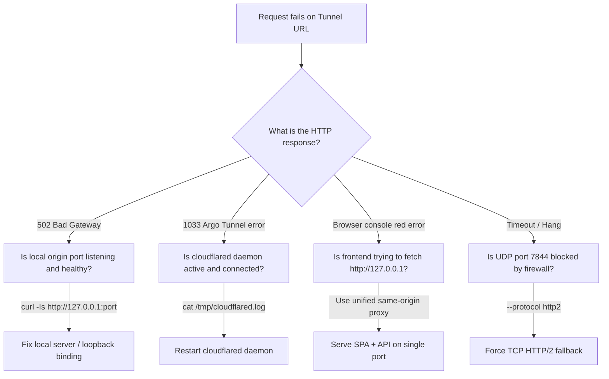

# Troubleshooting & Diagnostic Matrix

Exhaustive diagnostic procedures for resolving Cloudflare Tunnel failures, origin connectivity issues, and browser security blocks.

---

## 1. Quick Diagnostic Decision Tree



---

## 2. Diagnostic Matrix

| Error Symptom | Root Cause | Solution |
|---|---|---|
| **`502 Bad Gateway`** | `cloudflared` is connected to edge, but cannot reach the local port specified in `--url`. | 1. Check local server: `curl -Is http://127.0.0.1:<PORT>`<br>2. Ensure server binds to `127.0.0.1` or `0.0.0.0` (not external IP).<br>3. Check if local server crashed. |
| **`1033 Argo Tunnel error`** | Cloudflare edge has no active connection for the tunnel UUID or subdomain. | 1. The `cloudflared` process was stopped or killed.<br>2. Check `pgrep -a -f cloudflared` to ensure daemon is alive.<br>3. Check log for `Initiating graceful shutdown`. |
| **`Blocked: mixed-content`** | The web page was loaded over `https://...trycloudflare.com`, but client JS calls `http://127.0.0.1:<API>`. | **Apply Same-Origin Proxy:** Run `scripts/unified-proxy.mjs` to serve both web build and API under the single HTTPS tunnel origin. |
| **`ERR_CONNECTION_REFUSED`** | Remote browser evaluated `fetch('http://127.0.0.1:port')` on *its own* machine. | Remote devices cannot reach the container's localhost. Route API requests through the tunnel or unified proxy. |
| **`QUIC connection failed`** | UDP port 7844 is blocked by intermediate router, cloud security group, or ISP. | Pass `--protocol http2` to fall back to standard TCP port 443. |
| **`CORS error / No 'Access-Control-Allow-Origin'`** | Origin server rejected cross-origin preflight `OPTIONS` request. | Ensure backend API or reverse proxy returns `Access-Control-Allow-Origin: *` and handles `OPTIONS` with status 204. |
| **`Cannot determine default config path`** | Informational warning when running quick tunnels without `config.yml`. | Harmless for quick tunnels. Can be silenced with `--no-autoupdate`. |
| **`Group ID 0 is not between ping_group_range`** | Running as root inside Docker container prevents ICMP ping creation. | Harmless for HTTP/HTTPS/WebSocket tunnels. No action required. |

---

## 3. Systematic Diagnostic Commands

Run this sequence to diagnose any failing tunnel:

```bash
# Step 1: Check if local service is responding locally
curl -Is http://127.0.0.1:8099 || echo "FAIL: Local origin is not listening on 8099!"

# Step 2: Check if cloudflared process is alive
pgrep -a -f "cloudflared tunnel" || echo "FAIL: cloudflared daemon is NOT running!"

# Step 3: Inspect the latest 25 lines of tunnel logs
tail -n 25 /tmp/cloudflared*.log

# Step 4: Test public tunnel endpoint
curl -Is --max-time 8 https://<assigned-url>.trycloudflare.com
```
