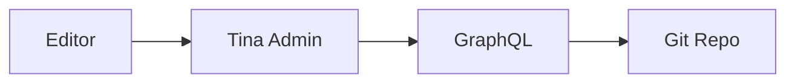

# Mermaid Diagrams

The `mermaid` toolbar item lets editors insert Mermaid diagrams. The default `TinaMarkdown` doesn't render them — you wire it up via the components prop.

## Schema side

Mermaid is built into the rich-text editor. Editors get a "Mermaid" option in the toolbar:

```typescript
{
  name: 'body',
  type: 'rich-text',
  isBody: true,
  // Mermaid is included in the default toolbar.
  // To restrict the toolbar:
  toolbarOverride: ['heading', 'bold', 'italic', 'codeBlock', 'mermaid'],
}
```

Mermaid blocks are stored as fenced code blocks with the `mermaid` language tag:

````mdx

````

## Rendering

You override the `code_block` component to detect mermaid:

```tsx
'use client'

import { useEffect, useRef } from 'react'
import mermaid from 'mermaid'

mermaid.initialize({ startOnLoad: false, theme: 'default' })

function MermaidBlock({ code }: { code: string }) {
  const ref = useRef<HTMLDivElement>(null)

  useEffect(() => {
    if (ref.current) {
      mermaid.render(`m-${Math.random()}`, code).then(({ svg }) => {
        if (ref.current) ref.current.innerHTML = svg
      })
    }
  }, [code])

  return <div ref={ref} className="mermaid-diagram" />
}

const components = {
  code_block: (props) => {
    if (props.lang === 'mermaid') {
      return <MermaidBlock code={props.value} />
    }
    return (
      <pre className={`language-${props.lang || 'text'}`}>
        <code>{props.value}</code>
      </pre>
    )
  },
}
```

## Static rendering (no client JS)

For SSG / Server Components, render mermaid at build time:

```tsx
import mermaid from 'mermaid'

async function renderMermaid(code: string) {
  // Run server-side via headless browser or @mermaid-js/mermaid-cli
  // ...returns SVG string
}

const components = {
  code_block: async (props) => {
    if (props.lang === 'mermaid') {
      const svg = await renderMermaid(props.value)
      return <div dangerouslySetInnerHTML={{ __html: svg }} />
    }
    return /* ... */
  },
}
```

For most projects the client-side approach is simpler.

## Performance

Mermaid + dependencies adds ~150KB to the client bundle. If you use Mermaid only on a handful of pages, lazy-load it:

```tsx
import dynamic from 'next/dynamic'

const MermaidBlock = dynamic(() => import('./MermaidBlock'), {
  ssr: false,
  loading: () => <div>Loading diagram…</div>,
})
```

## Theming

```typescript
mermaid.initialize({
  startOnLoad: false,
  theme: 'dark',          // 'default', 'dark', 'forest', 'neutral'
  themeVariables: {
    primaryColor: '#3b82f6',
  },
})
```

Match the diagram theme to your site's design system.

## Editor experience

When editors insert a Mermaid diagram, they get:

- A code editor in the admin (textarea)
- Optional preview rendering (depends on TinaCMS version)
- Save commits as a fenced `mermaid` code block

Test diagram syntax at https://mermaid.live before saving complex diagrams.

## Common mistakes

| Mistake | Effect | Fix |
|---|---|---|
| Mermaid in code_block override but no detection on `lang` | All code blocks try to render as mermaid | Branch on `props.lang === 'mermaid'` |
| Mermaid initialized at module top in Server Component | SSR error | Initialize inside `useEffect` |
| Including Mermaid on every page | Bundle bloat | Lazy-load with `dynamic` |
| Server-side mermaid render without headless browser | Empty output | Either use client-side or set up SSR rendering pipeline |
