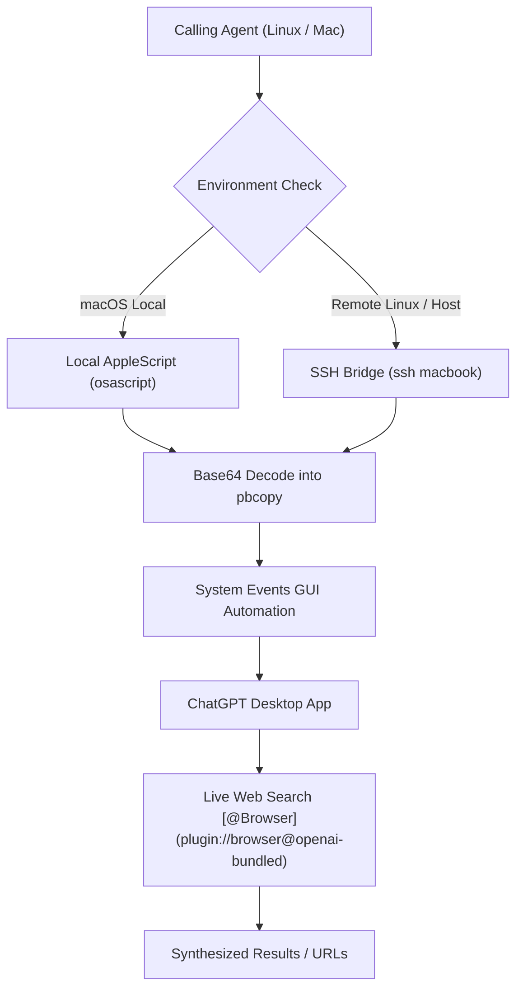

# ChatGPT macOS Research Bridge

Drive the native macOS **ChatGPT desktop app** (`/Applications/ChatGPT.app`) as an autonomous web research engine. Dispatch structured prompts, trigger live browsing via the bundled Browser plugin, execute rapid batch bursts without UI lag, and protect against rate limits using automated cooldown windows.

---

## When to Use

*Match any one of the following:*

- *Running deep web research via macOS ChatGPT desktop app from a terminal, remote server, or agent*
- *Automating person, clinician, executive, or company background investigations using ChatGPT's live web browsing*
- *Searching for authentic human portraits / face verification while strictly rejecting stock photos, logos, and empty rooms*
- *Dispatching high-volume research prompts to ChatGPT in 10-item bursts with 5-minute rate-limit cooldown intervals*
- *Connecting a Linux server or container to a Mac workstation via SSH (`ssh macbook`) to control ChatGPT.app via AppleScript*

**Do NOT use this skill for:**

- Direct OpenAI API calls (use official OpenAI SDK or MCP tools instead)
- Headless browser automation without ChatGPT (use `run-agent-browser` or `ego-browser`)
- Local codebase or filesystem-only search (use `grep_search` or `find_by_name`)

---

## Core Architecture & Capabilities



### Key Engineering Guarantees

1. **Tool Invocation:** Prefixes prompts with `[@Browser](plugin://browser@openai-bundled)` to guarantee ChatGPT triggers its browsing tool instead of answering from static memory.
2. **Safe Transport:** Encodes prompt payloads in Base64 before piping into `pbcopy`. Eliminates quote escaping bugs, shell expansion syntax errors, and Unicode truncation.
3. **Rapid Burst ("Tak-Tak-Tak"):** Sends batches of 10 prompts back-to-back with minimal micro-delays (~1.2s per prompt: `Cmd+N` → 0.5s → `Cmd+V` → 0.3s → `Enter`).
4. **Rate Limit Shield:** Automatically enforces a 5-minute (300s) cooldown between batches of 10 to allow ChatGPT's browser agents to complete their work and prevent account throttling.
5. **State Persistence:** Records submitted query IDs in a JSON ledger so interrupted batches can resume immediately without duplicate submissions.

---

## Quick Start Recipes

### 1. Verify Bridge Health

Verify that the Mac workstation is reachable and ChatGPT is active:

```bash
node skills/chatgpt-mac-research/scripts/chatgpt-research-runner.mjs --check-bridge
```

### 2. Single Research Prompt

Dispatch a targeted query with automatic browser tool activation:

```bash
node skills/chatgpt-mac-research/scripts/chatgpt-research-runner.mjs \
  --prompt "Find the verified official practice website and public portrait of Dr. med. Leyla Duman in Munich."
```

### 3. Batch Campaign from Targets File

Given a JSON file of research items (`[ { "id": "target-1", "query": "..." } ]`):

```bash
node skills/chatgpt-mac-research/scripts/chatgpt-research-runner.mjs \
  --targets targets.json \
  --batch-size=10 \
  --wait-minutes=5 \
  --state-file=.chatgpt_state.json
```

---

## Workflow Steps

### Step 1: Prepare & Sanitize the Research Payload

1. **Strip Internal Context:** Never expose internal project filenames (e.g. `cities/almanya/...`) in prompts dispatched to ChatGPT.
2. **Define Search Breadth:** If an official domain is known, provide it as a starting reference, but explicitly command ChatGPT to search broadly across search engines, registries, and professional networks.
3. **Specify Negative Constraints:** Explicitly ban stock photos, clinic logos, empty furniture/rooms, and colleague photos.
4. Read `references/prompt-templates.md` for domain-specific prompt blueprints.

### Step 2: Select Transport Mode

1. **Local macOS:** Directly calls `/usr/bin/osascript` via Node `child_process`.
2. **Remote Host:** Bridges over `ssh macbook` (or custom host defined by `--ssh-host` or `$CHATGPT_SSH_HOST`).
3. Read `references/mac-applescript-bridge.md` for SSH configuration, TCC Accessibility setup, and micro-timing adjustments.

### Step 3: Execute Batch Dispatch & Cooldown

1. Run queries in groups of 10.
2. Within the group, dispatch immediately ("tak-tak-tak") using keyboard simulation (`Cmd+N`, `Cmd+V`, `Return`).
3. Pause for 5 minutes between groups to respect OpenAI desktop rate limits.
4. Read `references/batch-and-rate-limits.md` for ledger schemas and cooldown mechanics.

### Step 4: Harvest & Verify Evidence

1. Collect direct image URLs or textual citations from ChatGPT responses.
2. If verifying portraits: inspect the returned asset visually (`view_file` or image decoder) before ingesting to confirm genuine human face authenticity.

---

## Reference Routing

| Reference File | Read When |
|---|---|
| `references/prompt-templates.md` | Authoring research prompts, formatting the `[@Browser](plugin://browser@openai-bundled)` tag, or setting negative constraints. |
| `references/mac-applescript-bridge.md` | Configuring SSH tunnels (`~/.ssh/config`), debugging AppleScript/osascript, resolving macOS TCC Accessibility permissions, or tuning keystroke delays. |
| `references/batch-and-rate-limits.md` | Tuning burst size, adjusting cooldown intervals, or inspecting/resetting the state persistence ledger. |

---

## Guardrails & Non-Negotiable Rules

1. **Exact Browser URI:** Never use plain text `@Browser` when tool attachment is required. Always use `[@Browser](plugin://browser@openai-bundled)`.
2. **Base64 Encoding:** Always pipe clipboard data through Base64 to prevent bash escaping errors over SSH.
3. **No Unbounded Loops:** Never fire more than 10 consecutive queries to ChatGPT desktop app without an inter-batch cooldown.
4. **State Ledger:** Always persist submitted item IDs to disk so progress is never lost if the agent or host restarts.
