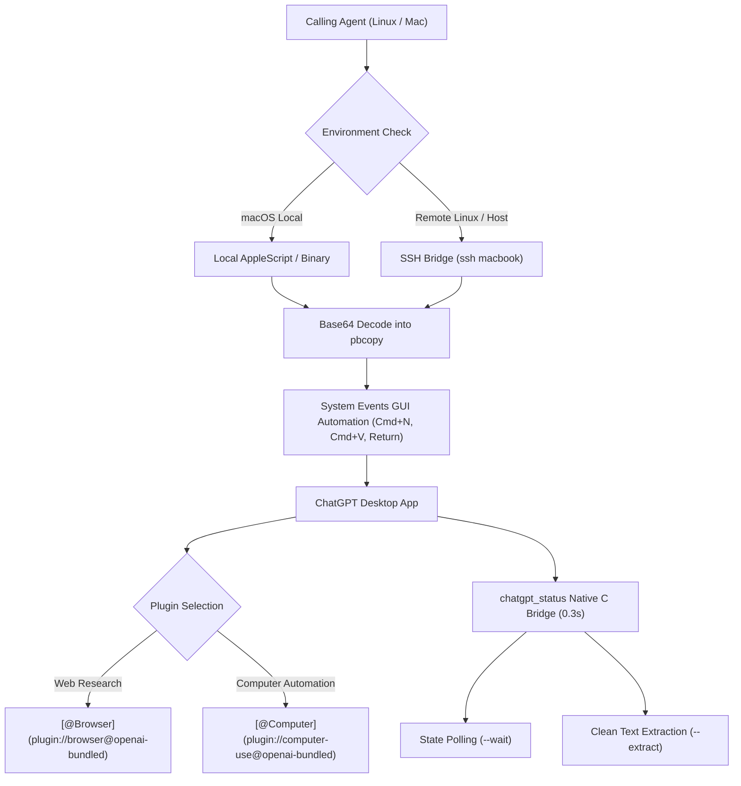

# ChatGPT macOS Research & Automation Bridge

Drive the native macOS **ChatGPT desktop app** (`/Applications/ChatGPT.app`) as an autonomous web research and OS automation engine. Dispatch structured prompts, trigger live browsing via `@Browser` or desktop automation via `@Computer`, monitor generation completion via real-time macOS accessibility hooks, extract synthesized results, and manage high-volume batch campaigns.

---

## When to Use

*Match any one of the following:*

- *Running deep web research via macOS ChatGPT desktop app from a terminal, remote server, or agent*
- *Triggering ChatGPT computer automation (`@Computer`) to interact with the Mac workstation or local environment*
- *Automating person, clinician, executive, or company background investigations using ChatGPT's live web browsing (`@Browser`)*
- *Checking whether ChatGPT on the Mac is actively generating or finished (`chatgpt_status` / `--wait` / `--status`)*
- *Extracting clean markdown responses and citations directly from the ChatGPT desktop window (`--extract`)*
- *Dispatching high-volume research prompts to ChatGPT in 10-item bursts with 5-minute rate-limit cooldown intervals*
- *Connecting a Linux server or container to a Mac workstation via SSH (`ssh macbook`) to control ChatGPT.app via AppleScript*

**Do NOT use this skill for:**

- Direct OpenAI API calls (use official OpenAI SDK or MCP tools instead)
- Headless browser automation without ChatGPT (use `run-agent-browser` or `ego-browser`)
- Local codebase or filesystem-only search (use `grep_search` or `find_by_name`)

---

## Plugin Dispatch Decision Framework

When interacting with ChatGPT desktop app, select the appropriate plugin scheme based on the objective:

| Task Objective | Requirement | Prepend Tag |
|---|---|---|
| **Live Web Research** | Search engines, online registries, news, verified current URLs, external citations | `[@Browser](plugin://browser@openai-bundled)` |
| **Computer & OS Actions** | Desktop interaction, local app usage, filesystem tasks, running shell commands, screen review | `[@Computer](plugin://computer-use@openai-bundled)` |
| **Hybrid Research & Local Execution** | Web search followed by local file generation or OS-level automation | Both tags prepended |
| **Pure Reasoning / Coding** | Internal text synthesis, translation, code refactoring, math, formatting | *No plugin tag added* |

> [!IMPORTANT]
> Never use plain text `@Browser` or `@Computer` when tool attachment is required. Always use the exact markdown URI:
> - `[@Browser](plugin://browser@openai-bundled)`
> - `[@Computer](plugin://computer-use@openai-bundled)`

---

## Core Architecture & Capabilities



### Key Engineering Guarantees

1. **Tool Invocation:** Injects `[@Browser](...)` or `[@Computer](...)` based on `--plugin` flag to force ChatGPT to attach the required bundled tool.
2. **Safe Transport:** Encodes prompt payloads in Base64 before piping into `pbcopy`. Eliminates quote escaping bugs, shell expansion syntax errors, and Unicode truncation.
3. **Instant Generation Detection:** Uses a compiled native C accessibility binary (`chatgpt_status`) linking directly to `ApplicationServices.framework`. Detects generation state (`generating` vs `idle`) in **0.3s** (eliminating 2-minute AppleScript timeouts).
4. **Smart Extraction:** Traverses the conversation DOM and extracts the latest assistant response with full citations, automatically stripping sidebar titles and system disclaimers.
5. **Rapid Burst ("Tak-Tak-Tak"):** Sends batches of 10 prompts back-to-back with minimal micro-delays (~1.2s per prompt: `Cmd+N` → 0.5s → `Cmd+V` → 0.3s → `Enter`).
6. **Rate Limit Shield:** Automatically enforces a 5-minute (300s) cooldown between batches of 10 to allow ChatGPT's browser agents to complete their work and prevent account throttling.
7. **State Persistence:** Records submitted query IDs in a JSON ledger so interrupted batches can resume immediately without duplicate submissions.

---

## Quick Start Recipes

### 1. Verify Bridge & ChatGPT Health

Verify that the Mac workstation is reachable and inspect ChatGPT status:

```bash
node skills/chatgpt-mac-research/scripts/chatgpt-research-runner.mjs --check-bridge
```

### 2. Inspect Live Generation Status

Check whether ChatGPT is currently generating or idle:

```bash
node skills/chatgpt-mac-research/scripts/chatgpt-research-runner.mjs --status
```

### 3. Single Research Query with Automated Wait & Extraction

Dispatch a query, wait for completion, and automatically print the synthesized response:

```bash
node skills/chatgpt-mac-research/scripts/chatgpt-research-runner.mjs \
  --prompt "Research the discovery and CT scan findings of the Antikythera mechanism." \
  --wait \
  --extract
```

Save directly to a markdown file:

```bash
node skills/chatgpt-mac-research/scripts/chatgpt-research-runner.mjs \
  --prompt "Summarize SQLite WAL index architecture with citations." \
  --wait \
  --extract \
  --output=sqlite_wal_report.md
```

### 4. Dispatch Computer Automation Prompt

Invoke the `@Computer` plugin for desktop/workstation operations:

```bash
node skills/chatgpt-mac-research/scripts/chatgpt-research-runner.mjs \
  --prompt "Inspect the Downloads folder for newly downloaded PDF files and summarize their names." \
  --plugin=computer \
  --wait
```

### 5. Batch Campaign from Targets File

Given a JSON file of research items (`[ { "id": "target-1", "query": "..." } ]`):

```bash
node skills/chatgpt-mac-research/scripts/chatgpt-research-runner.mjs \
  --targets targets.json \
  --batch-size=10 \
  --wait-minutes=5 \
  --state-file=.chatgpt_state.json
```

---

## Workflow Steps

### Step 1: Select Plugin Mode & Prepare Payload

1. **Choose Plugin:**
   - Web search / Fact verification → `--plugin=browser`
   - Mac desktop / OS manipulation → `--plugin=computer`
   - Pure text analysis / Code rewriting → `--plugin=none`
2. **Strip Internal Context:** Never expose internal project filenames (e.g. `cities/almanya/...`) in prompts dispatched to ChatGPT.
3. **Specify Negative Constraints:** In portrait or entity research, explicitly ban stock photos, clinic logos, empty furniture/rooms, and colleague photos.
4. Read `references/prompt-templates.md` for domain-specific prompt blueprints.

### Step 2: Dispatch Prompt & Monitor Generation

1. Use `chatgpt-research-runner.mjs --prompt "..." --wait`.
2. The runner copies the Base64 payload into macOS `pbcopy` and keystrokes `Cmd+N`, `Cmd+V`, `Return`.
3. The native accessibility monitor polls `/tmp/chatgpt_status` every 1.5 seconds.
4. When `stop_buttons` drops to 0 and `send_buttons` returns to 1, the runner confirms completion.

### Step 3: Harvest & Verify Evidence

1. Extract the synthesized response via `--extract` or `--output=result.md`.
2. Collect direct image URLs or textual citations.
3. If verifying portraits: inspect the returned asset visually (`view_file` or image decoder) before ingesting to confirm genuine human face authenticity.

---

## Reference Routing

| Reference File | Read When |
|---|---|
| `references/prompt-templates.md` | Authoring research prompts, applying the Plugin Dispatch Decision Framework (`@Browser` vs `@Computer`), or setting negative constraints. |
| `references/mac-applescript-bridge.md` | Configuring SSH tunnels (`~/.ssh/config`), debugging native C accessibility bridge (`chatgpt_status.c`), resolving macOS TCC Accessibility permissions, or tuning keystroke delays. |
| `references/batch-and-rate-limits.md` | Tuning burst size, adjusting cooldown intervals, or inspecting/resetting the state persistence ledger. |

---

## Guardrails & Non-Negotiable Rules

1. **Exact Plugin URIs:** Never use plain text `@Browser` or `@Computer`. Always use `[@Browser](plugin://browser@openai-bundled)` and `[@Computer](plugin://computer-use@openai-bundled)`.
2. **Base64 Encoding:** Always pipe clipboard data through Base64 to prevent bash escaping errors over SSH.
3. **Accessibility Bridge for Status:** Never use slow AppleScript `entire contents` loops to check status. Always use the compiled native `chatgpt_status` binary.
4. **No Unbounded Loops:** Never fire more than 10 consecutive queries to ChatGPT desktop app without an inter-batch cooldown.
5. **State Ledger:** Always persist submitted item IDs to disk in batch runs so progress is never lost if the agent or host restarts.
