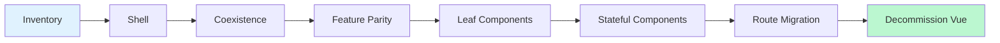

# Coexistence Patterns: Running Vue & Next.js Side-by-Side

> Run both frameworks in production, migrate route-by-route, roll back safely.

---

## 1. Strangler Fig Overview

Next.js becomes the **new frontend edge**; Vue serves unmigrated routes behind proxy/rewrites. Next.js absorbs routes until Vue is fully decommissioned.

### Migration Flow



| Phase              | Goal                                                   |
| ------------------ | ------------------------------------------------------ |
| **Inventory**      | Catalog every Vue route, component, and shared service  |
| **Shell**          | Next.js scaffold with layout, auth, and proxy rules     |
| **Coexistence**    | Both apps serve production traffic via proxy/rewrites   |
| **Feature Parity** | Migrated routes match Vue behaviour exactly             |
| **Leaf Components**| Pure presentational components converted first          |
| **Stateful**       | Complex state-holding components (stores, composables)  |
| **Route Migration**| Full pages rewritten; Vue routes removed one-by-one     |
| **Decommission**   | Vue runtime, adapters, and proxy rules removed entirely |

**Key principle:** every phase must be independently deployable and rollback-able. Never batch multiple route migrations into a single deployment.

---

## 2. Coexistence Strategy Decision Table

| Strategy                  | Best For                         | Pros                                       | Cons                                          | When to Use                                     |
| ------------------------- | -------------------------------- | ------------------------------------------ | --------------------------------------------- | ----------------------------------------------- |
| **Proxy / Rewrites**      | Route-level strangler            | Zero coupling, simple ops, instant rollback| No shared UI within a single page             | Default choice — start here                     |
| **Web Components Adapter**| Embedding Vue widgets in Next.js | Framework-agnostic, Shadow DOM isolation   | Prop serialization friction, bundle overhead  | Shared widgets (date-picker, chart) in transition|
| **Micro-Frontends**       | Large teams, independent deploys | Parallel team velocity, runtime sharing    | Operational complexity, shared state issues   | Multiple teams owning different feature slices  |
| **Iframe Containment**    | Hard isolation, legacy quarantine| Total CSS/JS isolation                     | Poor SEO, UX seams, no shared state           | Last resort for untouchable legacy modules      |

> **Rule of thumb:** Start with Proxy/Rewrites. Only add Web Components or micro-frontends for within-page coexistence.

---

## 3. Proxy / Rewrites (Route-Level Strangler)

### 3.1 Next.js `rewrites` in `next.config.js`

Forward unmatched routes to Vue. As you add Next.js pages, traffic stops reaching Vue automatically.

```js
// next.config.js
const nextConfig = {
  async rewrites() {
    return {
      fallback: [
        { source: "/:path*", destination: `${process.env.VUE_APP_ORIGIN}/:path*` },
      ],
    };
  },
};
module.exports = nextConfig;
```

Forward a specific prefix explicitly:

```js
async rewrites() {
  return [
    { source: "/legacy/:path*", destination: "http://vue-app.internal:3001/legacy/:path*" },
  ];
},
```

### 3.2 Next 16+ `proxy.ts` Network Boundary

`proxy.ts` replaces many `middleware.ts` uses for routing decisions — runs before the Next.js router.

```ts
// proxy.ts (project root — Next 16+)
import type { NextRequest } from "next/server";

const VUE_ORIGIN = process.env.VUE_APP_ORIGIN!;
const LEGACY_PREFIXES = ["/settings", "/admin", "/reports"];

export function proxy(request: NextRequest) {
  const { pathname } = request.nextUrl;
  if (LEGACY_PREFIXES.some((p) => pathname.startsWith(p))) {
    return fetch(new URL(pathname + request.nextUrl.search, VUE_ORIGIN), {
      headers: request.headers,
      method: request.method,
      body: request.body,
    });
  }
  return undefined; // proceed to Next.js
}
```

### 3.3 Pitfalls

| Pitfall                    | Detail                                                                          |
| -------------------------- | ------------------------------------------------------------------------------- |
| **Hydration mismatch**     | If rewritten path differs from what Vue Router expects, hydration breaks. Always preserve the original path. |
| **Auth in proxy**          | Don't overload `proxy.ts` with auth logic. Share sessions via common cookie domain or JWT. |
| **Cookie/CORS drift**      | Both apps must share the same top-level domain or set `Domain=.example.com`.    |
| **Health-check coupling**  | Next.js health checks pass even if Vue is down. Ping both in `/api/health`.     |

---

## 4. Web Components Adapter Layer

Wrap Vue components as Custom Elements to embed them inside Next.js pages.

### 4.1 Vue SFC → Custom Element

**Vue SFC** (`StatusBadge.vue`) with props, emits, and scoped styles becomes a custom element:

```ts
// register-elements.ts
import { defineCustomElement } from "vue";
import StatusBadge from "./StatusBadge.ce.vue"; // rename .vue → .ce.vue
customElements.define("vue-status-badge", defineCustomElement(StatusBadge));
```

**Usage in Next.js:**

```tsx
// app/dashboard/page.tsx
"use client";
import { useEffect, useRef } from "react";
import "@/adapters/register-elements";

export default function Dashboard() {
  const badgeRef = useRef<HTMLElement>(null);
  useEffect(() => {
    const el = badgeRef.current;
    if (!el) return;
    const handler = () => console.log("badge clicked");
    el.addEventListener("click", handler);
    return () => el.removeEventListener("click", handler);
  }, []);

  return (
    <div>
      <h1>Dashboard</h1>
      {/* @ts-expect-error — custom element */}
      <vue-status-badge ref={badgeRef} variant="success">Active</vue-status-badge>
    </div>
  );
}
```

### 4.2 Prop & Attribute Serialization

HTML attributes are **always strings**. Set complex values as properties on the DOM element:

```tsx
// ❌ Broken — object coerced to "[object Object]"
<vue-chart data={chartData} />

// ✅ Correct — set property imperatively
useEffect(() => {
  if (chartRef.current) (chartRef.current as any).data = chartData;
}, [chartData]);
```

### 4.3 Shadow DOM Styling

`defineCustomElement` uses Shadow DOM by default — global CSS won't penetrate.

1. Bundle styles inside `.ce.vue` files (they are inlined into the shadow root).
2. Use `::part()` selectors if the component exposes `part` attributes.
3. Disable Shadow DOM with a wrapper (lose style isolation).

### 4.4 Event Bridging

Custom elements emit `CustomEvent`s. React's synthetic events ignore these — use `addEventListener` via a ref:

```tsx
useEffect(() => {
  const el = ref.current;
  const onSelect = (e: Event) => setSelectedDate((e as CustomEvent).detail.date);
  el?.addEventListener("date-select", onSelect);
  return () => el?.removeEventListener("date-select", onSelect);
}, []);
```

---

## 5. Micro-Frontends

### 5.1 single-spa

```js
import { registerApplication, start } from "single-spa";
registerApplication({
  name: "@org/vue-settings",
  app: () => System.import("@org/vue-settings"),
  activeWhen: ["/settings"],
});
registerApplication({
  name: "@org/react-dashboard",
  app: () => System.import("@org/react-dashboard"),
  activeWhen: ["/dashboard"],
});
start();
```

### 5.2 Webpack 5 Module Federation

```js
// next.config.js (host)
const { NextFederationPlugin } = require("@module-federation/nextjs-mf");
module.exports = {
  webpack(config) {
    config.plugins.push(
      new NextFederationPlugin({
        name: "host",
        remotes: { vueApp: "vueApp@http://vue-app.internal:3001/remoteEntry.js" },
        shared: { react: { singleton: true }, "react-dom": { singleton: true } },
      })
    );
    return config;
  },
};
```

### 5.3 When to Use & Complexity Warnings

Use when: multiple teams deploy independently, feature slices justify own build pipelines, or within-page coexistence exceeds Web Components' limits.

| Concern          | Detail                                                                |
| ---------------- | --------------------------------------------------------------------- |
| Shared state     | No free lunch — use custom events, a shared store, or URL state.      |
| Version skew     | Host and remote must agree on shared dependency versions.             |
| Error isolation  | A crash in one micro-frontend can leak into host if not sandboxed.    |
| Testing          | Integration tests must boot multiple apps simultaneously.             |
| Performance      | Each remote adds a network request; use preloading wisely.            |

---

## 6. Iframe Containment

**When:** Hard isolation required (third-party widget, global CSS pollution, untouchable legacy).

**Costs:** weaker SEO (content not indexed), shared state only via `postMessage`, UX seams (scrollbars, focus traps), accessibility issues, poor mobile touch handling.

**Guidance:** Tactical containment tool — not primary strategy. Eliminate all iframes before decommission.

```tsx
// app/legacy/settings/page.tsx
export default function LegacySettings() {
  return (
    <iframe
      src={`${process.env.VUE_APP_ORIGIN}/settings`}
      className="w-full h-[calc(100vh-64px)] border-0"
      title="Legacy Settings"
      sandbox="allow-scripts allow-same-origin allow-forms"
    />
  );
}
```

---

## 7. Component Contracts

### 7.1 TypeScript Contract Stub

Define an interface both Vue and React implementations must satisfy:

```ts
// contracts/button.contract.ts
export interface ButtonContract {
  props: {
    variant?: "primary" | "secondary";
    size?: "sm" | "md" | "lg";
    disabled?: boolean;
  };
  events: {
    onClick: () => void;
  };
  slots: {
    default: "label content";
    icon?: "optional leading icon";
  };
}
```

### 7.2 Using Contracts to Gate Migration

1. **Extract** contract from Vue component's props, emits, and slots.
2. **Implement** React component to same contract.
3. **Verify** via shared Storybook story that both render identically.
4. **Swap** behind a feature flag (see §8).

```ts
import type { ButtonContract } from "@/contracts/button.contract";
type AssertVueProps = ButtonContract["props"];   // used in Vue defineProps<>
type AssertReactProps = ButtonContract["props"]; // used in React component
```

### 7.3 Generating Usage Graphs

Before migrating, understand the component's blast radius:

```bash
rg "import.*StatusBadge" --type vue --type ts -l    # direct importers
rg "StatusBadge" src/ --type vue -c | sort -t: -k2 -rn | head -20  # usage count
```

Use `madge` to visualize dependency order — leaf components with zero consumers migrate first.

---

## 8. Rollback Strategies

Every migration step must be reversible. Three levels cover the full spectrum.

### 8.1 Route-Level Rollback

Add the route back to `LEGACY_PREFIXES` to redirect traffic to Vue:

```ts
// proxy.ts — rollback: add "/dashboard" back
const LEGACY_PREFIXES = ["/settings", "/dashboard"];
```

**Recovery time:** seconds (deploy config change or env-var toggle).

### 8.2 Component-Level Rollback

Feature flag swaps between Vue custom element and React component:

```tsx
import { useFeatureFlag } from "@/lib/feature-flags";

export function StatusBadge(props: StatusBadgeProps) {
  const useReact = useFeatureFlag("react-status-badge");
  if (!useReact) {
    // @ts-expect-error custom element
    return <vue-status-badge variant={props.variant}>{props.children}</vue-status-badge>;
  }
  return <span className={`badge badge--${props.variant}`}>{props.children}</span>;
}
```

**Recovery time:** milliseconds (flip the flag).

### 8.3 Request-Boundary Rollback

`proxy.ts` is a **single-file convention** for instant rollback at the network edge:

```ts
// Rollback in one file:
//   1. Add route to LEGACY_PREFIXES
//   2. Deploy (or toggle env var)
//   3. All traffic for that route returns to Vue
```

### Rollback Decision Matrix

| Signal                             | Level            | Action                               |
| ---------------------------------- | ---------------- | ------------------------------------ |
| Spike in 5xx on migrated route     | Route-level      | Add prefix back to `LEGACY_PREFIXES` |
| Visual regression on one component | Component-level  | Flip feature flag to Vue adapter     |
| Auth / session issues              | Request-boundary | Route all traffic through Vue        |
| Performance regression             | Route-level      | Roll back route, profile, re-migrate |

---

## 9. Decommission Checklist

Once every route is migrated and validated, remove coexistence scaffolding:

- [ ] **Remove Vue runtime** — delete `vue`, `@vue/*` from `package.json`
- [ ] **Remove adapter layer** — delete `register-elements.ts`, `.ce.vue` files
- [ ] **Remove proxy rules** — delete `proxy.ts` legacy forwarding, clean `rewrites()`
- [ ] **Remove feature flags** — delete migration-specific flags and dead code paths
- [ ] **Simplify build pipeline** — remove Module Federation / single-spa config
- [ ] **Remove Vue dev tooling** — Vite config, Vue ESLint plugin, Vue test utils
- [ ] **Clean shared deps** — audit `node_modules` for orphaned Vue packages
- [ ] **DNS / infra cleanup** — decommission Vue deployment, remove DNS entries
- [ ] **Final performance audit** — Lighthouse, Core Web Vitals vs pre-migration baseline
- [ ] **Update documentation** — remove all coexistence references

> **Celebrate.** The strangler fig has consumed the host. Ship it. 🎉
