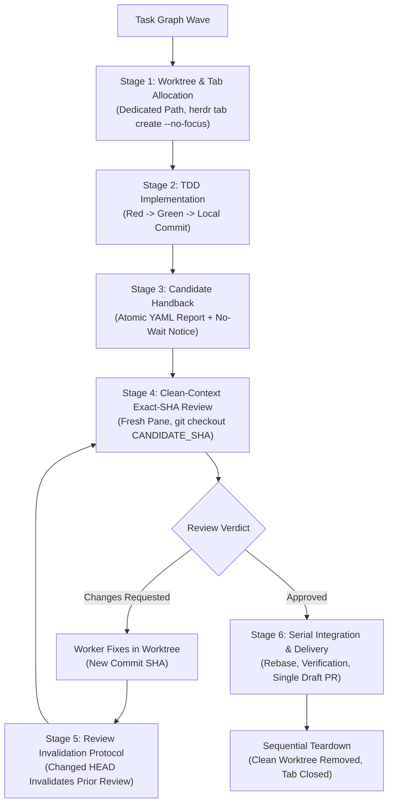

# Herdr

Herdr is an external multiplexer and supervisor control plane for interactive AI coding agents (OpenAI Codex CLI, Google Antigravity CLI / AGY, Claude Code, Cursor, and Gemini). It decouples topology (`workspace` → `tab` → `pane`), OS processes (`pty`), and cognitive agents (`agent`), enabling a supervisor model to orchestrate multiple workers concurrently without trapping them in headless subshells or blinding human operators.

Under the Codex-first supervisor paradigm, orchestration follows an explicit chain of authority: **Codex CTO** → **Codex Engineering Manager (EM)** → **AGY Implementers, Fresh Reviewers, Integration, and Recovery Executors**.

---

## 0. Fundamental Axioms & Mental Model

1. **Interactive PTY as a First-Class Sandbox**: Never run agents with headless `-p` or `--print` flags. Interactive agents require their live TUI for multi-turn conversational repair, tool approvals, and thought visibility. Herdr multiplexes the real interactive PTY.
2. **The 3-Axis Decoupling**:
   - **Worker State (PTY/Screen)**: `idle`, `working`, `blocked`, `done`, `unknown`.
   - **Observer State (Host Wait Handle)**: `none`, `waiting`, `settled`, `timed_out`.
   - **Delivery State (Engineering/Git)**: `implementation` → `candidate_handback` → `clean_review` → `ready_for_review` → `integrated`.
   - *An observer timeout is not a worker failure; an idle worker is not a completed mission; unknown remains unknown. Settlement only grants permission to inspect screen and filesystem evidence.*
3. **Law of Swarms**: Code synthesis is embarrassingly parallel ($O(1)$ scaling), but software integration is strictly serial ($O(N^2)$ interaction space). Run writers in parallel isolated checkouts; review and merge PRs serially into a moving verified baseline.
4. **Runtime Decoupling (Runtime Is Not Role)**: Execution engine (`codex`, `agy`, `claude`) does not define organizational role or authority. Mission briefs explicitly assign role authority. The fleet leverages heterogeneous model tiers suited to each role (e.g. `gpt-6-astra` for EM; `gemini-3.8-flash-high` for executors). No universal same-model constraint.
5. **Two Durable Artifact Kinds**:
   - *Kind 1: Mutable Manager Checkpoint* (`state.yaml` alone) in shared run root outside worktrees. Maintained exclusively by the Engineering Manager.
   - *Kind 2: Immutable YAML Reports* (`<task>-a<attempt>-<purpose>.yaml` and manager milestone records) published atomically outside worktrees.

---

## 1. Role Selection & Authority Gate (Cold Reader Intake)

The same `SKILL.md` and reference catalog are read by all participants. **Every cold reader must identify its assigned role first** before executing instructions:

| Assigned Role | Runtime Host | Primary Authority & Scope | Permitted Actions | Strictly Prohibited Duties |
|---|---|---|---|---|
| **CTO** | Codex / Root PTY | Strategic governance, architectural boundaries, candidate evidence gates, and delivery sign-off. | Monitor EM checkpoints via compact reads; review candidate diffs and verification evidence. | Daily task dispatch, fine-grained PTY monitoring, direct worktree edits. |
| **Engineering Manager (EM)** | Codex | Central orchestration: maintains `state.yaml`, dispatches tasks, monitors capacity, ingests reports, relays reviewer Q/A, publishes milestones. | Split panes, create tabs, issue prompts, consume immutable reports idempotently, manage task graph. | Direct feature code authoring in manager checkout; pushing directly to `main`. |
| **Implementer** | AGY | Feature implementation, test synthesis (TDD), local branch commits, and atomic report publication in assigned worktree. | Code editing (`apply_patch`), test execution, git commits, publishing immutable reports to run root. | Bootstrapping secondary management hierarchies, editing `state.yaml`, managing peer workers. |
| **Fresh Reviewer** | AGY | Independent read-only technical audit of exact candidate commit SHAs in a clean context window. | Checkout exact candidate commit SHA, run verification checks, inspect diffs, publish review reports. | Editing production code, advancing branches, approving own code, spawning subagents. |
| **Integration Executor** | AGY | Baseline reconciliation, worktree provisioning, serial rebase verification, packaging validation, PR mechanics, and clean teardown. | Git worktree lifecycle, serial rebase, generator runs (`gen-marketplace.py`), draft PR lifecycle. | Parallel drafting, merging without candidate gate approval, force-cleanup without inventory. |
| **Recovery Executor** | AGY | Bounded diagnostic probes, process reconciliation, Git lock clearing, and crashed agent session restart. | Query `pane process-info`, read visible screens, send modal keystrokes, reconcile orphaned locks. | Blind kills (`kill -9` / `pkill`), relaunching agents over live interactive TUIs. |

> [!IMPORTANT]
> **No Management Hierarchy Bootstrapping**: Assigned AGY implementers and reviewers must **never** infer they are orchestrators, spawn nested subagent hierarchies, or modify `state.yaml`. All multi-agent coordination flows through the designated Engineering Manager.

---

## 2. Coordinate Discovery & Return Address Registration

Verify execution inside a Herdr-managed pane before issuing commands:

```bash
test "${HERDR_ENV:-}" = 1 || { echo "Must run inside a Herdr-managed pane"; exit 1; }
```

### Discover Live Coordinates
Every agent must discover its native coordinates immediately upon entry:

```bash
CALLER_PANE_ID="${HERDR_PANE_ID:-$(herdr pane current | jq -r .result.pane.pane_id)}"
CALLER_TAB_ID="${HERDR_TAB_ID:-$(herdr pane current | jq -r .result.pane.tab_id)}"
CALLER_TERM_ID="${HERDR_TERMINAL_ID:-$(herdr pane current | jq -r .result.pane.terminal_id)}"
CALLER_CWD="$(herdr pane current | jq -r .result.pane.cwd)"
```

### Worker Registration Protocol
Before undertaking assigned engineering work, a newly started worker registers its confirmed identity with the manager return address (`$MANAGER_PANE_ID`) without `--wait`:

```bash
herdr agent prompt "$MANAGER_PANE_ID" \
  "Registration: task=$TASK_ID attempt=$ATTEMPT mission=$MISSION_ID status=registered pane=$CALLER_PANE_ID tab=$CALLER_TAB_ID terminal=$CALLER_TERM_ID runtime=$RUNTIME model=$MODEL cwd=$CALLER_CWD."
```

---

## 3. Bidirectional Push Notifications & Input Delivery

### Why Passive Polling Fails Across Agent Runtimes
In multi-agent environments, pure polling (`herdr agent wait`) freezes discrete turn-based runtimes (Codex, AGY) mid-turn. When a turn yields without an active wait, background worker completions go unnoticed.

### The Push Callback Mandate
Every delegated task brief provides explicit caller coordinates (`$CALLER_PANE_ID`, `$CALLER_TAB_ID`). When a worker completes a phase or encounters a blocker, it **pushes a notice directly into the caller's PTY**:

```bash
herdr agent prompt "$CALLER_PANE_ID" "<NOTICE_TEXT>"
```

- **Bracketed Paste Mechanics**: Wraps text in DEC Mode 2004 (`\x1b[200~...\x1b[201~`), preventing premature execution of multiline text until fully written.
- **Staged Enter Delay**: Enforces a 300ms pause before transmitting `\r` (Enter), preventing dropped characters.
- **Worker Notices Omit `--wait`**: Workers must NEVER pass `--wait` when notifying the manager. Passing `--wait` blocks the worker and causes callback deadlocks if the manager prompts back.
- **Notice Format**: Uses strict 1:1 field parity with canonical report identity:
  ```text
  REPORT NOTICE: mission_id=<MISSION_ID> task_id=<TASK_ID> attempt=<ATTEMPT> report_id=<REPORT_ID> pane_id=<PANE_ID> tab_id=<TAB_ID> report_path=<REPORT_PATH> status=<STATUS> requested_action=<ACTION>
  ```
- **Optional Tab Deferred Input**: Whole-turn-deferred input requiring exclusive composer ownership. Never use Tab for urgent alerts or operational fan-in notifications; Enter is the operational default.

### The Modal Bridge (`herdr agent send-keys`)
When an agent pauses for interactive confirmation (`[y/N]`, `ask_question`), Herdr transitions its state to `blocked` and actively rejects `herdr agent prompt` with `error.code: agent_blocked`. Resolve modals mechanically:
1. Inspect the 2D viewport: `herdr agent read <target> --source visible --lines 20`
2. Transmit pre-validated keystrokes: `herdr agent send-keys <target> down enter`

### Degraded AGY Mode (`herdr pane run` Fallback)
When an agent runs in an interactive terminal but Herdr detection rules report `unknown`:
1. Confirm foreground AGY process and visible composer via `herdr pane process-info --pane <PANE_ID>` and `herdr agent read <TARGET> --source visible`.
2. Use verified fallback `herdr pane run <PANE_ID> <COMMAND>...` (injects text + Enter). Never use on an unverified shell or relaunch over a live TUI.

---

## 4. Parallel Swarm & Delivery Lifecycle



### 1. Capacity Calibration & Dynamic Refill
- **Initial 2-Worker Calibration**: Begin uncalibrated runs with 2 concurrent workers to verify host CPU, memory, and PTY stability.
- **Dynamic Capacity Refill**: As workers publish handback reports and settle, immediately refill capacity and dispatch ready disjoint downstream lanes. Concurrency scales dynamically to available host resources.
- **Compiler/Test Leases**: Serialize heavy builds and full test runs while parallelizing code drafting and diff reviews.

### 2. The 6-Stage Delivery Sequence
1. **Stage 1: Worktree Allocation**: Allocate isolated checkouts under `.worktrees/<task>` or task-owned external roots; create tab with `--no-focus`. Never share worktrees.
2. **Stage 2: TDD Implementation**: Write failing test first (Red), satisfy with minimal code (Green), commit locally with conventional message.
3. **Stage 3: Candidate Handback**: Publish immutable report to `<REPORT_ROOT>` via the atomic publication pipeline; notify manager without `--wait`.
4. **Stage 4: Clean-Context Exact-SHA Review**: Spawn fresh AGY reviewer in dedicated pane (`herdr pane split`). Reviewer checks out exact commit SHA (`git checkout <SHA>`) with zero context pollution. Never review code in the implementer's active pane.
5. **Stage 5: Review Invalidation Protocol**: Review binds strictly to an exact commit SHA. Any subsequent commit or rebase advances branch HEAD ($SHA_2 \neq SHA_1$), automatically invalidating prior reviews. Fresh review is required.
6. **Stage 6: Serial Integration & Delivery**: AGY Integration Executor combines verified lane commits, runs repository generators (`python3 scripts/gen-marketplace.py`), runs validation suites (`python3 scripts/validate-skills.py`), and opens a single draft PR (unmerged handback when instructed).
7. **Sequential Teardown**: Follow the strict order: wait/notify → read → verify report → merge PR / combine commits → close tab (`herdr tab close`) → remove worktree (`git worktree remove`). Never force-clean without inventory.

---

## 5. Minimal Reporting Contract & Atomic Publication

Multi-agent state is anchored to exactly two durable artifact kinds under `<REPORT_ROOT>`:
1. **Mutable Manager Checkpoint**: `state.yaml` alone, edited exclusively by the Engineering Manager.
2. **Immutable Reports**: All producer reports (`<task>-a<attempt>-<purpose>.yaml`) and manager milestone records (`manager-m<N>.yaml`).

### The 4-Step Atomic Publication Pipeline
Producers must never allow partially written or clobbered reports:
1. **Write `.partial`**: Write report via `apply_patch` to `<REPORT_ROOT>/<report_id>.partial`.
2. **Validate Content**: Verify YAML syntax and compute SHA-256 digest.
3. **Collision Pre-Flight & Atomic Rename**:
   ```bash
   test ! -e "<REPORT_ROOT>/<report_id>.yaml" || { echo "Destination exists!"; exit 1; }
   mv -n "<REPORT_ROOT>/<report_id>.partial" "<REPORT_ROOT>/<report_id>.yaml"
   test -f "<REPORT_ROOT>/<report_id>.yaml" || { echo "Rename failed!"; exit 1; }
   ```
4. **Native Prompt Notice (No-Wait)**: Alert manager return pane without blocking:
   ```bash
   herdr agent prompt "$MANAGER_PANE_ID" "REPORT NOTICE: mission_id=$MISSION_ID task_id=$TASK_ID attempt=$ATTEMPT report_id=$REPORT_ID pane_id=$CALLER_PANE_ID tab_id=$CALLER_TAB_ID report_path=$REPORT_PATH status=$STATUS requested_action=$ACTION"
   ```

### Core Reporting Invariants
- **Manager Alone Increments Attempts**: Producers strictly match their assigned `attempt`; corrections within an attempt publish under a fresh `report_id` suffix.
- **Idempotent Digest Consumption**: Manager records SHA-256 digests; duplicate notices are no-ops; mutated reports with identical IDs are flagged as `MUTATED_REPORT_REJECTED`.
- **Receipt Is Not Approval**: Acknowledging report receipt only updates `state.yaml`; task completion requires independent technical review or candidate gate sign-off.
- **10-Minute Silent Boundary**: If operating without external notice or state transition for 10 minutes, publish a checkpoint report at the next safe tool boundary.
- *Detailed schemas, canonical fields, and reviewer Q/A protocol are routed to [references/report-contract.md](references/report-contract.md).*

---

## 6. Screen Inspection Buffers & Recovery Diagnostics

Full-screen interactive TUIs run on the terminal's Alternate Screen Buffer (`\x1b[?1049h`), where off-screen text is discarded from PTY scrollback. Herdr provides four distinct read sources:

| Source | CLI Syntax | Architectural Role |
|---|---|---|
| **`recent-unwrapped`** | `herdr agent read <TARGET> --source recent-unwrapped --lines <N>` | **Transcripts & Code**: Merges soft wraps. Mandatory default for reading LLM outputs, logs, code, and diffs. |
| **`visible`** | `herdr agent read <TARGET> --source visible --lines <N>` | **Modals & Spinners**: 2D rendered viewport. Mandatory for inspecting questionnaires, menus, and thinking progress. |
| **`recent`** | `herdr agent read <TARGET> --source recent --lines <N>` | **Columnar Data**: Preserves terminal columns for ASCII diagrams, tables, and aligned grids. |
| **`detection`** | `herdr agent read <TARGET> --source detection` | **Rule Introspection**: Plain text evaluated by TOML regex rules for heuristic diagnosis (`herdr agent explain`). |

- **Filesystem Fallback**: If `recent-unwrapped` cannot display a full deliverable on the Alternate Screen, never guess truncated text; read the published report file directly from disk.
- **Read Before Action**: Always read `visible` screen and check `herdr pane process-info` before targeted intervention.
- **Targeted Escape (`esc`)**: Interrupts stuck prompts or active turns. Always inspect background process inventory afterwards, as detached subshell tools may continue executing.
- **Hung Tool Interruption (`ctrl+c`)**: Terminates unresponsive child commands; verify return to interactive prompt.
- **No Blind Kills**: Blanket `kill -9` or `pkill` is strictly prohibited. Reconcile Git index locks (`.git/index.lock`) and unfinalized `.partial` files before restarting sessions.
- **Live TUI Protection**: Never execute `herdr agent start` over a live TUI; verify pane is resting at a shell prompt (`$`, `%`).
- *Detailed recovery runbooks and event loops are routed to [references/event-monitoring.md](references/event-monitoring.md) and [references/stopped-agent-recovery.md](references/stopped-agent-recovery.md).*

---

## 7. Verified CLI Command Matrix

| Command Group | Command & Exact Syntax | Modifies PTY? | Primary Architectural Rationale |
|---|---|---|---|
| **Status** | `herdr status --json` | No | Introspect server/client version and protocol health. |
| **Workspace** | `herdr workspace list` | No | List project workspaces and repo root anchors. |
| | `herdr workspace get <WS_ID>` | No | Inspect detailed workspace state and linked worktree metadata. |
| | `herdr workspace close <WS_ID> [--group]` | Yes | Close workspace container (use `--group` if child worktrees exist). |
| **Worktree** | `herdr worktree list [--cwd <PATH>]` | No | List Git worktrees across repositories. |
| | `herdr worktree create [--cwd <PATH>] --branch <NAME> --path <PATH> --no-focus` | Yes (pty) | Create Git worktree and mount as Herdr workspace. |
| | `herdr worktree remove --workspace <ID> [--force]` | Yes | Remove physical worktree directory and close workspace. |
| **Tab** | `herdr tab create --workspace <WS> --cwd <PATH> --label <TEXT> --no-focus` | Yes (pty) | Encapsulate independent task branch without stealing focus. |
| | `herdr tab get <TAB_ID>` | No | Query tab state and aggregate agent status. |
| | `herdr tab close <TAB_ID>` | Yes | Terminate all child panes and free tab layout upon completion. |
| **Pane** | `herdr pane split --pane <PANE_ID> --direction <right\|down> --cwd <PATH> --no-focus` | Yes (pty) | Create sibling terminal split based on caller geometry. |
| | `herdr pane get <PANE_ID>` | No | Inspect pane process, dimensions, and scroll state. |
| | `herdr pane run <PANE_ID> <CMD>...` | Yes | Verified fallback for degraded mode; injects text + Enter. |
| | `herdr pane close <PANE_ID>` | Yes | Close finished individual pane. |
| **Agent** | `herdr agent start <NAME> --kind <KIND> --pane <PANE_ID> -- <ARGS...>` | Yes | Launch AI CLI in shell pane sitting at prompt. |
| | `herdr agent get <TARGET>` | No | Inspect cognitive agent session ID, status, and title. |
| | `herdr agent prompt <TARGET> <TEXT>` | Yes (paste) | Deliver prompt atomically via bracketed paste with 300ms Enter delay. |
| | `herdr agent send-keys <TARGET> <KEY>...` | Yes (keys) | Modal bridge: navigate menus and answer confirmation prompts. |
| | `herdr agent wait <TARGET> --until idle --until done --timeout <MS>` | No | Event-driven kernel wait on Herdr state mutation bus. |
| | `herdr agent read <TARGET> --source recent-unwrapped --lines <N>` | No | Read uncorrupted, unwrapped terminal output. |
| | `herdr agent explain <TARGET> --json` | No | Disclose regex manifest rules and evidence governing agent state. |
| **Notification**| `herdr notification show <TITLE> --body <TEXT> --sound done` | No | Non-blocking desktop/TUI toast alert across connected clients. |

---

## 8. Canonical References & Routing Matrix

Consult these focused canonical references for detailed schemas, runbooks, and templates:

| Reference | Role-Specific Trigger & Intended Audience | Core Topics Covered |
|---|---|---|
| [references/report-contract.md](references/report-contract.md) | **All Roles** authoring, validating, publishing, or consuming reports; EM ingesting reports; Reviewers raising questions. | Canonical producer YAML report schema, 4-step atomic publication pipeline, concise notice format, manager consumption semantics, idempotent digest checks, reviewer Q/A protocol. |
| [references/event-monitoring.md](references/event-monitoring.md) | **EM & Observers** supervising agent terminals, reading Alt-Screen transcripts, delivering prompts, or diagnosing unknown states. | 4 terminal screen inspection buffers, bracketed paste input mechanics, no-wait notice constraints, Tab deferred input, modal bridge, degraded `pane run` mode. |
| [references/stopped-agent-recovery.md](references/stopped-agent-recovery.md) | **Recovery Executors & EM** unblocking stalled, modal-blocked, hung, or crashed agent sessions. | Read-before-action diagnosis matrix, modal resolution, targeted `esc` and background process hazards, `ctrl+c` hung tool recovery, Git lock reconciliation, safe TUI restart sequence, EM session resumption. |
| [references/mission-briefs.md](references/mission-briefs.md) | **EM** dispatching tasks; **Implementers & Reviewers** receiving assignments and verifying role boundaries. | Standalone brief templates for implementers, fresh reviewers, and integration executors; mandatory coordinate discovery; measurable acceptance criteria; atomic handback rules. |
| [references/parallel-capacity.md](references/parallel-capacity.md) | **EM & CTO** planning concurrency waves; **Integration Executors** managing worktrees, review invalidations, and PR delivery. | Law of Swarms, 2-worker initial calibration and dynamic capacity refill, resource invariants, compiler build leases, dependency waves, 6-stage delivery lifecycle, exact-SHA review invalidation, serial integration. |
