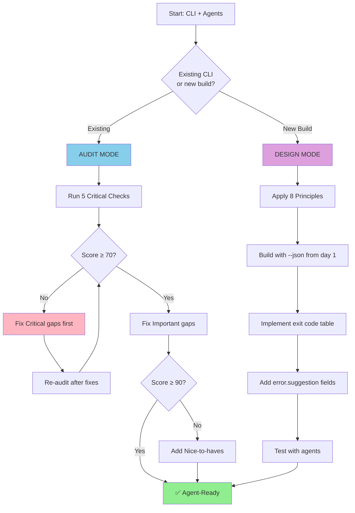

# optimize-cli-for-agents

> Make CLIs reliably usable by AI agents — audit existing tools or design new ones with agent-first thinking.

## When to Use This Skill

| Situation | Mode |
|-----------|------|
| "I have a CLI that agents keep failing to use" | Audit Mode → score it, fix gaps |
| "I'm wrapping an API in a CLI that agents will call" | Design Mode → agent-first from day 1 |
| "My agent workflow is fragile, output parsing keeps breaking" | Audit Mode → fix output contracts |
| "I want to know if I should build MCP or CLI" | Decision Framework |
| "My CLI hangs when run in CI/agents" | Audit Mode → fix interactivity |

---

## 0. Quick Start (TL;DR)

### 3-Minute Audit

Copy-paste these commands to quickly test any CLI (replace `mycli cmd` with your actual command):

```bash
# Test 1: JSON output exists?
mycli cmd --json 2>/dev/null | jq . && echo "✅ C1 PASS" || echo "❌ C1 FAIL"

# Test 2: stdout/stderr separated?
mycli cmd --json > /tmp/out.txt 2>/tmp/err.txt && jq . /tmp/out.txt && echo "✅ C2 PASS"

# Test 3: Semantic exit codes?
mycli nonexistent-thing; [ $? -ne 0 ] && [ $? -ne 1 ] && echo "✅ C3 PASS" || echo "❌ C3 FAIL (exit code was $?)"

# Test 4: Non-interactive mode?
echo "" | timeout 5 mycli dangerous-cmd && echo "✅ C4 PASS" || echo "❌ C4 FAIL (hung or no --yes)"

# Test 5: Structured errors?
mycli fail --json 2>/dev/null | jq '.error.code' && echo "✅ C5 PASS" || echo "❌ C5 FAIL"
```

### 5-Minute Design Checklist

Quick reference for new CLIs:

- [ ] `--json` flag outputs pure JSON to stdout
- [ ] All progress/logs go to stderr
- [ ] Exit codes: 0=success, 2=usage, 3=not_found, 4=auth, 5=conflict, 6=validation, 7=transient
- [ ] `--yes`/`--force` flags for non-interactive mode
- [ ] Error JSON has `class`, `code`, `retryable`, `suggestion` fields

### Instant Score Calculator

```
Score = (C_pass × 20) + (I_pass × 5) + (N_pass × 2)

≥90 = ✅ Agent-Ready | 70-89 = 🟡 Mostly Ready | 50-69 = 🟠 Needs Work | <50 = 🔴 Agent-Hostile
```

Where: **C** = Critical checks (5 items, 20pts each), **I** = Important checks (5 items, 5pts each), **N** = Nice-to-have (5 items, 2pts each)

---

## Decision Flow



<details>
<summary>ASCII version (for terminals without mermaid rendering)</summary>

```
┌─────────────────────────────────────────────────────────────────┐
│                    optimize-cli-for-agents                       │
├─────────────────────────────────────────────────────────────────┤
│                                                                  │
│    ┌──────────────┐                    ┌──────────────┐         │
│    │ AUDIT MODE   │                    │ DESIGN MODE  │         │
│    │ (existing)   │                    │ (new build)  │         │
│    └──────┬───────┘                    └──────┬───────┘         │
│           │                                   │                  │
│           ▼                                   ▼                  │
│    ┌──────────────┐                    ┌──────────────┐         │
│    │ 5 Critical   │                    │ 8 Agent-First│         │
│    │ Checks       │                    │ Principles   │         │
│    └──────┬───────┘                    └──────┬───────┘         │
│           │                                   │                  │
│           ▼                                   ▼                  │
│    ┌──────────────┐                    ┌──────────────┐         │
│    │ Score & Fix  │                    │ Build with   │         │
│    │ Gaps         │──────────┬─────────│ --json, etc  │         │
│    └──────────────┘          │         └──────────────┘         │
│                              ▼                                   │
│                    ┌──────────────────┐                         │
│                    │  ✅ Agent-Ready   │                         │
│                    │  CLI (Score ≥90)  │                         │
│                    └──────────────────┘                         │
│                                                                  │
└─────────────────────────────────────────────────────────────────┘
```

</details>

---

## 1. AUDIT MODE — Agent-Readiness Checklist

Run this checklist against any existing CLI to produce a score and prioritized fix list.

### CRITICAL (each missing item breaks agent workflows)

| # | Check | Verify | Fix |
|---|-------|--------|-----|
| C1 | Machine-parseable output exists (`--json` or `--output json`) | `mycli cmd --json 2>/dev/null \| jq .` succeeds | Add `--json` flag; stdout = pure JSON |
| C2 | stdout and stderr are separated | Run `mycli cmd --json > out.txt 2> err.txt` — `out.txt` must be valid JSON | Move all progress/human text to stderr |
| C3 | Exit codes are semantic (not all-zeros or all-ones) | Trigger a "not found" error; `echo $?` must not be 0 | Map error types to exit codes 2–7 |
| C4 | No mandatory interactive prompts in headless mode | Run `mycli dangerous-cmd </dev/null`; must not hang | Add `--yes`/`--force`; detect non-TTY and exit 2 |
| C5 | Errors have machine-parseable codes | Force an error with `--json`; check `error.code` in output | Add structured error object with `class`, `code`, `retryable` |

Each critical item is worth **20 points**. Missing all five = 0. All five present = 100.

### IMPORTANT (missing items cause fragility)

- Consistent field types across commands (no string/int flip-flopping between versions)
- Idempotent operations, or a `conflict` exit code (5) when operation can't be retried safely
- `--dry-run` flag for destructive commands
- `--help` includes realistic examples, not just flag lists
- Noun-verb grammar consistency across all commands

Each important item is worth **5 points** (max 25).

### NICE-TO-HAVE

- JSONL streaming for long-running operations (one JSON object per line)
- `--quiet` mode that emits bare, pipe-friendly output (IDs only, no envelope)
- `schema_version` field in every JSON output envelope
- Async job pattern (`job start` / `job status` / `job wait`) for slow operations

Each nice-to-have item is worth **2 points** (max 10).

### Scoring

| Score | Grade |
|-------|-------|
| ≥ 90 | ✅ Agent-Ready |
| 70–89 | 🟡 Mostly Ready — fix Important gaps |
| 50–69 | 🟠 Needs Work — agents will be brittle |
| < 50 | 🔴 Agent-Hostile — agents cannot use this reliably |

**Formula:** `(critical_passed × 20) + (important_passed × 5) + (nice_to_have_passed × 2)`

---

## 2. DESIGN MODE — Agent-First Principles

Use these when the agent is the *primary* consumer and you have greenfield control.

### Principle 1 — Determinism over Discoverability

- **Human-first:** Interactive menus, wizard flows, guided prompts help users explore
- **Agent-first:** Every command has a documented, stable output schema. Agents don't explore — they execute against contracts.
- **Example:** Instead of a setup wizard, provide `mycli init --config-file init.json` with a documented schema.

### Principle 2 — Data over Decoration

- **Human-first:** Colors, spinners, progress bars, emojis, aligned tables make output readable
- **Agent-first:** stdout is a data channel. All decoration goes to stderr. Agents pipe stdout directly to `jq` or language parsers.
- **Example:** Progress bar on stderr + JSON result on stdout. Never ANSI codes in stdout.

### Principle 3 — Fail Loudly, Fail Specifically

- **Human-first:** Generic "Something went wrong. Try again." is acceptable — humans ask for help
- **Agent-first:** Every error is a structured object. `{"error":{"class":"auth","code":"TOKEN_EXPIRED","retryable":true}}` lets agents self-heal without human escalation.
- **Example:** Auth failure exits 4 with `{"ok":false,"error":{"class":"auth","code":"TOKEN_EXPIRED","retryable":true,"suggestion":"Run 'mycli auth login' to refresh token"}}`.

### Principle 4 — Idempotent by Default

- **Human-first:** "Already exists" errors are fine — the human reads them and moves on
- **Agent-first:** Agents retry on transient failures. If creating a resource that already exists returns exit 5 (conflict) rather than exit 1 (unknown), the agent can route correctly without accidentally duplicating state.
- **Example:** `mycli user create alice` returns exit 5 + structured conflict error if alice exists, letting the agent branch to `user get` instead.

### Principle 5 — Self-Describing Contracts

- **Human-first:** `--help` is a quick reminder for experienced users
- **Agent-first:** `--help` is the API spec. It must include exit codes, output field names, and runnable examples. Agents read `--help` before calling a command for the first time.
- **Example:** Help text includes `Exit codes: 0=success 3=not_found 4=auth_error` and `Output fields: id (string), status (created|updated|deleted), created_at (ISO8601)`.

### Principle 6 — Predictable Grammar

- **Human-first:** Creative subcommand naming is memorable (`mycli nuke`, `mycli zap`)
- **Agent-first:** Strict noun-verb hierarchy. Agents discover capabilities through the `--help` tree. Inconsistent grammar forces agents to memorize special cases.
- **Example:** `mycli user create`, `mycli user get`, `mycli user delete` — not `mycli new-user`, `mycli fetch-user`, `mycli rm-user`.

### Principle 7 — Headless First

- **Human-first:** Default to interactive — prompt for missing values, confirm destructive ops
- **Agent-first:** Assume no TTY, no stdin, no user present. If a required value is missing, exit 2 with a specific error. Never hang waiting for input.
- **Example:** `if not sys.stdin.isatty() and not args.yes: sys.exit(2)` — fail fast, tell the agent what flag to add.

### Principle 8 — Recovery Paths

- **Human-first:** Error messages explain what went wrong
- **Agent-first:** Every error response must tell the agent what to do *next*. The `suggestion` field is not optional — it is the agent's next action.
- **Example:** `"suggestion": "Use 'mycli user get alice' to fetch the existing user, or add --force to overwrite"` — the agent can immediately retry with the correct command.

---

## 3. Output Contracts (Quick Reference)

### JSON Envelope (success and error)

Every `--json` response must conform to this envelope. Field presence is guaranteed.

```json
// Success
{
  "ok": true,
  "command": "user create",
  "schema_version": "1.0",
  "result": { "id": "usr_123", "status": "created" }
}

// Error
{
  "ok": false,
  "command": "user create",
  "schema_version": "1.0",
  "error": {
    "class": "conflict",
    "code": "USER_EXISTS",
    "message": "User 'alice' already exists",
    "retryable": false,
    "suggestion": "Use 'mycli user get alice' to fetch existing user, or 'mycli user update alice' to modify"
  }
}
```

### Exit Code Table (with agent routing)

| Code | Class | When | Agent Does |
|------|-------|------|-----------|
| 0 | success | Operation completed | Continue workflow |
| 1 | unknown | Unexpected crash / unhandled exception | Surface to user, do not retry |
| 2 | usage | Bad flags, missing args, invalid syntax | Fix invocation, do not retry |
| 3 | not_found | Resource does not exist | Create it or skip this step |
| 4 | auth | Token expired, forbidden, insufficient scope | Re-authenticate or escalate |
| 5 | conflict | Already exists / state clash | Resolve conflict or add `--force` |
| 6 | validation | Business rule violated, invalid input value | Fix input data |
| 7 | transient | Network error, rate-limit, timeout | Retry with exponential backoff |

### Stream Rules (non-negotiable)

- **stdout** = JSON data only. Nothing else ever reaches stdout.
- **stderr** = logs, progress bars, spinners, warnings, human-readable status
- **Verify with:** `mycli cmd --json 2>/dev/null | jq .` — must always succeed and produce valid JSON
- **JSONL streaming:** For long-running ops, emit one complete JSON object per line to stdout. Agents read line-by-line.

---

## 4. Common Fixes for Existing CLIs

### Problem 1: No structured output

**Symptom agents see:** Must regex-parse human-formatted tables or prose. Breaks on any formatting change.

**Fix:** Add a `--json` flag. When active, redirect all existing output to stderr and emit a JSON envelope to stdout.

```
# Before (stdout)
NAME     STATUS   AGE
web-1    Running  3d
```

```json
// After: mycli pods list --json (stdout only)
{"ok":true,"command":"pods list","schema_version":"1.0","result":{"pods":[{"name":"web-1","status":"running","age_seconds":259200}]}}
```

---

### Problem 2: All errors exit 1

**Symptom agents see:** Cannot distinguish "not found" from "auth failed" from "server crash" — must parse stderr text with regex.

**Fix:** Map error types to exit codes. Add a dispatch table in the error handler.

```python
EXIT_CODES = {
    "not_found": 3,
    "auth": 4,
    "conflict": 5,
    "validation": 6,
    "transient": 7,
}

def exit_with_error(error_class, code, message, retryable=False, suggestion=None):
    payload = {"ok": False, "error": {"class": error_class, "code": code,
                                       "message": message, "retryable": retryable}}
    if suggestion:
        payload["error"]["suggestion"] = suggestion
    print(json.dumps(payload))
    sys.exit(EXIT_CODES.get(error_class, 1))
```

---

### Problem 3: Interactive prompts hang agents

**Symptom agents see:** Workflow deadlocks indefinitely waiting for "y/N" confirmation. CI timeout eventually kills the process.

**Fix:** Detect non-TTY at startup. If running headless and `--yes` is not set, exit 2 immediately.

```python
# Python
if not sys.stdin.isatty() and not args.yes:
    print(json.dumps({"ok": False, "error": {"class": "usage", "code": "NON_INTERACTIVE",
                       "message": "Use --yes for non-interactive mode", "retryable": False}}))
    sys.exit(2)
```

```bash
# Shell
if [ ! -t 0 ] && [ "$YES" != "true" ]; then
  echo '{"ok":false,"error":{"class":"usage","code":"NON_INTERACTIVE","message":"Use --yes for non-interactive mode","retryable":false}}' >&1
  exit 2
fi
```

---

### Problem 4: stdout/stderr mixed

**Symptom agents see:** `mycli cmd --json | jq .` fails with parse errors because progress text (`Fetching... done`) is interleaved with JSON on stdout.

**Fix:** Audit every `print` / `console.log` / `echo` call in the codebase. Anything that isn't the final JSON result goes to stderr.

```python
# Before
print("Fetching resources...")      # goes to stdout — breaks jq
print(json.dumps(result))

# After
print("Fetching resources...", file=sys.stderr)  # progress → stderr
print(json.dumps(result))                         # data → stdout
```

---

### Problem 5: Inconsistent field names

**Symptom agents see:** Agent code breaks when `user_id` becomes `userId` in v2, or `created` becomes `created_at` in one command but not another.

**Fix:** Establish a naming convention (snake_case for CLIs is conventional), document it in CONTRIBUTING, and enforce it with a schema linter or JSON Schema validation in CI.

```json
// Consistent snake_case contract
{"user_id": "usr_123", "created_at": "2024-01-15T10:00:00Z", "is_active": true}

// Never mix
{"userId": "usr_123", "created": "2024-01-15T10:00:00Z", "isActive": true}
```

---

### Problem 6: No recovery hints in errors

**Symptom agents see:** Receives an error with a message like "Resource conflict". Has no next action. Escalates to human or fails the workflow.

**Fix:** Every error response must include `suggestion` with a concrete runnable command the agent can execute immediately.

```json
// Before — agent is stuck
{"ok": false, "error": {"message": "User already exists"}}

// After — agent knows exactly what to do next
{
  "ok": false,
  "error": {
    "class": "conflict",
    "code": "USER_EXISTS",
    "message": "User 'alice' already exists",
    "retryable": false,
    "suggestion": "Use 'mycli user get alice' to fetch existing user, or 'mycli user update alice --email new@example.com' to modify"
  }
}
```

---

## 5. Anti-Patterns (What Breaks Agents)

### Anti-Pattern 1: ANSI codes on stdout

```bash
# Breaks agents — color codes corrupt JSON parsing
echo -e "\033[32mSuccess!\033[0m user created with id usr_123"

# Agent-safe — decoration on stderr, data on stdout
echo "Success: user created" >&2
echo '{"ok":true,"result":{"id":"usr_123"}}'
```

**Why it breaks:** Agent tries to parse `\033[32m{"ok":true}` as JSON. Fails. Workflow dies.

---

### Anti-Pattern 2: Different output shape per subcommand

```bash
mycli user list    # returns {"users": [...]}
mycli role list    # returns [...]           ← different root shape
mycli group list   # returns {"data": {"groups": [...]}}  ← nested differently
```

**Why it breaks:** Agent must have special-case parsing logic per command. Any new command requires code changes. Fix: every list command returns `{"ok":true,"result":{"items":[...],"total":N}}`.

---

### Anti-Pattern 3: Success messages that look like errors

```bash
# Ambiguous — is this success or failure?
echo "Warning: user already exists, no changes made"
exit 0
```

**Why it breaks:** Agent has no way to know if the operation succeeded or was skipped without text parsing. Fix: exit 5 (conflict) with structured body, or exit 0 with `"result":{"action":"skipped","reason":"already_exists"}`.

---

### Anti-Pattern 4: Hiding the real error behind a wrapper

```bash
# Original error swallowed — agent sees useless message
try:
    do_thing()
except Exception:
    print("Operation failed")   # original exception lost
    sys.exit(1)
```

**Why it breaks:** Agent cannot distinguish root causes. Fix: include `error.code` mapped from the underlying exception class, and log the stack trace to stderr only.

---

### Anti-Pattern 5: Version-breaking field renames

```bash
# v1
{"user_id": "usr_123", "status": "active"}

# v2 — same command, renamed fields, no version signal
{"id": "usr_123", "state": "active"}
```

**Why it breaks:** Agent code written against v1 silently breaks against v2. Fix: include `schema_version` in every response; increment it on breaking changes; support old field names as aliases for one major version.

---

### Anti-Pattern 6: Unpaginated List Outputs

```bash
# Breaks agents — OOM on large datasets, no way to continue
mycli users list  # returns 50,000 users as one JSON array
```

**Why it breaks:** Agent memory exhausted; no cursor for resumption. Fix: `--limit`, `--cursor`, return `next_cursor` in response.

```json
// Agent-safe pagination
{
  "ok": true,
  "result": {
    "items": [...],
    "next_cursor": "eyJpZCI6MTAwMH0=",
    "has_more": true
  }
}
```

---

### Anti-Pattern 7: Rate Limit Without Retry-After

```bash
# Breaks agents — no hint when to retry
{"error": "Rate limited"}  # exits 1
```

**Why it breaks:** Agent retries immediately, gets rate-limited again, loops forever. Fix: Exit 7 (transient), include `retry_after_seconds`.

```json
{
  "ok": false,
  "error": {
    "class": "transient",
    "code": "RATE_LIMITED",
    "retryable": true,
    "retry_after_seconds": 30
  }
}
```

---

### Anti-Pattern 8: Platform-Specific Paths in Output

```bash
# Breaks agents — paths don't work on other OS
{"path": "C:\\Users\\admin\\file.txt"}  # Windows
{"path": "/home/user/file.txt"}          # Linux
```

**Why it breaks:** Agent running on different OS can't use the path. Fix: Use relative paths or include `platform` field.

```json
{
  "result": {
    "relative_path": "./output/file.txt",
    "absolute_path": "/home/user/project/output/file.txt",
    "platform": "linux"
  }
}
```

---

### Anti-Pattern 9: No Timeout Handling

```bash
# Breaks agents — hangs indefinitely on slow network
mycli deploy --wait  # no timeout, blocks forever
```

**Why it breaks:** Agent workflow hangs; no way to abort. Fix: `--timeout` flag with default; exit 7 on timeout.

```python
# Good pattern
parser.add_argument('--timeout', type=int, default=300, 
                    help='Max seconds to wait (default: 300)')

if time.time() - start > timeout:
    exit_error("transient", "TIMEOUT", f"Operation timed out after {timeout}s", 
               retryable=True, exit_code=7)
```

---

### Anti-Pattern 10: Unbounded Batch Operations

```bash
# Breaks agents — can't control blast radius
mycli users delete-inactive  # deletes ALL inactive users
```

**Why it breaks:** Agent can't limit scope; one wrong call = disaster. Fix: Require `--limit` or `--dry-run` first.

```bash
# Good pattern
mycli users delete-inactive --dry-run  # shows what would be deleted
mycli users delete-inactive --limit 100 --yes  # controlled batch
```

---

### Anti-Pattern 11: Version Sniffing via Error Messages

```bash
# Breaks agents — no programmatic way to check compatibility
mycli --version
# outputs: "mycli v2.3.4 (built 2024-01-15)"
# Agent must regex-parse this
```

**Why it breaks:** Version format changes break regex; no semantic comparison. Fix: `--version --json` with structured output.

```json
// mycli --version --json
{
  "name": "mycli",
  "version": "2.3.4",
  "major": 2,
  "minor": 3,
  "patch": 4,
  "api_version": "v2",
  "min_api_version": "v1"
}
```

---

## 7. Testing & Verification

### Automated Audit Script

Save this as `audit-cli.sh` and run against any CLI:

```bash
#!/bin/bash
# Usage: ./audit-cli.sh "mycli cmd"

CLI="$1"
SCORE=0
MAX_CRITICAL=100
MAX_IMPORTANT=25
MAX_NICE=10

echo "🔍 Auditing: $CLI"
echo "================================"

# C1: JSON output
echo -n "C1 JSON output: "
if $CLI --json 2>/dev/null | jq . > /dev/null 2>&1; then
    echo "✅ PASS (+20)"
    ((SCORE+=20))
else
    echo "❌ FAIL"
fi

# C2: stdout/stderr separation
echo -n "C2 stdout/stderr: "
$CLI --json > /tmp/out.txt 2>/tmp/err.txt
if jq . /tmp/out.txt > /dev/null 2>&1; then
    echo "✅ PASS (+20)"
    ((SCORE+=20))
else
    echo "❌ FAIL"
fi

# C3: Semantic exit codes
echo -n "C3 Exit codes: "
$CLI nonexistent-resource --json > /dev/null 2>&1
EXIT=$?
if [ $EXIT -gt 1 ] && [ $EXIT -lt 8 ]; then
    echo "✅ PASS (+20) - exit code $EXIT"
    ((SCORE+=20))
else
    echo "❌ FAIL - exit code $EXIT (expected 2-7)"
fi

# C4: Non-interactive
echo -n "C4 Non-interactive: "
if timeout 5 bash -c "echo '' | $CLI dangerous-cmd --json" > /dev/null 2>&1; then
    echo "✅ PASS (+20)"
    ((SCORE+=20))
else
    echo "❌ FAIL (hung or requires --yes)"
fi

# C5: Structured errors
echo -n "C5 Error structure: "
if $CLI fail --json 2>/dev/null | jq -e '.error.code' > /dev/null 2>&1; then
    echo "✅ PASS (+20)"
    ((SCORE+=20))
else
    echo "❌ FAIL (no error.code field)"
fi

echo "================================"
echo "Score: $SCORE / $MAX_CRITICAL (Critical only)"

if [ $SCORE -ge 90 ]; then
    echo "Grade: ✅ Agent-Ready"
elif [ $SCORE -ge 70 ]; then
    echo "Grade: 🟡 Mostly Ready"
elif [ $SCORE -ge 50 ]; then
    echo "Grade: 🟠 Needs Work"
else
    echo "Grade: 🔴 Agent-Hostile"
fi
```

---

### CI Integration (GitHub Actions)

```yaml
# .github/workflows/agent-ready.yml
name: Agent Readiness

on: [push, pull_request]

jobs:
  audit:
    runs-on: ubuntu-latest
    steps:
      - uses: actions/checkout@v4
      
      - name: Build CLI
        run: make build
        
      - name: Test JSON output
        run: |
          OUTPUT=$(./mycli status --json)
          echo "$OUTPUT" | jq -e '.ok != null' || exit 1
          
      - name: Test error structure
        run: |
          ./mycli nonexistent --json > /dev/null 2>&1 || true
          ./mycli nonexistent --json 2>&1 | jq -e '.error.code' || exit 1
          
      - name: Test exit codes
        run: |
          ./mycli nonexistent --json > /dev/null 2>&1
          [ $? -eq 3 ] || exit 1  # Should be "not found"
          
      - name: Test non-interactive
        run: |
          timeout 5 bash -c 'echo "" | ./mycli create --json' || [ $? -eq 2 ]
          
      - name: Validate JSON Schema
        run: |
          ./mycli status --json | npx ajv validate -s schema/response.json -d -
```

---

### JSON Schema for Validation

```json
// schema/response.json
{
  "$schema": "http://json-schema.org/draft-07/schema#",
  "type": "object",
  "required": ["ok"],
  "properties": {
    "ok": {"type": "boolean"},
    "command": {"type": "string"},
    "schema_version": {"type": "string"},
    "result": {},
    "error": {
      "type": "object",
      "required": ["class", "code", "message"],
      "properties": {
        "class": {"enum": ["unknown", "usage", "not_found", "auth", "conflict", "validation", "transient"]},
        "code": {"type": "string", "pattern": "^[A-Z_]+$"},
        "message": {"type": "string"},
        "retryable": {"type": "boolean"},
        "suggestion": {"type": "string"},
        "retry_after_seconds": {"type": "integer", "minimum": 0}
      }
    }
  },
  "if": {"properties": {"ok": {"const": false}}},
  "then": {"required": ["ok", "error"]}
}
```

---

### Smoke Test Suite

```bash
#!/bin/bash
# smoke-test.sh - Run before every release

set -e

echo "=== Smoke Test Suite ==="

# Test 1: Basic invocation
echo "Test 1: Basic --json"
./mycli version --json | jq -e '.version' > /dev/null

# Test 2: Error handling
echo "Test 2: Error structure"
./mycli nonexistent --json 2>&1 | jq -e '.error.class' > /dev/null

# Test 3: Exit codes
echo "Test 3: Exit codes"
set +e
./mycli auth check --json > /dev/null 2>&1
CODE=$?
set -e
[ $CODE -eq 0 ] || [ $CODE -eq 4 ] || { echo "Unexpected exit code: $CODE"; exit 1; }

# Test 4: stdout purity
echo "Test 4: stdout is pure JSON"
./mycli list --json > /tmp/out.txt 2>/dev/null
head -c1 /tmp/out.txt | grep -q '{' || { echo "stdout doesn't start with {"; exit 1; }

# Test 5: Non-interactive mode
echo "Test 5: Non-interactive"
timeout 5 bash -c 'echo "" | ./mycli delete test --json' 2>&1 | jq -e '.error.code == "NON_INTERACTIVE"' > /dev/null

echo "=== All smoke tests passed ✅ ==="
```

---

### Pre-Release Checklist

Before releasing a new version:

- [ ] All 5 critical checks pass (audit score ≥ 100)
- [ ] JSON schema validation passes for all commands
- [ ] Exit codes match the documented table
- [ ] `--help` includes examples and exit code documentation
- [ ] No ANSI codes in stdout when `--json` is active
- [ ] `--dry-run` works for all destructive commands
- [ ] Error suggestions include valid runnable commands
- [ ] CI workflow passes on Linux, macOS, and Windows

---

## 8. References

The following reference files provide deeper detail on specific topics:

| File | Contents |
|------|----------|
| `references/output-contracts.md` | Full JSON schema definitions, field-by-field spec, JSONL format for streaming |
| `references/mcp-vs-cli-decision.md` | Decision framework: when to build an MCP server vs a CLI wrapper |
| `references/execution-patterns.md` | Patterns for retry logic, backoff, job polling, and parallel execution from agents |
| `references/discovery-and-auth.md` | How agents discover CLI capabilities via `--help` parsing and handle auth flows |
| `references/examples.md` | End-to-end worked examples: auditing a real CLI, designing a greenfield agent CLI |
