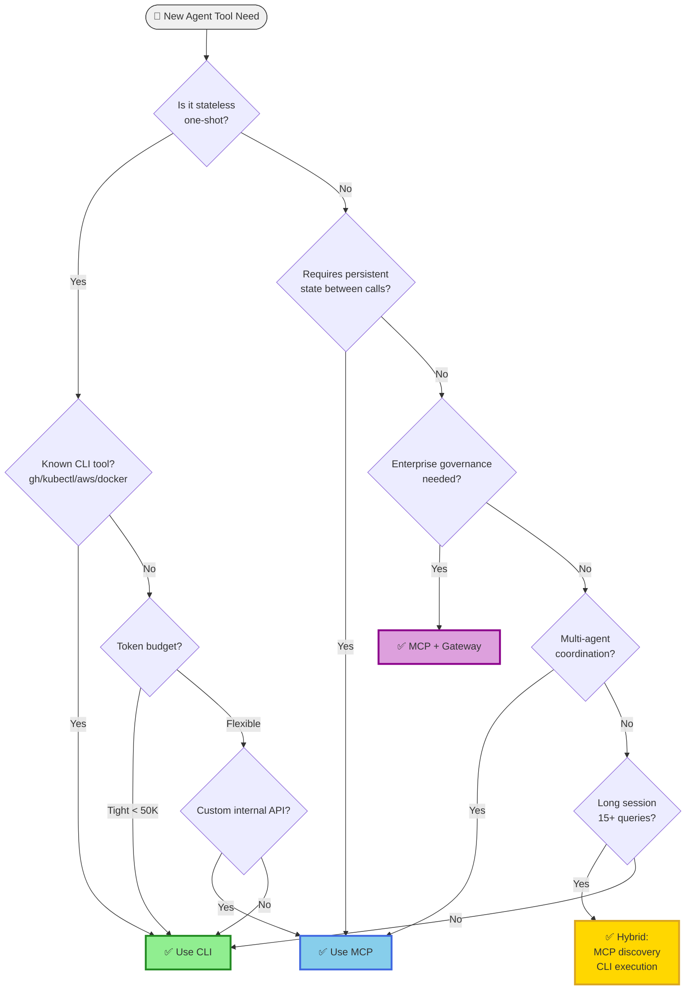
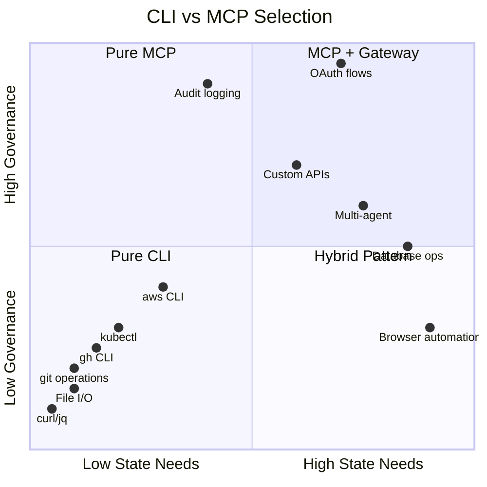
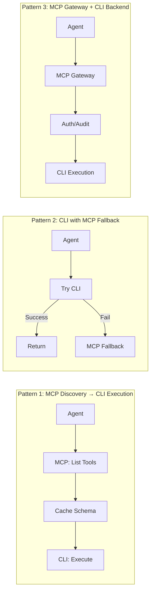

# MCP vs CLI Decision Guide

## 1. Executive Summary

**The answer is not MCP vs CLI — it's knowing when to use which.**

Most successful production setups use both strategically:
- **CLI** for dev workflows, one-shot operations, token efficiency
- **MCP** for enterprise governance, stateful sessions, multi-agent interop

---

## 2. Token Economics

| Scenario | MCP Tokens | CLI Tokens | Ratio |
|----------|-----------|-----------|-------|
| Simple "get repo info" | ~10,000 | ~200 | **50x** |
| Stack 4 MCP servers | ~150,000+ | ~800 | **187x** |
| Per query (amortized, 10+ queries) | ~880 | ~750 | 17% |

**Key Insight:** MCP token cost is paid once per session. After 8-10 queries, overhead amortizes. But with many tools (93 GitHub tools = 55k tokens), it's catastrophic.

**The Real Problem:** Bloated MCP servers, not the protocol itself.

### 2.0 Real Token Costs by Provider (June 2025)

| Provider | Model | Input $/1M | Output $/1M | Context | Notes |
|----------|-------|------------|-------------|---------|-------|
| **OpenAI** | GPT-4o | $2.50 | $10.00 | 128K | Most common |
| | GPT-4o-mini | $0.15 | $0.60 | 128K | Cost-optimized |
| | GPT-4.1 | $2.00 | $8.00 | 1M | Latest |
| | o3 | $10.00 | $40.00 | 200K | Reasoning |
| | o4-mini | $1.10 | $4.40 | 200K | Reasoning budget |
| **Anthropic** | Claude Sonnet 4 | $3.00 | $15.00 | 200K | Default |
| | Claude Opus 4 | $15.00 | $75.00 | 200K | Premium |
| | Claude Haiku 4 | $0.25 | $1.25 | 200K | Fast/cheap |

**MCP Cost Impact (Real Numbers):**

| Setup | Token Load | GPT-4o Cost | Claude Sonnet 4 | Claude Haiku 4 |
|-------|------------|-------------|-----------------|----------------|
| 93-tool MCP (GitHub) | 55,000 | $0.138/session | $0.165/session | $0.014/session |
| 20-tool MCP | 12,000 | $0.030/session | $0.036/session | $0.003/session |
| 5-tool minimal | 3,000 | $0.008/session | $0.009/session | $0.001/session |
| CLI equivalent | 400 | $0.001/session | $0.001/session | $0.0001/session |

**Break-even Analysis:**
```
55K token MCP overhead = $0.138 (GPT-4o) or $0.165 (Sonnet 4)
CLI per-call overhead  = ~$0.001

Break-even point: 138-165 queries before MCP amortizes
Reality: Most sessions are 5-15 queries → CLI wins

For Haiku 4: Break-even at ~14 queries (reasonable for long sessions)
```

**Monthly Cost Projections (1000 sessions/month):**
| Approach | GPT-4o | Claude Sonnet 4 | Claude Haiku 4 |
|----------|--------|-----------------|----------------|
| 93-tool MCP | $138/mo | $165/mo | $14/mo |
| 20-tool MCP | $30/mo | $36/mo | $3/mo |
| 5-tool MCP | $8/mo | $9/mo | $0.75/mo |
| CLI-first | $1/mo | $1.20/mo | $0.10/mo |

### 2.1 Provider-Specific Overhead

**OpenAI Function Calling:**
| Component | Tokens | Notes |
|-----------|--------|-------|
| Function wrapper | ~50 | `{"type": "function", "function": {...}}` |
| Per-parameter schema | ~15-30 | Depends on description length |
| Enum values | ~5 each | Each option adds tokens |
| Required array | ~10 | `"required": ["param1", "param2"]` |
| **Typical 5-param tool** | **~180** | Schema only |
| **20-tool server** | **~3,600** | Before any descriptions |

**Claude Tool Use:**
| Component | Tokens | Notes |
|-----------|--------|-------|
| Tool definition wrapper | ~40 | `<tool_use>` structure |
| Input schema | ~20-40 | JSON Schema overhead |
| Description (avg) | ~50 | Anthropic recommends detailed |
| **Typical 5-param tool** | **~160** | Slightly more efficient |
| **20-tool server** | **~3,200** | Still significant |

**CLI `--help` Parsing:**
| Approach | Tokens | Notes |
|----------|--------|-------|
| Full `--help` output | ~200-500 | Depends on tool |
| Pre-parsed summary | ~50-100 | Agent-optimized |
| Known tool (no help) | **0** | LLM trained on man pages |
| **Typical workflow** | **~100** | One-time per tool |

**Real-World Comparison:**
```
GitHub MCP Server (93 tools):     ~55,000 tokens
gh CLI (--help parsing):          ~400 tokens
gh CLI (known commands):          ~0 tokens (trained)

Cost per 1M input tokens (GPT-4o): $2.50
93-tool MCP session cost:          $0.14
gh CLI session cost:               $0.001
```

---

## 3. Reliability Comparison

From production benchmarks:
- **CLI reliability:** 100% (75 runs)
- **MCP reliability:** 72% (28% failing/wrong results)

The gap comes from:
- Tool selection confusion with many options
- Schema parsing failures
- Connection stability issues

---

## 4. When CLI Wins

**One-shot stateless operations:**
- `git status`, `npm test`, `curl`, `jq`
- No schema loading, no connection overhead
- Direct output, no marshalling

**Token-constrained environments:**
- 50x cheaper for simple operations
- No ambient cost of tool definitions

**Known CLI tools:**
- LLMs trained on `gh`, `kubectl`, `aws`, `docker` man pages
- Native comprehension without schemas
- 50+ years of Unix composability

**High reliability requirements:**
- 100% vs 72% in benchmarks
- Process isolation (crash one ≠ crash all)
- Instant debugging (stderr visible)

---

## 5. When MCP Wins

**Stateful sessions:**
- Playwright browser automation (persistent browser, page context)
- Database connections (connection pools, transactions)
- OAuth token management (refresh, session continuity)

**Enterprise governance:**
- OAuth/OIDC flows with proper token handling
- Audit trails (structured logging of tool invocations)
- Scoped permissions (tool-level RBAC)
- Multi-tenant isolation

**Dynamic tool discovery:**
- Typed parameters with rich docstrings
- Structured JSON I/O parsed natively
- Registry-based server discovery

**Multi-agent interoperability:**
- Single protocol works with Claude, GPT, Gemini
- Standardized capability negotiation

---

## 6. Decision Flowchart



### 6.0 Quick Decision Matrix



### 6.1 Decision Tree (Detailed)

```
START: Do you need agent tooling?
│
├─→ Is it a one-shot, stateless operation?
│   ├─ YES → Use CLI
│   └─ NO → Continue
│
├─→ Does the tool require state between calls?
│   ├─ YES → Use MCP
│   └─ NO → Continue
│
├─→ Do you need enterprise governance?
│   │   (OAuth, audit trails, scoped permissions)
│   ├─ YES → Use MCP (with gateway)
│   └─ NO → Continue
│
├─→ Is this a known CLI tool with good LLM training?
│   │   (gh, kubectl, aws, docker, git, jq)
│   ├─ YES → Use CLI
│   └─ NO → Continue
│
├─→ Are you token-constrained?
│   ├─ YES → Use CLI or minimal MCP (5-10 tools max)
│   └─ NO → Continue
│
├─→ Do you need multi-agent interoperability?
│   ├─ YES → Use MCP
│   └─ NO → Use CLI or Skills
│
└─→ DEFAULT: Start with CLI, add MCP when you hit a wall
```

### 6.2 When to Choose Each

| Scenario | CLI | MCP | Hybrid | Why |
|----------|:---:|:---:|:------:|-----|
| **Stateless Operations** |||||
| One-shot operations | ✅ | ❌ | ❌ | Zero overhead, direct execution |
| File operations | ✅ | ❌ | ❌ | Simple, no state needed |
| Git operations | ✅ | ❌ | ❌ | LLM trained, fast |
| Shell scripting | ✅ | ❌ | ❌ | Native composability |
| **Stateful Operations** |||||
| Browser automation | ❌ | ✅ | ❌ | Persistent page context required |
| Database connections | ❌ | ✅ | ❌ | Connection pooling, transactions |
| OAuth token flows | ❌ | ✅ | ❌ | Refresh cycles, session continuity |
| WebSocket sessions | ❌ | ✅ | ❌ | Bidirectional state |
| **Governance & Enterprise** |||||
| Compliance/audit | ❌ | ✅ | ❌ | Structured logging, RBAC |
| Multi-tenant SaaS | ❌ | ✅ | ❌ | Isolation boundaries |
| Rate limiting | ⚠️ | ✅ | ❌ | Gateway enforcement |
| **Cost Optimization** |||||
| Token-constrained | ✅ | ❌ | ❌ | 50x cheaper per operation |
| Long sessions (15+) | ❌ | ⚠️ | ✅ | Amortized but hybrid better |
| High volume CI/CD | ✅ | ❌ | ❌ | No process overhead |
| **Tool Discovery** |||||
| Known tools (gh, k8s) | ✅ | ❌ | ❌ | LLM trained on man pages |
| Custom internal APIs | ❌ | ✅ | ✅ | Schema provides docs |
| Dynamic tool sets | ❌ | ✅ | ✅ | Registry discovery |
| **Multi-Agent** |||||
| Multi-agent coordination | ❌ | ✅ | ❌ | Shared state, standard protocol |
| Agent handoffs | ❌ | ✅ | ❌ | Session continuity |
| Single-agent dev | ✅ | ❌ | ❌ | Simpler stack |

**Legend:** ✅ Best choice | ⚠️ Acceptable | ❌ Poor choice

---

## 7. Hybrid Patterns

### 7.0 Pattern Overview



### 7.1 MCP for Discovery, CLI for Execution

The best of both worlds: use MCP's typed discovery to find the right tool, then execute via CLI for efficiency.

**When to use:** You have custom/internal tools that need schema documentation, but operations are stateless.

```typescript
// Agent workflow
async function hybridToolCall(intent: string) {
  // 1. MCP discovery (one-time per session, ~3K tokens)
  const tools = await mcpClient.listTools();
  
  // 2. Match intent to tool (cheap, cached)
  const match = findBestTool(tools, intent);
  
  // 3. Execute via CLI (no MCP overhead per call)
  if (match.cliEquivalent) {
    return execSync(match.cliEquivalent);
  }
  
  // 4. Fallback to MCP only for stateful ops
  return mcpClient.callTool(match.name, args);
}
```

**Complete Implementation:**

```typescript
// src/hybrid-executor.ts
import { MCPClient } from '@modelcontextprotocol/client';
import { execSync } from 'child_process';

interface ToolMapping {
  mcpName: string;
  cliCommand: string;
  argMapper: (mcpArgs: Record<string, unknown>) => string[];
  requiresState: boolean;
}

// Tool mappings: MCP schema → CLI equivalent
const TOOL_MAPPINGS: ToolMapping[] = [
  {
    mcpName: 'github_get_repo',
    cliCommand: 'gh repo view',
    argMapper: (args) => [`${args.owner}/${args.repo}`, '--json', 'name,description,url'],
    requiresState: false,
  },
  {
    mcpName: 'github_list_prs',
    cliCommand: 'gh pr list',
    argMapper: (args) => ['-R', `${args.owner}/${args.repo}`, '--json', 'number,title,state'],
    requiresState: false,
  },
  {
    mcpName: 'kubernetes_get_pods',
    cliCommand: 'kubectl get pods',
    argMapper: (args) => ['-n', args.namespace as string, '-o', 'json'],
    requiresState: false,
  },
  {
    mcpName: 'browser_navigate',
    cliCommand: '', // No CLI equivalent
    argMapper: () => [],
    requiresState: true, // Must use MCP
  },
];

class HybridExecutor {
  private mcpClient: MCPClient;
  private toolCache: Map<string, ToolMapping> = new Map();
  private schemaCache: unknown[] | null = null;

  async initialize() {
    // One-time schema load (~3K tokens for 20 tools)
    this.schemaCache = await this.mcpClient.listTools();
    
    // Build lookup cache
    for (const mapping of TOOL_MAPPINGS) {
      this.toolCache.set(mapping.mcpName, mapping);
    }
  }

  async execute(toolName: string, args: Record<string, unknown>): Promise<unknown> {
    const mapping = this.toolCache.get(toolName);
    
    // Unknown tool → MCP
    if (!mapping) {
      return this.mcpClient.callTool(toolName, args);
    }
    
    // Stateful tool → MCP
    if (mapping.requiresState) {
      return this.mcpClient.callTool(toolName, args);
    }
    
    // Stateless with CLI equivalent → CLI
    try {
      const cliArgs = mapping.argMapper(args);
      const result = execSync(`${mapping.cliCommand} ${cliArgs.join(' ')}`, {
        encoding: 'utf-8',
        timeout: 30000,
      });
      return JSON.parse(result);
    } catch (err) {
      // CLI failed → fallback to MCP
      console.warn(`CLI failed for ${toolName}, falling back to MCP`);
      return this.mcpClient.callTool(toolName, args);
    }
  }
}

// Usage
const executor = new HybridExecutor();
await executor.initialize(); // Load schemas once

// These use CLI (fast, no MCP overhead):
await executor.execute('github_get_repo', { owner: 'acme', repo: 'api' });
await executor.execute('kubernetes_get_pods', { namespace: 'production' });

// This uses MCP (requires state):
await executor.execute('browser_navigate', { url: 'https://example.com' });
```

**Token Savings:**
```
Traditional MCP (20 tools, 10 calls):
  Schema: 12,000 tokens (loaded once)
  Calls:  10 × 200 = 2,000 tokens
  Total:  14,000 tokens

Hybrid (20 tools, 10 calls, 8 CLI-eligible):
  Schema: 12,000 tokens (loaded once)
  MCP calls: 2 × 200 = 400 tokens  
  CLI calls: 8 × 0 = 0 tokens
  Total:  12,400 tokens
  
Savings: ~11% per session, scales with call volume
```

**Architecture:**
```
┌─────────────────────────────────────────────────────┐
│                    Agent                             │
├─────────────────────────────────────────────────────┤
│  ┌─────────────┐    ┌──────────────────────────┐   │
│  │ MCP Client  │    │     CLI Executor         │   │
│  │ (discovery) │    │ (stateless operations)   │   │
│  └──────┬──────┘    └────────────┬─────────────┘   │
│         │                        │                  │
│         ▼                        ▼                  │
│  ┌─────────────┐    ┌──────────────────────────┐   │
│  │ Tool Schema │    │  gh, kubectl, aws, etc   │   │
│  │   Cache     │    │                          │   │
│  └─────────────┘    └──────────────────────────┘   │
└─────────────────────────────────────────────────────┘
```

### 7.2 CLI Wrapper Around MCP Server

Expose MCP capabilities through a CLI interface for script compatibility.

```bash
#!/bin/bash
# mcp-cli-wrapper.sh - Wraps MCP server as CLI

MCP_SERVER="npx @company/tools-server"

case "$1" in
  list)
    echo '{"jsonrpc":"2.0","method":"tools/list","id":1}' | $MCP_SERVER
    ;;
  call)
    TOOL=$2
    shift 2
    ARGS=$(jq -n --argjson args "$*" '$args')
    echo "{\"jsonrpc\":\"2.0\",\"method\":\"tools/call\",\"params\":{\"name\":\"$TOOL\",\"arguments\":$ARGS},\"id\":1}" | $MCP_SERVER
    ;;
  *)
    echo "Usage: mcp-cli <list|call> [tool] [args...]"
    ;;
esac
```

**TypeScript implementation:**
```typescript
// src/mcp-cli-wrapper.ts
import { MCPClient } from '@modelcontextprotocol/client';

const cli = new Command('mcp-cli')
  .description('CLI wrapper for MCP server');

cli.command('call <tool> [args...]')
  .action(async (tool: string, args: string[]) => {
    const client = await MCPClient.connect(process.env.MCP_SERVER!);
    const result = await client.callTool(tool, parseArgs(args));
    console.log(JSON.stringify(result, null, 2));
    process.exit(0);
  });

// Run: mcp-cli call get-repo --owner acme --repo api
```

### 7.3 Agent Dynamic Selection

Let the agent choose CLI vs MCP based on operation characteristics.

```typescript
interface ToolInvocation {
  name: string;
  args: Record<string, unknown>;
  requiresState: boolean;
  tokenBudget: 'tight' | 'flexible';
}

async function smartToolDispatch(invocation: ToolInvocation): Promise<unknown> {
  const { name, args, requiresState, tokenBudget } = invocation;
  
  // Decision matrix
  const useMCP = 
    requiresState ||                           // Stateful = MCP
    (tokenBudget === 'flexible' && 
     !KNOWN_CLI_TOOLS.has(name));             // Unknown tool + budget = MCP
  
  if (useMCP) {
    return await mcpClient.callTool(name, args);
  }
  
  // CLI path
  const cliCommand = buildCLICommand(name, args);
  const { stdout, stderr, exitCode } = await exec(cliCommand);
  
  if (exitCode !== 0) {
    // Fallback to MCP on CLI failure
    console.warn(`CLI failed, falling back to MCP: ${stderr}`);
    return await mcpClient.callTool(name, args);
  }
  
  return parseOutput(stdout);
}

// Agent prompt includes:
// "For stateless operations on known tools (gh, kubectl, docker), 
//  use CLI. For stateful or custom operations, use MCP tools."
```

**Decision table embedded in agent system prompt:**
```markdown
## Tool Selection Rules

1. **Always CLI:** git, gh, kubectl, docker, aws, jq, curl
2. **Always MCP:** browser_*, database_*, oauth_*
3. **Prefer CLI when:** token budget tight, one-shot operation, CI/CD
4. **Prefer MCP when:** multi-step workflow, need audit trail, custom API
```

**MCP Server Wrapping CLI:**
```
Agent → MCP Server → CLI Wrapper → Tool
```

Benefits:
- CLI composability under MCP governance
- Restricted surface area
- Security boundary without shell access

**CLI with --mcp-server flag:**
```bash
# Use as CLI
mycli deploy --env prod

# Or as MCP server
mycli --mcp-server
```

Same tool, both interfaces.

**Progressive Tool Disclosure:**
1. Default: 5-10 core tools loaded
2. On-demand: Additional tools via `more_tools` call
3. Semantic router: Cheap LLM matches request to tool metadata

---

## 8. MCP Best Practices (When You Use It)

**Keep tools < 20 per server:**
- 93 tools = 55k tokens = context catastrophe
- Task-scoped servers (PR review: 5 tools, not 93)

**Use gateways for:**
- Dynamic filtering (only relevant tools reach context)
- Health checks and routing
- Audit logging
- Rate limiting

**Handle reliability:**
- Reconnection logic with state recovery
- Timeout handling
- Fallback to CLI on MCP failure

---

## 9. The Production Pattern

```
Main Orchestrator: MCP (5-10 tools max, gateway-filtered)
Sub-agents: CLI or Skills
Enterprise features: MCP gateway (auth, audit, rate limits)
Dev workflows: Pure CLI
```

---

## 10. Migration Paths

### 10.1 CLI → MCP Migration Guide

**When to migrate:** You need enterprise governance, multi-agent support, or stateful sessions.

**Phase 1: Assessment (1-2 days)**

```bash
# Inventory current CLI usage
grep -r "execSync\|spawn\|exec(" src/ --include="*.ts" | \
  grep -oE "(gh|kubectl|aws|docker|curl) [a-z-]+" | \
  sort | uniq -c | sort -rn > cli-usage.txt

# Categorize by state requirements
# Stateless: git, gh, kubectl get, aws s3, curl, jq
# Stateful: browser, database, oauth
```

**Phase 2: Design MCP Schema**

```typescript
// Map CLI commands to MCP tool definitions
// cli-to-mcp-schema.ts

interface CLIToMCPMapping {
  cliPattern: RegExp;
  mcpTool: {
    name: string;
    description: string;
    inputSchema: object;
  };
  executor: 'cli' | 'native';  // Keep CLI backend or rewrite
}

const mappings: CLIToMCPMapping[] = [
  {
    cliPattern: /gh repo view (\S+)/,
    mcpTool: {
      name: 'github_get_repo',
      description: 'Get repository information',
      inputSchema: {
        type: 'object',
        properties: {
          owner: { type: 'string', description: 'Repository owner' },
          repo: { type: 'string', description: 'Repository name' },
        },
        required: ['owner', 'repo'],
      },
    },
    executor: 'cli',  // Keep using gh CLI under the hood
  },
];
```

**Phase 3: Build MCP Wrapper**

```typescript
// src/mcp-server.ts
import { MCPServer } from '@modelcontextprotocol/server';
import { execSync } from 'child_process';

const server = new MCPServer({
  name: 'cli-wrapper',
  version: '1.0.0',
});

// Wrap CLI as MCP tool
server.tool('github_get_repo', {
  description: 'Get repository information',
  inputSchema: {
    type: 'object',
    properties: {
      owner: { type: 'string' },
      repo: { type: 'string' },
    },
    required: ['owner', 'repo'],
  },
  handler: async ({ owner, repo }) => {
    // Still using CLI under the hood
    const result = execSync(
      `gh repo view ${owner}/${repo} --json name,description,url`,
      { encoding: 'utf-8' }
    );
    return { content: [{ type: 'text', text: result }] };
  },
});

// Add governance layer
server.use(authMiddleware);      // OAuth validation
server.use(auditMiddleware);     // Log all calls
server.use(rateLimitMiddleware); // Prevent abuse
```

**Phase 4: Gradual Rollout**

```typescript
// Feature flag for migration
const USE_MCP = process.env.USE_MCP === 'true';

async function getRepo(owner: string, repo: string) {
  if (USE_MCP) {
    return mcpClient.callTool('github_get_repo', { owner, repo });
  }
  return execSync(`gh repo view ${owner}/${repo} --json name,description,url`);
}

// Migration checklist:
// □ Week 1: 10% traffic to MCP, monitor errors
// □ Week 2: 50% traffic, compare latencies  
// □ Week 3: 90% traffic, verify audit logs
// □ Week 4: 100% MCP, deprecate direct CLI
```

**Phase 5: Add Governance**

```typescript
// MCP Gateway configuration
const gateway = new MCPGateway({
  servers: [
    { name: 'github', url: 'mcp://localhost:3001' },
    { name: 'kubernetes', url: 'mcp://localhost:3002' },
  ],
  auth: {
    provider: 'oidc',
    issuer: 'https://auth.company.com',
    audience: 'mcp-gateway',
  },
  audit: {
    destination: 's3://logs-bucket/mcp-audit/',
    format: 'json',
  },
  rateLimit: {
    requests: 100,
    window: '1m',
    byUser: true,
  },
});
```

### 10.2 MCP → CLI Migration Guide

**When to migrate:** You need lower latency, reduced token costs, or simpler debugging.

**Phase 1: Identify Candidates**

```sql
-- Query audit logs for stateless, high-frequency operations
SELECT 
  tool_name,
  COUNT(*) as calls,
  AVG(duration_ms) as avg_latency,
  SUM(CASE WHEN requires_state THEN 1 ELSE 0 END) as stateful_calls
FROM mcp_audit_log
WHERE timestamp > NOW() - INTERVAL '30 days'
GROUP BY tool_name
HAVING stateful_calls = 0  -- Only stateless
ORDER BY calls DESC
LIMIT 20;
```

**Extraction criteria:**
- ✅ No state between calls
- ✅ Called >100 times/day
- ✅ Has CLI equivalent with same semantics
- ❌ Requires OAuth token refresh
- ❌ Requires connection pooling
- ❌ Part of multi-agent workflow

**Phase 2: Build CLI Equivalents**

```typescript
// Generate CLI commands from MCP schemas
function mcpToCli(tool: MCPTool): string {
  const mapping: Record<string, string> = {
    'github_get_repo': 'gh repo view ${owner}/${repo} --json name,description',
    'github_list_prs': 'gh pr list -R ${owner}/${repo} --json number,title',
    'kubernetes_get_pods': 'kubectl get pods -n ${namespace} -o json',
    'kubernetes_get_logs': 'kubectl logs ${pod} -n ${namespace}',
  };
  return mapping[tool.name] || '';
}

// Test CLI equivalence
async function validateEquivalence(tool: string, args: object) {
  const mcpResult = await mcpClient.callTool(tool, args);
  const cliResult = execSync(mcpToCli({ name: tool, ...args }));
  
  // Normalize and compare
  const mcpNorm = normalize(JSON.parse(mcpResult));
  const cliNorm = normalize(JSON.parse(cliResult));
  
  if (!deepEqual(mcpNorm, cliNorm)) {
    throw new Error(`Equivalence check failed for ${tool}`);
  }
}
```

**Phase 3: Implement Fallback Pattern**

```typescript
// CLI-first with MCP fallback
async function executeWithFallback(
  tool: string, 
  args: Record<string, unknown>
): Promise<unknown> {
  const cliCommand = CLI_MAPPINGS[tool];
  
  if (cliCommand) {
    try {
      const result = execSync(buildCommand(cliCommand, args), {
        encoding: 'utf-8',
        timeout: 10000,
      });
      return JSON.parse(result);
    } catch (err) {
      console.warn(`CLI failed: ${err.message}, falling back to MCP`);
    }
  }
  
  // Fallback to MCP
  return mcpClient.callTool(tool, args);
}
```

**Phase 4: Update Agent Instructions**

```markdown
## Tool Selection (Updated)

### Use CLI directly:
- `gh repo view`, `gh pr list`, `gh issue list`
- `kubectl get`, `kubectl describe`, `kubectl logs`
- `aws s3 ls`, `aws s3 cp`
- `docker ps`, `docker logs`
- `curl`, `jq`, `git`

### Use MCP tools:
- `browser_*` (stateful page context)
- `database_*` (connection pooling)
- `oauth_*` (token management)
- `workflow_*` (multi-step orchestration)

### Priority order:
1. Direct CLI for known commands
2. MCP for stateful/custom operations
3. Skills for domain-specific workflows
```

### 10.3 Migration Checklist

```markdown
## CLI → MCP Checklist

- [ ] Inventory all CLI usage in codebase
- [ ] Categorize by state requirements
- [ ] Design MCP tool schemas
- [ ] Build MCP server wrapping CLI
- [ ] Add authentication middleware
- [ ] Add audit logging
- [ ] Add rate limiting
- [ ] Test with 10% traffic
- [ ] Monitor error rates and latency
- [ ] Full rollout
- [ ] Update agent instructions

## MCP → CLI Checklist

- [ ] Query audit logs for stateless operations
- [ ] Build CLI equivalents
- [ ] Validate semantic equivalence
- [ ] Implement fallback pattern
- [ ] Update agent system prompts
- [ ] Monitor token savings
- [ ] Remove deprecated MCP tools
```

---

## 11. Summary Matrix

| Factor | CLI | MCP |
|--------|-----|-----|
| Token cost | Low | High (amortizes) |
| Reliability | 100% | ~72% |
| Stateful ops | No | Yes |
| Enterprise governance | Weak | Strong |
| LLM familiarity | High (trained) | Lower |
| Setup complexity | None | Server deployment |
| Debugging | Easy (stderr) | Complex (two processes) |
